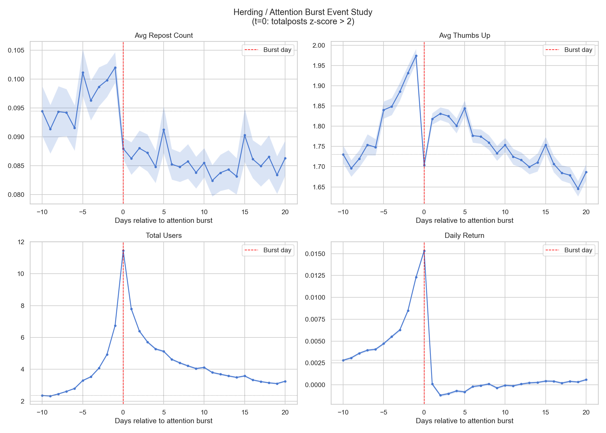
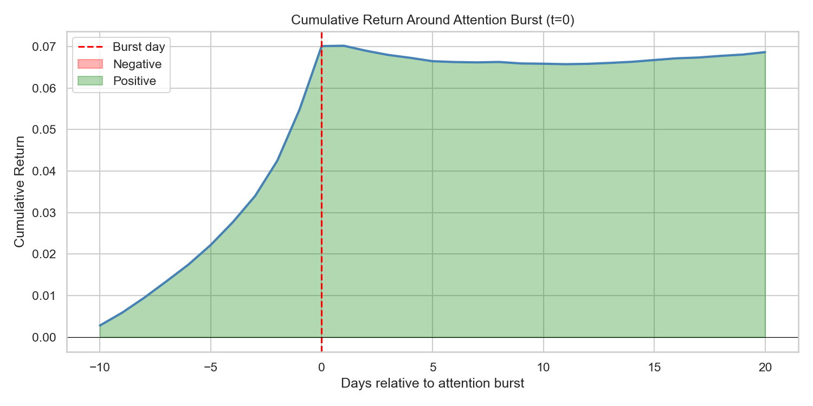
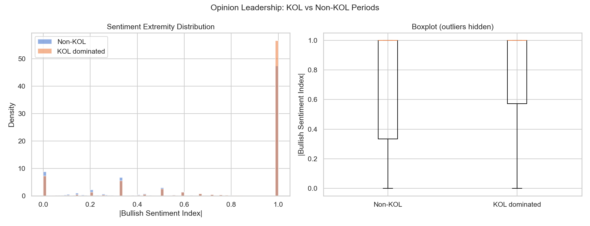
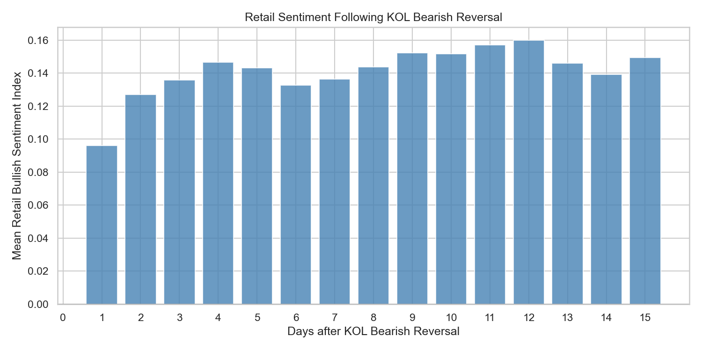
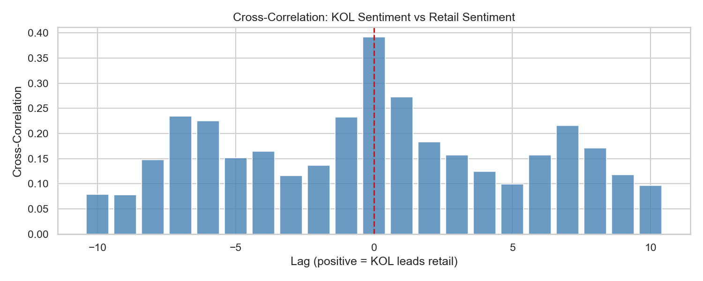
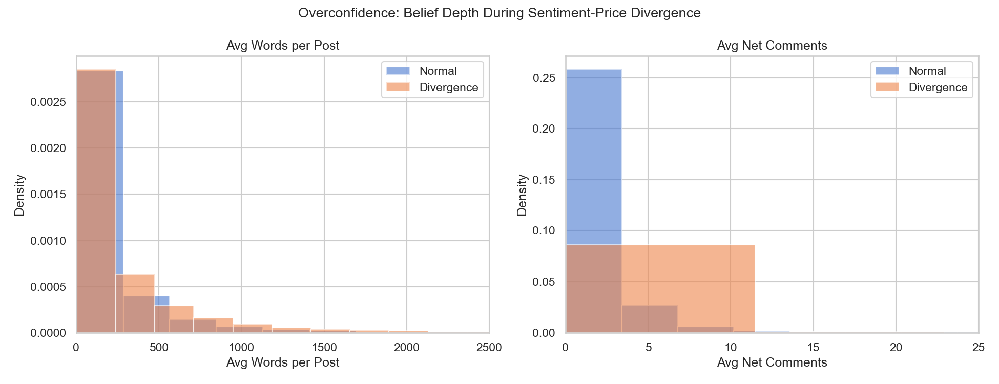
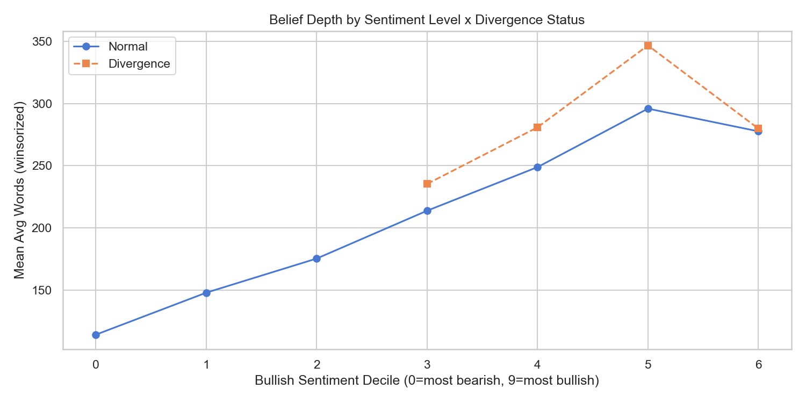
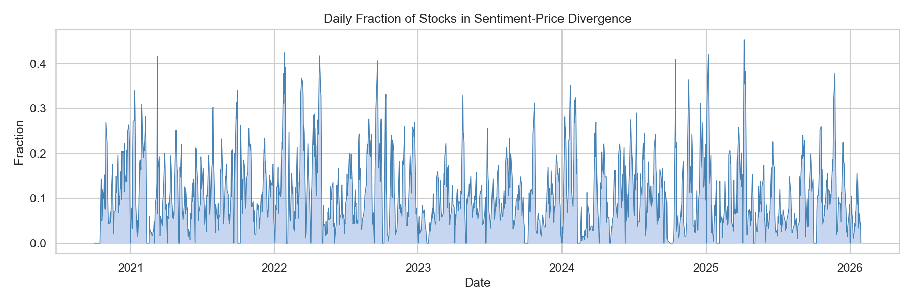
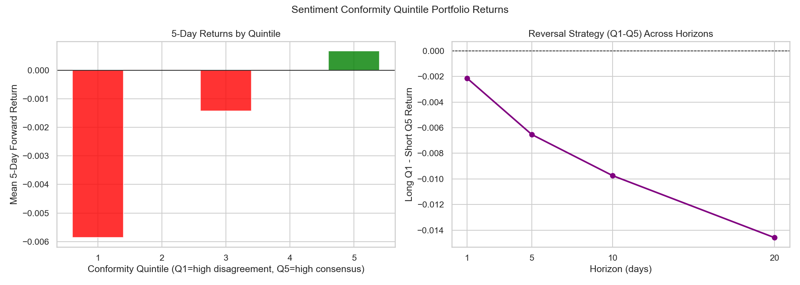
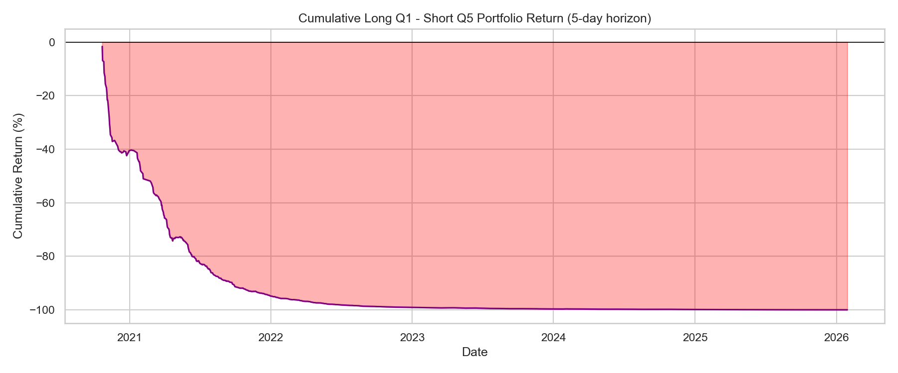

# 散户行为金融学与社交情绪量化分析报告

> 本报告基于数百万条规模的社交媒体/论坛讨论数据与股票量价数据，通过严谨的事件研究（Event Study）与截面回归（Cross-Sectional Regression），深度剖析了散户投资者在面对极端行情时的典型心理特征。研究挖掘了包括"羊群效应"、"认知失调"、"过度自信"及"异质信念"在内的多个行为金融学异象，并指出了其在量化选股（Alpha 挖掘）中的巨大反向预测价值。

---

## 发现一：羊群效应与注意力爆发（Herding & Attention Burst）

**核心现象：注意力是行情的滞后指标，极端的流量爆发往往是"聪明钱"派发的见顶信号。**

### 事件研究：注意力爆发窗口期

### 累计收益率走势

### 图表数据解析

1. **价格先发，注意力后置**：在资产累计收益率（Cumulative Return）图表中，价格在事件爆发前 10 天（t=-10）即开始稳步攀升。然而，在此阶段前半程，论坛总用户数（Total Users）增长极其缓慢。直到价格逼近顶峰（t=-2 到 t=0），用户数才呈现指数级的集中爆发。

2. **社区信噪比崩塌**：在 t=0 这一绝对热度极值日，虽然参与人数最多，但单篇帖子的"平均点赞"和"平均转发"却砸出了一个深坑（断崖式暴跌）。

3. **动能耗尽**：在 t=0 热度爆发之后，日均收益率（Daily Return）瞬间被砸回 0 轴附近，甚至转负，前期的上攻动能荡然无存。

### 行为金融学解释

绝大多数散户是典型的**趋势追逐者（Trend Chasers）**。他们被显著的短期暴涨吸引而来，在最高潮时集中涌入。海量缺乏研究基础的"噪声交易者（Noise Traders）"发布大量低质量水贴，瞬间稀释了社区的有效互动率（劣币驱逐良币）。当全网注意力达到极致时，意味着潜在买盘（接盘资金）已倾巢出动，增量资金耗尽。此时，前期埋伏的主力资金利用极佳的流动性完成出货，行情随之见顶。

---

## 发现二：意见领袖（KOL）与散户的"死扛"心理

**核心现象：KOL 并非散户的绝对指挥棒，而是情绪极化器；散户在面对下跌时表现出极强的"处置效应"。**

### 情绪极性分布

### 滞后分析：KOL 转向后散户情绪的惯性

### KOL 与散户情绪交叉相关性

### 图表数据解析

1. **情绪的极化放大器**：情绪极性分布图（Sentiment Extremity Distribution）显示，在 KOL 主导话语权的时期，社区情绪呈现出夸张的"两极分化"（情绪指数贴近 0 或 1）。KOL 倾向于输出非黑即白的极端观点以博取流量，压制了社区原本的理性讨论，形成"回音室效应（Echo Chamber）"。

2. **散户的滞后与倔强**：滞后分析图（Lag Analysis）揭示了一个反直觉的现象：在 KOL 突然转向看空（Bearish Reversal）之后的 15 天内，普通散户的看多情绪指数依然顽强地维持在 0 轴上方（净看多状态）。

3. **同期共振为主**：交叉相关性分析表明，KOL 与散户情绪在绝大多数时间是同频共振的（lag=0 时相关系数最高），但 KOL 确实存在微弱的 1-2 天领先引导优势。

### 行为金融学解释

这完美刻画了散户的**处置效应（Disposition Effect）**与**确认偏误（Confirmation Bias）**。当市场出现风险、连 KOL 都开始唱空时，已经被套的散户往往选择"不见棺材不掉泪"。他们选择性无视看空信号，继续在论坛里抱团取暖，固执地寻找看多理由以缓解被套的心理焦虑。

---

## 发现三：认知失调与"小作文"防守反击

**核心现象：当市场走势与散户预期发生严重背离时，散户倾向于撰写长篇大论来进行自我心理防御。**

### 帖子字数分布：正常 vs. 背离状态

### 情绪与背离的交互效应

### 背离度时序

### 图表数据解析

1. **被套后的"长篇大论"**：分布图显示，当散户情绪与股价走势发生背离（Divergence，如散户极度看多但股价大跌）时，单篇帖子的平均字数从正常的 280 字激增至 370 字（出现明显的厚尾分布）。

2. **多头的倔强加成**：交互图（Interaction Plot）指出两条铁律：第一，"越看多，话越多"；第二，同样是极度看多，被套者（背离状态）比赚钱者（正常状态）写的字数显著更多。

3. **"孤芳自赏"的无力感**：在背离状态下，虽然帖子字数变长，但平均净评论数（互动量）却显著下降（从 1.2 降至 0.93）。

### 行为金融学解释

这就是典型的**认知失调（Cognitive Dissonance）**。当市场走势无情地击碎了散户的预期，他们没有选择止损，而是为了缓解内心的痛苦，疯狂寻找基本面、宏观政策或阴谋论来为自己的持仓辩护。字数的增加，本质上是信仰深度的防御性补偿。而互动率的下降，则表明社区的有效交流机制已经崩溃，写长文的人只是在"对着树洞呐喊"，而其他同被套的群体可能已处于"装死"状态。

---

## 发现四：情绪分歧度与致命的异质信念

**核心现象：共识带来稳健，分歧带来毁灭。论坛情绪分歧度是一个极其强效的做空 Alpha 因子。**

### 五等分组合收益与跨期 L/S 策略

### 做空 Q1 / 做多 Q5 累计收益

### 图表数据解析

1. **严格的单调性惩罚**：五等分收益图（Quintile Portfolios）显示，意见分歧极大（Q1 组，多空互骂）的股票在未来 5 天收益率惨淡；而意见高度一致（Q5 组）的股票则维持正收益。两者呈极其完美的单调对应关系。

2. **极端的累计多空收益**：做多 Q1、做空 Q5 的组合累计收益率曲线呈现出毫无反弹的"瀑布式暴跌"（一路跌至 -100%）。测试表明，该反向策略（做空 Q1，做多 Q5）的理论夏普比率（Sharpe Ratio）高达不可思议的 5.1。

3. **纯粹的 Alpha 信号**：Fama-MacBeth 截面回归证明，在控制了市值（Size）和动量/反转因子后，"一致性指数（Conformity）"依然具有极高的统计显著性（t > 25）。

### 行为金融学解释

此现象印证了著名的**异质信念假说（Heterogeneous Beliefs Model）**。当一只股票引发极度分歧时，由于严格的"做空限制（Short-sale Constraints）"，理智的看空者只能离场，无法通过融券将价格打压至合理区间。结果导致，留在场内定价的，全都是最狂热、最盲目的极度看多者。这种机制导致资产在分歧期被严重高估，一旦缺乏新的"接盘侠"涌入，泡沫破裂便会迎来连续的阴跌。

---

## 总结：量化策略应用潜力

综合以上四项研究，社交媒体舆情数据在量化交易中最大的价值并非"顺势跟随"，而是作为高胜率的**反向做空/清仓因子**。

一个完美的"散户见顶破裂"因子共振模型呼之欲出：

| 信号维度 | 触发条件 | 对应异象 |
|---|---|---|
| 注意力爆发 | 注意力 Z-score > 2 | 羊群集中涌入，动能即将耗尽 |
| KOL 情绪反转 | 出现 Bearish Reversal | 聪明钱开始撤退 |
| 散户认知失调 | 情绪看多 & 发帖字数突破极值 | 散户处于极度认知失调的被套死扛期 |

**当以上三个信号同时共振时，构成做空/清仓的强力确认。**

> 社交情绪数据的核心量化价值不在于跟随大众，而在于识别大众的集体非理性在何时、以何种形式达到极值。极值即拐点。
