# NBER WORKING PAPER SERIES

# FINTECH PLATFORMS AND MUTUAL FUND DISTRIBUTION

Claire Yurong Hong

Xiaomeng Lu

Jun Pan

Working Paper 26576

http://www.nber.org/papers/w26576

NATIONAL BUREAU OF ECONOMIC RESEARCH

1050 Massachusetts Avenue

Cambridge, MA 02138

December 2019, Revised May 2022

This paper was previously entitled “The Economic Impact of Distributing Financial Products on Third-Party Online Platforms.” We are grateful to Brad Barber, Ben Charoenwong (discussant), Robin Döttling (discussant), Darrell Duffie, Hao Jiang, Andrew Karolyi, Jennifer Huang, Xing Huang, Yi Huang (discussant), Xin Liu (discussant), Wenlan Qian, Hongxun Ruan (discussant), Yu Shan (discussant), Clemens Sialm, Laura Stark, Baolian Wang, Joakim Westerholm (discussant), Shangjin Wei, Yizhou Xiao (discussant), Wei Xiong, Bernard Yeung, Xiaoyun Yu, Yao Zeng (discussant), Lu Zheng, and Haoxiang Zhu for valuable discussions and comments. We thank seminar and conference participants at Tsinghua University PBC School of Finance, Chinese University of Hong Kong (Shenzhen), Lingnan University, Shanghai Advanced Institute of Finance, Hong Kong University of Science and Technology, National University of Singapore, FISF at Fudan University, the 2021 American Finance Association, the 2019 China FinTech Research Conference, the 2020 Finance Down Under Conference, the 2020 ABFER Specialty Conference on FinTech, the 2021 European Retail Investment Conference, 2021 World Finance Conference, FMA2021, the 2022 NBER Chinese Economy Workshop and the behavioral finance online seminar organized by Wei Xiong. We are grateful to the Howbuy platform for data provision. We thank Linchen Liu, Shiwen Tian, and Heming Zhang for research assistance. The views expressed herein are those of the authors and do not necessarily reflect the views of the National Bureau of Economic Research.

NBER working papers are circulated for discussion and comment purposes. They have not been peer-reviewed or been subject to the review by the NBER Board of Directors that accompanies official NBER publications.

$©$ 2019 by Claire Yurong Hong, Xiaomeng Lu, and Jun Pan. All rights reserved. Short sections of text, not to exceed two paragraphs, may be quoted without explicit permission provided that full credit, including $©$ notice, is given to the source.

# ABSTRACT

We document a novel platform effect caused by the emergence of FinTech platforms in financial intermediation. In China, platform distributions of mutual funds emerged in 2012 and grew quickly into a formidable presence. Utilizing the staggered entrance of funds onto platforms, we find a marked increase of performance-chasing, driven by the centralized information flow unique to FinTech platforms. This pattern is further confirmed using proprietary data from a top platform. Examining the platform impact on fund managers, we find that, incentivized by the amplified performance-chasing, fund managers increase risk taking to enhance their probability of getting onto the top ranking.

Claire Yurong Hong Shanghai Advanced Institute of Finance Shanghai Jiao Tong University 211 West Huaihai Road, Shanghai P.R.China, 200030 yrhong@saif.sjtu.edu.cn

Jun Pan Shanghai Advanced Institute of Finance Shanghai Jiao Tong University Shanghai, China junpan@saif.sjtu.edu.cn

Xiaomeng Lu FISF, Fudan University Shanghai P.R.China, 200030 xiaomenglu@fudan.edu.cn

# 1 Introduction

The rise of the platform economy over the past decade is transforming the way we live. Empowered by technological innovations, platforms are like intermediaries on steroids, creating social and business connectivity on a previously unimaginable scale. Widely adopted platforms, such as Google for information, Amazon for retail, Facebook for social networking, and Uber for taxi rides, have profoundly reshaped how information is aggregated and disseminated, altering consumer behavior and disrupting the respective industries.

In this paper, we focus on the emergence of FinTech platforms in the asset management industry, taking advantage a 2012 policy change in China, which allows tech firms to distribute mutual funds via e-commerce platforms.1 Created by tech-driven firms, such Fin-Tech platforms distribute financial products directly to individual investors, bypassing and replacing the traditional channels of mutual-fund distributions organized by fund families, banks and brokers. Akin to what Amazon did for books and retail goods, FinTech platforms break down the market segmentation, distributing to their giant user bases not only financial products but also information, which, given the platform structure, is highly centralized in nature. As consumer behavior is influenced by the information fed to them – a fact made abundantly clear by the emergence of social-media platforms in disseminating information to the public,2 this highly centralized market structure leads to highly synchronized investor behavior. On the production side, fund managers, no matter how small or invisible, have the potential to reach the entire user base of these platforms. As their reliance on platform distribution increases, the platform-induced investor behavior can in turn affect fund managers’ incentives.

Focusing first on the impact of the platforms on investor behavior, our empirical results document a strong platform-induced amplification of performance chasing. We find a striking increase in performance sensitivity, driven by flows chasing the top-ranked funds much more aggressively after the emergence of the platforms. Upon ranking actively managed equity funds by their past 12-month returns into deciles, the average net flow to the funds in the top decile increases from 3.03% pre-platform (2008–2012) to 20.84% post-platform (2013–

2017).3 We further take advantage of the fact that our data include the exact dates on which each mutual fund signs up for the platforms. Using this information on staggered entrance, we find the increase in flow-performance sensitivity occurs exactly on and after a fund enters platforms. In particular, controlling for fund-level characteristics and time and fund fixed effects, we find that the post-platform performance sensitivity is over three times the pre-platform level for both equity and mixed funds. Moreover, we do not observe such a marked increase in flow-performance sensitivity under placebo tests, estimated by randomly assigning funds to be on- or off-platforms. In particular, our actual estimates on platform-induced performance chasing exceed 94.1% and 99.8% of the placebo estimates for equity and mixed funds respectively.

To further provide evidence on the platform-induced performance chasing, we directly examine investors’ behaviors on a FinTech platform – Howbuy, one of the top platforms in China. With the proprietary dataset obtained from Howbuy, we find that performance chasing is indeed stronger on the FinTech platforms. From 2015 through 2018, the top-decile equity funds account for an average of 49.37% of the quarterly purchases on Howbuy, significantly larger than the average of 37.61% for the entire market, which aggregates purchases over all distribution channels, both on- and off-platform. Pre-platform, only 23.79% of the quarterly purchases goes to the top-decile equity funds.

The emergence of FinTech platforms results in a striking increase in flow-performance sensitivity. Understanding the mechanisms behind this amplified performance chasing is therefore important. We hypothesize that the highly centralized and uniform information display on these FinTech platform apps may generate a pattern of coordinated or synchronized performance chasing. Off-platform, information signal is dispersed with funds distributed via various segmented channels. On-platform, investors are essentially fed the same information. In particular, as platforms invariably list mutual funds by their past performance, the top-performing funds are displayed prominently at the front page of every investor’s mobile device, causing an otherwise diverse set of investors to chase the same set of front-page funds. Consequently, performance chasing behavior at an individual level might be synchronized and lead to amplified performance-chasing at the aggregate level.

To demonstrate the importance of this centralized information display channel, we examine the platform effect on the front-page funds. Across all platforms, mutual funds are displayed by past 12-months returns in a descending order via mobile apps in a performance rank list.4 Depending on the size of their cell-phone screen, investors normally see 8 to 12

funds on the front page of the performance rank list. The front-page funds attract lots of attention as investors would need to scroll down on the phone to see the funds with lower returns. If our hypothesis of synchronized performance chasing is correct, we expect to see platform-induced performance chasing to concentrate among those few top performing funds that show up on the front page. This is exactly what we find. The platform-induced performance chasing is the strongest for the top 12 funds and decreases almost precipitously with the ranking of the funds as they become less likely to appear on the front page.

Adding further confirmation to the importance of front-page visibility, we show that the platform effect comes largely from retail investors, who, under limited attention and capacity constraint, are more likely to be attracted by past winner funds listed on the front page of the apps. We find no big increase in flow-performance sensitivity for institutional investors, as they rely less on platform for trading. Shedding further light on the platform effect, we compare and contrast the sensitivity of investor flow to fund’s platform ranking and intra-family ranking. In lack of the centralized information display from platforms, the sensitivity of flow to funds’ intra-family performance ranking should stay the same before and after platform introduction, which we find indeed is the case. Taken together, these evidences suggest that the uniquely centralized information display on platforms is an important driver of the amplified performance chasing that we observe.

To understand the broader impact of FinTech platforms, we further investigate the responses of fund managers and the consequences on fund performance. Specifically, we find that, in the presence of this amplified performance chasing, top-ranked funds exhibit a pattern of increased volatility to “gamble” the market and enhance their chance of making onto the top list. This added risk taking incentive for top ranked funds is consistent with the much more convex flow-performance relationship that they face after the introduction of platforms. Decomposing fund volatility further into systematic and idiosyncratic components, we find that this added risk taking is mainly present in the systematic component. Given the positive risk premium associated with systematic risk, boosting the systematic component in risk taking does provide higher expected returns, which indicates that the fund managers have already reached the limit of their own skills and are using leverage to get ahead. While the economic magnitude of the result is not big, the emergence of such a practice points to the unintended consequences associated with the platform intermediation of financial products.5

Turning to the impact of platforms on fund performance, we find that top-performing funds fail to outperform both in the pre- and post-platform era. Moreover, associated with the platform effect, we observe an increase in volatility and a decrease in Sharpe ratio in the first year after the funds successfully make into the top. Due to a short sample period in our setting, these asset pricing results are relatively weak and inconclusive. Nonetheless, existing literature provides extensive theories and empirical findings pointing to the potential negative impact of platforms on fund performance. In particular, with the decreasing returns of scale effect in Berk and Green (2004) and the return deterioration from managerial risk-shifting documented in Huang, Sialm, and Zhang (2011), our previous findings on post-platform amplified performance chasing and changing managerial risk taking point to the potential investor welfare loss in the long run.

Finally, we also discuss and rule out potential confounding effects for the platform-induced performance chasing. In particular, we show that funds’ endogenous decision to enter platforms cannot explain our results. Moreover, with a battery of robustness checks under alternative specifications, we show that the platform effect cannot be explained by the timevarying market conditions, changes in the composition of funds, and the availability of other distribution channels in the post-platform era.

Related literature: Our paper contributes to three strands of literature. First, our paper speaks to the emerging literature on the impact of information dissemination on investor behavior. In particular, investor behaviors are altered by the rapidly changing information environment associated with the emergence of digital platforms, for example, in the gamification of stock trading environment on Robinhood (Barber et al. (2021)), and through social media like Reddit (Hu et al. (2021)) or StockTwit (Cookson, Engelberg, and Mullins (2022)). As investors’ behavior is heavily influenced by the information flow on social-media platforms, it changes the beliefs of other market participants, resulting in new market equilibrium, as modeled in Pedersen (2021) and Gˆarleanu, Panageas, and Zheng (2021).6 We add to this literature by documenting the unique impact of centralized and uniform information distribution. In particular, not only do platforms exacerbate investors’ heuristics of focusing on the salient and simplistic performance information, but the centralized and uniform information distribution across all platforms also synchronizes investors’ action upon these

homogeneous signals.

Our paper is also related to the classic literature the performance-chasing by mutual fund investors and its impact on managerial incentives. As documented by Gruber (1996), Brown et al. (1996), Chevalier and Ellison (1997), and Sirri and Tufano (1998), mutual fund flows tend to chase past performance, resulting in a convex flow-performance relationship, which in turn alters fund managers’ risk-taking incentives.7 Huang, Sialm, and Zhang (2011) further show that such distortions lead to fund underperformance. Our paper contributes to this literature by showing that the existing flow-performance relation can be dramatically amplified in a platform economy where the distribution of information is highly centralized and investor actions are highly synchronized. Moreover, building on the economic mechanism suggested in this literature, we show that this platform effect impacts not only investor behavior but also managerial incentives.

Finally, our paper contributes to the growing literature on FinTech and its impact on the asset management industry.8 In his seminal paper on household finance, Campbell (2006) points to the bright side of FinTech – tech-initiated platforms bypass the traditional financial institutions and substantially lower the barriers of investment, but also raises the important concerns over whether investors might be ill-equipped to make financial decisions in such a less regulated environment. Indeed, the novel platform effect documented in our paper speaks to the unintended market-wide consequence of intermediating financial products via powerful platforms. In particular, small individual-level biases can be magnified into large market-wide phenomenon due to the informational power of the platforms.9 At the same time, however, FinTech does have the potential of improving financial inclusion, especially for emerging countries with underdeveloped financial infrastructures. For example, Hong, Lu, and Pan (2020) show that the recent development of FinTech platforms in China improves risk-taking for individuals under served by traditional financial institutions. Moreover, the introduction of robo-advisors and automated management tools encourage financial participation and help investors achieve better portfolio diversification (Reher and Sokolinski (2021), D’Acunto, Prabhala, and Rossi (2019), and Loos et al. (2020)). With the fast adoption of FinTech worldwide, our paper points to the importance of better design and smarter regulation in

channeling the information flow on large FinTech platforms.

The remainder of this paper is organized as follows: Section 2 describes the data used in our study and the institutional background. Section 3 presents the main results related to platform-induced performance chasing. Section 4 investigates the centralized information display channel as a main driver of the the platform effect. Section 5 explores the economic consequences of platforms on fund managers’ incentives and on fund performance. Section 6 concludes.

# 2 Data and Institutional Background

# 2.1 The Emergence of FinTech Platforms

In China, platforms are allowed to distribute mutual funds since 2012. China Securities Regulatory Commission (CSRC) announced in February 2012 that tech firms, independent of fund families, banks, and brokers, are allowed to distribute mutual funds via e-commerce platforms. Since then, platforms started to emerge and the total number of platforms reached 115 by year 2018.

As is typical in the platform economy, the top platforms grab most of the market shares while the smaller ones struggle for survival. Of the 115 platforms, the two largest platforms, which are also the focus of our paper, are Tiantian and Ant Financial. Tiantian is among the first four institutions to obtain the fund distribution license from CSRC in February 2012. Ant Financial missed the first batch of license issuance, but quickly entered the platform business in April 2014 by acquiring Shumi platform.10

With the introduction of platforms, mutual funds of various types joined platforms to seize the market share. As shown in Figure 1, the coverage of actively managed mutual funds by the top four platforms, Ant, Howbuy, Tiantian, and Tong Huashun, increases swiftly from zero to 60% over the span of just one year from 2012Q2 to 2013Q2. The fraction of funds available for sale on each top platform further increases to around 80% by year 2014, and has been stabilized afterward. Examining the determinants of funds’ entrance, we find that non-bank-affiliated funds and funds with lower retail ratios, smaller sizes, and longer histories are more likely to enter platforms early (Appendix A1.). Funds’ past performance and performance volatility, however, have no impact on the timing of their entrance.

Compared with existing distribution channels, platforms stand out in terms of both fund coverage and market share. The fraction of mutual funds available for sale via brokers and

banks are around 40% and 20% respectively during our sample period. While the sales numbers have been closely guarded by the platforms, based on the asset management industry report offered by China International Capital Corporation (CICC), FinTech platforms capture 20%, $2 2 \%$ , 35%, and 42% of the total mutual fund indirect sales (non-family channel) market share in year 2015, 2016, 2017, and 2018 respectively. Based on Ant Group (Ant Financial) IPO prospectus, the sales and net income from mutual fund distribution is RMB 2.23 trillion and RMB 10.5 billion respectively in 2017. For a large bank like China Merchants Bank, as reported in the annual report, the fund distribution sales and net income is only RMB 705.5 and 5.0 billion in 2017.

# 2.2 The Features of FinTech Platforms

The features and designs of the FinTech platforms in China are highly homogeneous. In particular, platforms unanimously adopt a simple performance rank list to display the entire universe of mutual funds via mobile apps. For illustration, Panel A of Appendix Figure A1 exhibits the cell phone screenshots of two platforms, Ant Financial and Howbuy.

The first screenshot shows the front page of the Alipay app, a catch-all app developed by Ant group, which integrates all kinds of services from calling a taxi to ordering takeout. Service on mutual funds distribution is also embedded inside this ecosystem, making mutual fund investment as easy as other aspects of everyday life. Once a user logs into the platform app, it takes only one or two clicks to view the performance rank list on the second screenshot in Figure A1.11 On this list, all funds in a specific style are ranked according to their past cumulative raw returns. Investors only have the discretionary power to choose a specific return horizon out of the window of 1, 3, 6, 12, and 36 months to rank funds. By clicking on a fund, investors will enter the page in the third screenshot, where they can explore more detailed information and make the purchase.

Since all FinTech platforms rank funds based on past raw returns, the information display of their performance rank list is almost identical. Specifically, on the same day, the performance rank list from the Howbuy app (the fourth screenshot) and the one from Alipay (the second screenshot) display exactly the same list of funds on the front page of the app. The simple and identical information display across different platforms indicates that investors, regardless of place and time, will receive common information signal when they purchase

mutual funds through FinTech platforms.12

For comparison, Panel B of Appendix Figure A1 shows a screenshot from Charles Schwarb OneSource, a typical brokerage for mutual funds in the US. One can observe several key differences between OneSource and the FinTech platforms in China. First, OneSource operates mainly through Internet websites. They list their own affiliated funds on top, at a position more salient for investors. Second, below their affiliated funds, they display a subset of third-party funds according to their own selection criteria, as opposed to the entire universe of funds. Finally, as a typical financial firm, they provide rich information and abundant criteria for investors to filter and select funds. They offer individual investors more freedom to customize their own pool of funds but arguably make fund investment decisions more complicated. Other standard online brokerage firms and websites of fund families share similar features along these dimensions.

# 2.3 Data and Methodology

Data on mutual funds, including fund total net assets, return, inception date, and historical style, etc., are obtained from Wind for the sample period from 2008 to 2020. We focus on the actively managed equity, mixed, and bond mutual funds by excluding index funds, passive funds, structured funds, and QDII funds from our sample. Funds with a size below RMB 1 million and an age less than two years old are excluded. We further exclude funds that are likely to be wealth management products by requiring the daily returns of the fund to be nonzero for at least half of its life. Since platforms treat different share classes of the same fund as different funds, to mimic investors’ choice set on platforms, we conduct our analysis using each fund share class.13

Following prior literature (e.g., Chevalier and Ellison (1997), Sirri and Tufano (1998)), the flow to fund $i$ in quarter $t$ is computed using the following equation:

$$
\mathrm {F l o w} _ {i, t} = \frac {\mathrm {T N A} _ {i , t} - \mathrm {T N A} _ {i , t - 1} (1 + \mathrm {R e t} _ {i , t})}{\mathrm {T N A} _ {i , t - 1}},
$$

where $\mathrm { R e t } _ { i , t }$ is the quarter- $t$ split and dividend adjusted return of fund $i$ and TNA refers $^ { \cdot i , t }$ to the total net assets under management of fund $i$ at quarter $t$ end. We assume that inflows and outflows occur at the end of each quarter, and that investors reinvest the dividend they receive in the same fund.

Table 1 provides the summary statistics of the actively managed mutual funds in our sample, with Panel A reporting the information on the aggregate mutual fund industry year by year and Panel B reporting the information at fund-quarter-level. As shown in Panel A, the total number of funds steadily increases from fewer than 200 in 2008 to over 4000 by 2020. The number of bond funds, however, is particularly small in the early years, with only around 25 funds by 2009. The same pattern can be observed from Figure 1. The aggregate industry size for equity and mixed funds remain relatively stable around 2012, whereas the industry size for bond funds increases substantially only after 2015. Considering the limited presence of bond funds in the pre-platform era, we rely more on equity and mixed funds to study the impact of platforms.

Another visible change in our sample is the sudden decrease in the number of equity funds, along with the sudden increase in the number of mixed funds in 2015. This is caused by a policy change in August 8, 2015, which increases the minimum stock holding requirement for equity mutual funds from 60% to 80%. As a result, a large number of equity funds switch to mixed funds around 2015Q3. Apart from the change in fund style classification, the Chinese stock market experiences a dramatic run up in the first half of 2015 and then a dramatic crash in the second half. This would have introduced noise and potentially unusual investor behavior into our sample. To ensure that our results are not driven by these major events, we perform two tests in subsequent analyses: 1) shrink our analysis to a narrow window (2011–2014) to avoid the inclusion of 2015; 2) exclude 2015 altogether as a robustness test.

Comparing the risk-return profile across different fund styles, Panel A of Table 1 indicates that equity funds have the most volatile return distribution, followed by mixed funds and then bond funds. There exists substantial variation in equity funds’ monthly return, ranging from the lowest value of - $- 5 . 5 5 \%$ in 2008 to the highest value of 4.89% in 2009. Mixed funds, with the flexibility to invest in bonds, experience the lowest monthly return of -4.58% in 2008 and highest monthly return of $4 . 0 9 \%$ in 2009.

Panel B of Table 1 further reports the distribution of the main variables used in our analysis, summarized using fund-quarter observation for each style category respectively. All the continuous variables are winsorized within each style category at the 2% and 98% percentiles to alleviate the concern on outliers.14 Taking equity fund as an example, an average equity fund in our sample has a size of RMB 1.19 billion, an age of around 5 years, an annual return of $1 1 \%$ , and a daily return standard deviation of 141 bps. The standard deviation of fund annual return is 28.8%, $2 9 . 6 \%$ , and 13.8% for equity, mixed, and bond funds respectively, indicating large variations both across funds and over time. Turning to the main variable of interest – fund flow, the average quarterly flows for equity and mixed

funds are close to zero, with a standard deviation of around 30%. Bond funds, however, exhibits very volatile flow with a standard deviation of 74.1%, possibly driven by their heavy institutional ownership.

# 3 Performance Chasing in the Post-Platform Era

The emergence of FinTech platforms could lead to substantial changes in the mutual fund industry. Focusing on investors’ performance chasing behaviors, in this section, we first compare and contrast the sensitivity of flow to fund past performance for periods before and after platform introduction. Direct evidence on platform-induced performance chasing is further provided, based on a proprietary data from Howbuy – one of the largest FinTech platform in China. Finally, utilizing the staggered sign-up dates of funds onto platforms, we provide plausibly causal evidence on the effect of platforms on performance chasing.

# 3.1 Pre- and Post-Platform: Market-Wide Impact

We start by documenting the sensitivity of flow to fund past performance for the five years before (2008 to 2012) and five years after (2013 to 2017) the introduction of platforms. We use 2013Q1 as the beginning of the post-platform period because, following the initial issuance of platform licenses in February 2012, the first batch of funds become available for sale on the platforms around the end of 2012. To study the change in market-wide flowperformance relationship, we form performance-based deciles by sorting, at the beginning of each quarter, all the actively managed funds within each style category into ten groups, according to their respective cumulative raw returns over the past 12 months. The 12-month return horizon is chosen because FinTech platforms usually display mutual funds by their past n-month returns in a descending order, with n=12 as one of the default settings.15 We then examine the quarterly flows to the ten performance deciles, summarized separately for the periods before and after the introduction of platforms.

As demonstrated in Figure 2, the flow-performance curve steepens dramatically in the post-platform sample for both equity and mixed funds, which is driven mostly by the increase in flow to the top decile. Focusing first on equity funds, pre-platform, there is some evidence of performance chasing, with the flow to the top-decile funds on average slightly higher than the flows to the other deciles. After the emergence of platforms, the magnitude of performance chasing increases strikingly. According to Panel A of Table 2, the top-decile average flow increases from 3.03% in the pre-platform period to 20.84% in the post-platform

period. The post- and pre-platform difference in top-decile flow is 17.81% with a $t$ -stat of 3.19. This amplified performance chasing is also observed in mixed funds, which are of lower expected returns and lower risk compared with the equity funds: Prior to the emergence of platforms, top-decile mixed funds attract an average flow of 3.84%. Post platforms, the top-decile flow increases to 13.21%, 9.37% ( $t$ -stat = 2.69) higher than the pre-platform level.

For bond funds, the results are less conclusive. Though the top-decile flow is on average higher in the post-platform period, it is not significantly different from that of the preplatform period. At least two reasons contribute to the nosier pattern in the performance chasing of bond funds: First, as discussed in Section 2.3, the bond fund sample is rather small in the pre-platform period. China’s fixed-income market, particularly the credit market, starts to take off only after 2010 (Geng and Pan (2019)). Consequently, the estimation of flow-performance sensitivity tend to be extremely noisy and the change in performance chasing is insignificant. Second, bond funds are dominated by institutional investors, who presumably rely less on FinTech platforms to execute trades. As shown in Appendix Figure A2, the average institutional ownership for bond, equity, and mixed funds are 64.9%, 19.5% and 16.1% in the post-platform period respectively. As FinTech platforms should primarily affect retail investors’ trading behavior, we expect the platform effect to be weaker for bond funds. Due to the above reasons, we mainly focus on equity and mixed funds to study the impact of platform emergence in our subsequent analyses.

To further connect the amplified performance chasing to the emergence of platforms, we examine how the flow-performance sensitivity varies over time. If the drastic increase in flowperformance relation is driven by the introduction of platforms, we expect this amplification effect to take place only on and after 2013. The upper left panel of Figure 3 plots the excess flow (red line marked with “o”) for top-decile equity funds quarter by quarter, with the shaded area indicating the 95% confidence intervals. Excess flow to the top-decile funds is measured as the quarterly difference between the top-decile flow and the flow averaged across all deciles. Focusing on the time-series variation around 2013, one can observe a sudden increase in the excess flow into the top-decile funds shortly after the introduction of platforms. The change is visible even within the narrow window of two years after the policy change (shaded red region, 2011–2014). Extending the window to five years after the policy change (shaded blue region, 2008–2017), we observe a much bigger increase in flows to the best performing funds, though the confidence interval becomes wider due to the unusual year of 2015.

Finally, as a placebo test, we compare the previous results against those in the US. As the US fund market did not experience any shock around 2013, we expect the flow-performance sensitivity to remain stable during our sample period. Indeed, as shown in the upper right panel of Figure 2, the flow-performance sensitivity of actively managed equity funds in the

US is similar in the pre- and post-platform periods: The average flow to the top-decile funds is around 6% per quarter in both periods, larger than the average flow of 3.03% per quarter in the pre-platform era in China, and much smaller than the average flow of 20.84% per quarter in the post-platform era in China. Given that the distribution of US mutual funds is still under the traditional model, it makes sense that the flow-performance sensitivity in the US is much lower than in China’s post-platform era. The time-series pattern in the upper right panel of Figure 3 further confirms this hypothesis. In contrast to the pattern in China, we observe no significant shift in flow-performance relationship for US mutual funds during the period from 2007 to 2018.

# 3.2 Direct Evidence from a Top FinTech Platform

Up to now, we document a sharp rise in performance chasing at the market level in the postplatform era. If platforms indeed amplify investors’ performance chasing tendency, then we should observe a higher level of performance chasing on platforms than in traditional channels. In this section, we provide direct supporting evidence using a proprietary dataset obtained from Howbuy, one of the top five platforms in China.16

To measure performance-chasing behavior, we compute the market share of purchase for each performance decile on Howbuy as well as the whole market. Specifically, in each quarter, we calculate this measure as the amount of all fund purchase in one decile divided by the total amount of fund purchase summed across the ten deciles on Howbuy (or the whole market). Thus, the market shares of purchase for the ten deciles add up to 100%. To allow for direct comparison between Howbuy and the whole market, we use the same sample of funds and the same 12-month performance decile rank for each fund in the calculation. Since the whole market data is the aggregation over all distribution channels (both on- and off-platforms) and Howbuy data is a pure representation of the platform economy, a comparison of the two enables us to visualize the transition from traditional channel to the platform channel.

Panel B of Table 2 reports the average top-decile market share of purchase on Howbuy and in the whole market from 2015 through 2018. Since the data from Howbuy is only available from 2015 through 2018, for comparison purposes, we restrict the whole market data to the same period. Focusing first on equity funds, we find that an average of 49.37% of the quarterly purchases goes to the top-decile equity funds on Howbuy. That is, on pure platform trading, the top 10% funds claim close to 50% of the market share, which is much larger than the corresponding fraction of 37.61% in the whole market. Despite a relatively short sample period, the difference between Howbuy and the whole market is still marginally

significant with a $t$ -stat of 1.69. Mixed funds exhibits a similar pattern as equity funds. In terms of the magnitude, an average of 39.50% of the quarterly purchases goes to the topdecile mixed funds on Howbuy, which is 10.47% ( $t { \mathrm { - s t a t } } = 2 . 3 5$ $t$ ) larger than that of the whole market during the same time. For bond funds, the contrast between Howbuy and the whole market is less pronounced. The “Howbuy-Market” difference is only 7.04 and is statistically insignificant from zero ( $t$ $t \mathrm { - s t a t } = 1 . 2 1$ ), echoing the findings in Section 3.1.

As a graphical illustration, the upper panels of Figure 4 provide an intuitive comparison of the market share of purchase across the three samples, i.e., the pre-platform market, the post-platform market, and the Howbuy sample. For both equity and mixed funds, the top-decile market share of purchase is the largest on Howbuy, followed by the post-platform market, and then followed by the pre-platform market. This pattern is consistent with the platform effect on market-wide performance chasing: The pre-platform market only consists of traditional channels, in which the performance-chasing tendency is the weakest; Howbuy is representative of platforms, on which performance-chasing tendency is the strongest. Post platforms, the market becomes a combination of traditional channels and platform channels. Therefore, we observe a rise in the magnitude of performance chasing in the market, but this magnitude is still below the level on platforms.

The time-series variation of the top-decile market shares add further evidence on the effect of platform on performance chasing. As shown in the lower panels of Figure 4, for both equity and mixed funds, the top-decile market share of purchase in the whole market (blue line) increases sharply immediately after the introduction of platforms. Moreover, topdecile market share of purchase on Howbuy (red line) is larger than that in the whole market for almost every quarter from 2015 trough 2018. In other words, although the magnitude of performance chasing fluctuates over time, the performance chasing tendency on platforms is almost always higher than that in the whole market.

# 3.3 Evidence from Staggered Fund Entrance onto Platforms

To build upon the previous analyses, we further utilize the information of the exact dates on which each mutual fund signs up for the platforms. As shown in Figure 1, funds gradually adopted platform distribution, mainly in the first two years after platform introduction. This staggered entrance of funds onto the platforms provides a unique setting for us to precisely identify the platform effect on flow-performance sensitivity.

We measure the extent of fund $\imath$ ’s platforms coverage using dummy variable Platform , $^ { i , t }$ which equals one when fund $i$ at the beginning of quarter $t$ is available on Tiantian or Ant Financial, the two biggest and dominant players in the market.17 Using this fund-quarter-

level variable Platform $^ { i , t }$ , we investigate the change in the flow-performance relationship in a panel regression setting as follows:

$$
\begin{array}{l} \mathrm {F l o w} _ {i, t} = \alpha + \beta_ {1} \cdot \mathrm {D e c i l e 1 0} _ {i, t - 1} + \beta_ {2} \cdot \mathrm {P l a t f o r m} _ {i, t} + \beta_ {3} \cdot \mathrm {D e c i l e 1 0} _ {i, t - 1} \times \mathrm {P l a t f o r m} _ {i, t} \\ + \sum_ {j} \gamma_ {j} \cdot \operatorname {C o n t r o l} _ {i, t - 1} ^ {j} + \varepsilon_ {i, t}, \tag {1} \\ \end{array}
$$

where Decile10 is a dummy variable that equals one if fund $i$ belongs to the top $\imath ; t - 1$ decile based on past 12-month cumulative raw return from quarter $t - 4$ to quarter $t - 1$ , and zero otherwise. The coefficients on the interaction terms (Decile10 $\times$ Platform) capture the platform effect, where a positive value indicates an increase in the flow to top-decile funds after they enter either of the two platforms. We include the natural logarithm of fund size, natural logarithm of fund age and fund’s last quarter flow as controls, and further include time fixed effects to control for the effect of time-varying market conditions on fund flow in all specifications. We conduct analyses both with and without fund fixed effects. Reported $t$ -statistics correspond to standard errors that are double clustered by fund and time.

The results are summarized in Table 3. For each fund style, we present regression results obtained using both a narrow window and a long window of sample period. The narrow window (2011–2014) focuses more precisely around the time of the introduction of platforms, which helps to pin down an immediate platform effect. Moreover, some years with unusual market condition are naturally excluded in this setting, alleviating the concern that changing market condition may affect the results.18 In comparison, the long window (2008–2017) setting has the advantage of estimating a permanent platform effect, which can partially reduce the estimation noise in the narrow window specification.

We find a strong platform effect across all specifications. Focusing first on equity funds in the narrow window in column (1), the extra flow to the top-decile equity funds, benchmarking to other deciles, is on average 6.73% per quarter before joining the platforms. After signing up to the platforms, the same fund in the top decile would attract an additional quarterly flow of 10.53% ( $t$ -stat = 2.46). Further including fund fixed effects in column (2) to control for any time-invariant (unobserved) fund characteristics, consistently, we find that joining platforms brings an additional flow of 16.32% ( $t$ -stat = 3.33) for top-decile funds, which is 2.40 times

the off-platform level. In other words, the magnitude of post-platform performance chasing more than triples its pre-platform level. Note that the platform effect becomes even larger after we control for fund fixed effects. Therefore, the large increase in performance chasing is not caused by some funds with an unconditionally higher level of flow that self-select to enter platforms. Repeating the analyses using the long window, we find a similar economic and statistical significance on the Decile10 dummies and the interaction terms. In particular, the quarterly excess flow to top-decile equity funds, benchmarking to other deciles, increases by 14.20% from their pre-platform level of $6 . 6 2 \%$ after joining platforms.

For mixed funds, we observe a rather similar pattern. Off platforms, top-decile mixed funds attract an excess flow of $4 . 6 0 \%$ per quarter, which is slightly smaller than the corresponding estimate for equity funds (6.73%) using the same specification. Post platforms, we observe a substantial increase in performance chasing. Benchmarking to the flow to the off-platform top deciles, top-decile mixed funds on platforms attract an additional flow of 11.79% per quarter, which is 2.56 times the off-platform level. Again, this magnitude is even larger in the specification including fund fixed effects. Lastly, in the long window specifications, we observe a similar magnitude of platform effect, indicated by the coefficient on the interaction terms. Overall, these results suggest that the estimates on the platform effect are robust across difference specifications.

# Placebo Test on Platform Entrance

To investigate the possibility that our results are driven by factors unrelated to each fund’s on-platform status, we conduct a placebo test to further demonstrate that the increase in flow-performance sensitivity indeed comes from platform entrance. Specifically, we ask the following question: Suppose we randomly assign a fund to be an on-platform or off-platform fund, how likely can we obtain a platform effect that is equivalent to the magnitude in our previous tests.

To this end, we randomly reshuffle the value of the platform dummy across funds and meantime maintain its overall distribution within each quarter. That is, we require the fraction of funds on the top two platforms to equal to the true value in each quarter, but randomize on which funds in the sample are on platforms. Then, we re-estimate the baseline regression in Equation (1) based on those pseudo platform dummies and save the coefficient on Decile10 $\times$ Platform. For brevity, we focus on the long window specifications with fund fixed effects in Table 3. We repeat this analysis for 1,000 times and report the distribution of the coefficient estimates in Figure 5.

As is obvious from the figure, the actual estimates in columns (2) and (4) of Table 3, denoted by the red dotted lines, lie well to the left of the entire distribution of the coefficient

estimates from the placebo tests. Due to the swift adoption of platforms, the fraction of funds on platforms increases over time, and the platform dummy in the randomized samples tend to correlate with the actual value. Therefore, we naturally observe an average positive coefficient on Decile10 $\times$ Platform across the simulated samples. However, the increase in flowperformance sensitivity in the actual sample is still significantly larger than that estimated using the simulated samples. In particular, out of the 1,000 simulations, the actual coefficient estimate of 14.20% for equity funds is larger than 94.9% of the placebo estimates in the simulated samples, i.e., our actual estimate is a $5 . 1 \%$ event in the simulate sample. For mixed funds, with a larger sample and larger cross-fund platform variation, the actual coefficient estimate of 17.04% happens with an extremely rare probability, as it exceeds 99.8% of the placebo estimates. The evidence suggests that the actual entrance dates of individual funds onto platforms contain important information in the identification of the platform effect.19

# 4 Understanding Post-Platform Performance Chasing

Consumer behavior is influenced by the information fed to them – a fact made abundantly clear by the emergence of social-media platforms in disseminating information to the public. Likewise, FinTech platforms distribute to their giant user bases not only financial products, but also information, which in turn drives consumer behavior. In this section, we study the extent to which the post-platform increase in performance chasing is the outcome of the uniquely centralized information distribution on FinTech platforms.

# 4.1 The Platform Effect: Centralized Information Distribution

Prior to the arrival of FinTech platforms, information distributions to mutual-fund investors are decentralized and multifaceted. Investors purchase from dispersed sources, either directly from the fund families or indirectly from the local branches of hundreds of banks and brokers, each offering their own collections of funds with fund advisers dispensing recommendations according to their own incentives. By contrast, information flow on FinTech platforms is highly centralized and uniform. Investors on FinTech platforms are essentially fed the same information – the front page of their mobile apps displays mutual funds by their past $n$ -month returns in a descending order, with $n { = } 1 2$ as a popular choice. Depending on the screen size of the mobile devices, the front page contains roughly 8 to 12 funds, making those front-page funds highly visible to all platform investors regardless of where such investors live or which platform they are using. Imagine massive number of investors reacting almost simultaneously

to identical information. Even a small amount of performance chasing by a small fraction of the population can be synchronized into the significant performance chasing observed in post-platform era.

# Front-Page Visibility in the Post-Platform Era

To test this channel of synchronized performance chasing, we focus our analysis on the frontpage funds. As there can be thousands of funds in each style category (e.g., mixed funds) and investors are unlikely to scroll down for hundreds of pages, the front-page visibility could be an important determinant of the platform-induced flow. In particular, our hypothesis is that the platform effect is the strongest for the few very top funds and then weakens for funds outside the front page. By contrast, this sharp prediction of front-page visibility does not apply to the pre-platform era, as, lacking the synchronization mechanism offered by the platforms, most investors chase top-ranked funds only within their own universe of funds. Indeed, as shown in the upper panel of Figure 6, pre-platform, the performance chasing is mostly flat among the top 30 funds – relative to the group of funds ranked below 30, the excess flow to the top 1–3 (front-page) funds is 8.19%, similar in magnitude to an average of 3.55% from top 19 to top 30 (off front-page) funds. Post-platform, the excess flow to the top 1–3 funds increases to 44.60%, 36.39% larger than its pre-platform level. While the excess flow to the top 19 to top 30 funds also increases, but the average magnitude of 9.20% is significantly smaller than those for the front-page funds.20

The lower panel of Figure 6 further plot the differences in the on- and off-platform performance chasing across the top 30 funds, which are significant, both economically and statistically, for funds on the front page. In our setting, investors can scroll down to view lower ranked funds and, depending on the time of their purchases, the past 12-month returns might also deviate from our calculations. Moreover, instead of past 12-month returns, they can also be influenced by the past 3-month or 6-month returns. As such, we do not expect to see a clear cutoff point in ranking associated with the front-page visibility. Nevertheless, consistent with our conjecture that the top 8 to 12 funds are the most visible, we do find that the post-platform increase in flow is the largest for funds ranked above top 12 and then drops gradually in magnitude and statistical significance outside of the top 12 ranking. In particular, the on and off-platform flow difference is on average $2 3 . 0 1 \%$ for the top 1–12 funds, whereas this difference is only $5 . 6 5 \%$ for the top 19–30 funds, suggesting a much weaker platform effect for the off-front page funds.

# Closeness to the Front Page

In addition to focusing on just a few front-page funds, we further extend the idea of frontpage visibility to include the broad set of funds in our analysis. For each fund, we measure its closeness to the front page by sorting it into one of the four ranking groups – “Top 10” for the top-10 ranked funds, “Top 11–30” for top 11 to 30, “Top 31–50” for top 31 to 50, and the rest ranked below 50. The panel regressions reported in Table 4 follow the same specification as in Equation (1), with the Decile ranking replaced by “Top-X” dummies (Top 10, Top 11–30, and Top 31–50), which are better aligned with the concentration toward the top ranking in the post-platform era.

Funds that are closer to the front page of a FinTech app experience a larger increase in fund flow in the post-platform period: For equity funds, in the long window estimation with fund fixed effects, the increase in flow in the post-platform period is 30.00%, 12.24%, and 9.18% for Top 10, Top 11 to 30, and Top 31 to 50 funds, respectively. Similarly, the magnitude of the platform effect drops uniformly across all regression specifications. This pattern is exactly what we expect: As investors scroll down the performance rank list, they may view the funds that are closer to the front page with a higher chance. Therefore, the increase in flow is positively related to funds’ closeness to the front page. Mixed funds display a similar pattern: Post-platform, funds that are closer to the front page experience a larger increase in fund flow. The magnitude of regression coefficients for mixed funds are also similar to the corresponding values for equity funds.

Comparing the economic importance of front-page visibility with that of the performance Decile ranking, we find that platform-induced performance chasing is overwhelmingly stronger for front-page funds. In particular, for a well-performed top decile equity fund, the increase in flow in the post-platform period is 14.2%, less than half of the magnitude for top-10 ranked funds. The contrast between Decile ranking and front-page ranking, in the post-platform era, also points to the important role of front-page visibility in explaining platform-induced synchronized performance chasing.

# 4.2 Retail Investors vs. Institutional Investors

The introduction of platforms allows retail investors to trade mutual funds with great ease, which is hardly possible in the pre-platform era. Retail investors, under limited attention and capacity constraint, are more likely to be attracted by past winner funds listed on the front page of the apps. Institutional investors, equipped with in-depth research and sophisticated financial expertise, might rely less on platforms in the investment of mutual funds. The differential trading behavior of retail and institutional investors motivate us to sharpen the platform effect by examining the differential response of retail and institutional investors to

front-page funds.

Utilizing the additional information on fund investor composition, we first conduct the subsample analysis conditional on the change in fund holder number, following the regression specification in Table 4. As the number of institutional investors is usually small, a big increase in fund holder number largely reflects the entrance of new retail investors into the fund. Using the median value of the change in fund holder number in each quarter as the cutoff point, we divide the whole sample into halves. Our hypothesis is that the platform effect should be larger in the above-median subsample, i.e., among the funds that attract more retail investors.

As reported in the left four columns of Table 5, the platform effect comes almost entirely from the subsample with above-median change in fund holders. For equity funds, within the above-median subsample, we observe an additional flow of 35.84%, 13.34%, 14.00% for top 10, 11–30, 31–50 funds after they enter platforms, benchmarking to the same top-X fund’s off-platform flow. In contrast, within the below-median subsample, the corresponding values are only 10.02%, $5 . 0 2 \%$ , and $2 . 6 6 \%$ , much smaller than the previous values and mostly statistically insignificant. That is, the platform effect is mainly driven by the funds that indeed attract more retail investors. For mixed funds, the results are qualitatively the same.

Second, to offer more direct evidence, we decompose fund flow into two components – retail and non-retail flows – and examine the platform effect on each components.21 Our hypothesis is that the platform effect should be largely driven by the performance chasing of front-page funds from retail flow. The right four columns of Table 5 report the corresponding results estimated using retail flow and non-retail flow as the dependent variables.22

Consistent with our hypothesis, we observe a much larger platform effect on retail flow than non-retail flow. Taking equity funds as an example, retail flow increases by 20.75% for the top-10 ranked platform funds, benchmarking to the same top 10 funds off-platform. By contrast, the corresponding increase in non-retail flow is only 6.50%. Moreover, the increase in retail flow is positively related to funds’ closeness to the front page, whereas the increase in non-retail flow is relatively flat across the top 50 funds. Specifically, for top 10, 11–30, and 31–50 funds, the post-platform increase in retail flows are 20.75%, 8.94%, and 5.25%, respectively. The platform effect drops precipitously with funds’ ranking. For the increase in non-retail flow, the contrast is less obvious: the increase is 6.50% for top 10 funds and $3 . 0 0 \%$ for top 31–50 funds. Repeating the same exercise for mixed funds, we find a qualitatively

similar pattern.

Taken together, consistent with our hypothesis, we find that the platform effect is mainly driven by retail investors, who rely heavily on the performance rank list when purchasing mutual funds on platforms. Institutional investors, in contrast, exhibit a weaker pattern of performance chasing. Moreover, the post-platform performance chasing from retail investors is predominantly concentrated among the front-page funds, shedding further light on the importance of centralized information display in explaining the platform effect.

# 4.3 Platform Ranking vs. Intra-Family Ranking

To shed further light on the importance of centralized information display in explaining the amplified performance chasing, we compare and contrast the sensitivity of investor flow to fund’s platform (universal) ranking and intra-family ranking. As a major distribution channel both in the pre- and post-platform era, fund families offer funds under their brand umbrella. With individual funds competing for limited capital attracted through their family brand, fund’s performance ranking within the family can be an important determinant of flow (Kempf and Ruenzi (2007)). Moreover, in lack of the centralized information display from platforms, the sensitivity of flow to funds’ intra-family performance ranking should stay the same before and after platform introduction, thus offering us a placebo test.23

To test this hypothesis, we examine the response of flow to the intra-family performance ranking in the pre- and post-platform period. We require a family to have at least five funds under its brand to be included, which reduces our fund-quarter observations slightly from 6,057 to 5,542 for equity funds and 12,229 to 11,195 for mixed funds. Since the average number of funds in a family is 8.74 for the pre-platform sample, we focus on the performance quintile ranks as opposed to deciles ranks within each family. Following the long window specification with fund fixed effect in Table 3, we create the Family Top Quintile dummy (FMQuintile5) and its interaction with the Platform dummy. The Family Top Quintile dummy equals one if a fund’s return in the past twelve months belongs to the top quintile within its own fund family.

As shown in Table 6, we find a dramatic increase in the sensitivity of flow to fund’s platform ranking after a fund joins platforms, while there is no significant change in the sensitivity of flow to fund’s intra-family ranking. Taking equity funds as an example, before a fund joins platforms, being in the top quintile group of its own family helps obtain an

additional flow of 2.96%. This effect of intra-family ranking remains with a similar magnitude in the post-platform period, as reflected in the insignificant coefficient estimate of the interaction term, FMQuintile5 $\times$ Platform. In contrast, the position of a fund in the whole universe becomes more important. A top-decile fund in the whole fund universe enjoys an extra flow of 15.35% after it joins the platforms, controlling for the effect of intra-family ranking. For mixed funds, we observe a similar pattern. Before a fund joins platforms, being in the top family quintile and top platform decile attracts an additional flow of 3.12% and 1.16% respectively. Post platform entrance, the same fund attracts an additional flow of 1.43% for being in the top family quintile and 15.63% for being in the top platform decile.24

In summary, by studying the time-varying importance of funds’ performance ranking within its family and in the whole fund universe, we offer evidence on the uniqueness of platform ranking in explaining the amplified performance chasing. The absence of platform effect within fund families suggests that the amplified performance chasing is closely tied to the information display of platforms, and it cannot be explained by a market-wide general tendency to chase performance.

# 5 Managerial Incentives and Fund Performance

Consumer behavior influences managerial incentives. As demonstrated by the seminal work of Brown, Harlow, and Starks (1996) and Chevalier and Ellison (1997), the shape of the flow-performance relation affects the risk taking of fund managers. Extending this important observation to the post-platform era, we study in this section whether or not the amplified performance chasing induced by platform investors leads to amplified distortion in managerial incentives. Further establishing the real impact of the distortion, we study how the platforminduced performance chasing affects fund performance.

# 5.1 Increased Risk-Taking by Fund Managers

At the beginning of each quarter, we estimate the closeness of each fund to the top-performer list using its relative performance over the past nine months and gauge its subsequent risk taking over the next three months. In structuring this test, our hypothesis is that, attempting to get into the 12-month top-performer list, funds that are closer to the top by the 9-month mark have stronger incentives to “gamble” over the next three months. This approach follows the original test of Chevalier and Ellison (1997), who, assuming that investors react to yearend fund performances, use the January-September returns as main information variable to

differentiate funds that are more likely to gamble and then test the hypothesis by focusing on their subsequent fourth-quarter risk taking. We perform our analysis at the quarter end, as in the post-platform era, fund rankings are updated continuously and there is no need to fix the test at the year end. We adopt the same 12-month horizon, as one of the default settings prevalent on FinTech platforms is to display mutual funds within each category according to their past 12-month returns.

To formally test our hypothesis of platform-induced risk taking, we apply quarterly panel regressions of the following form:

$$
\mathrm {V o l} _ {i, t} = a + b \mathrm {P l a t f o r m} _ {i, t} + c \mathrm {D e c i l e 1 0} _ {i, t - 1} + d \mathrm {D e c i l e 1 0} _ {i, t - 1} \times \mathrm {P l a t f o r m} _ {i, t} + \varepsilon_ {i, t}, (2)
$$

where, for each fund $i$ , $\mathrm { V o l } _ { i , t }$ measures its risk taking in quarter $t$ , Platform captures its $^ { \cdot i , t }$ entrance onto the platform by quarter $t$ , and Decile10i,t−1 is a dummy that equals one if fund $i$ ranks among the top decile within its style category, based on past 9-month return up to the end of quarter $t - 1$ . As in any difference-in-difference approach, the coefficient of the most interest is associated with the interaction term, which captures the post- and pre-platform difference of the difference in risk taking between a top-decile fund and a nontop-decile fund. We further include time and fund fixed effects as well as fund-level variables measured up to quarter-end $t - 1$ to take out the influences on fund volatility unrelated to managerial incentives or platform entrances.

The fund’s risk taking Voli,t is measured in three dimensions. Using the daily fund returns in quarter $t$ , we first calculate the fund’s volatility, and then use a two-factor model that includes aggregate stock and bond portfolios to decompose the total volatility into systematic and idiosyncratic volatility. We use the value-weighted equity fund returns for the stock market portfolio, and the value-weighted bond fund returns for the bond market portfolio. The one-year deposit rate is used as the risk free rate. The factor loadings are estimated using the daily returns within each quarter.

Panel A of Table 7 reports the results. Consistent with our hypothesis, with amplified performance chasing, arises amplified distortion in risk taking. Focusing first on the results for total volatility, pre-platform, we do not find a significant relation between the likelihood to gamble and subsequent risk taking. The pre-platform difference in total volatility between top-decile funds and other funds is -0.56 bps per day and statistically insignificant. Postplatform, the top-decile funds increase their risk taking more relative to the funds in other deciles– The difference in total volatility between the top-decile funds and the other funds increase by 8.84 bps per day for equity funds and 11.01 bps per day for mixed funds, equivalent to an annualized volatility of 1.40% and 1.74%, respectively, significant both economically

and statistically.25

Turning next to the results on systematic and idiosyncratic risk taking, we see that, pre-platform, fund managers of a top-decile fund “gamble” by taking more idiosyncratic risk (i.e., security selection) over the subsequent quarter. The pre-platform extra idiosyncratic volatility is 3.56 and 3.50 bps per day for equity and mixed funds respectively. Post-platform, the differences in idiosyncratic volatility remain almost unchanged as the coefficients on the interaction term are small and insignificant. In other words, even though the managerial incentives for extra risk taking is high in the post-platform era, such fund managers do not significantly take more risk in the form of idiosyncratic volatility. One direct interpretation of this result is that, pre-platform, fund managers have already exerted their skills in security selection, and, in spite of the amplified incentives in the post-platform era, there is little room for further improvement.

While taking uninformed idiosyncratic risk does not get rewarded, fund managers know very well that leveraging on systematic risk do earn extra risk premium. Indeed, our results show that, post-platform, fund managers gamble by taking on more systematic risk and earning the extra market risk premium. The pre-platform differences in systematic volatility between a top-decile fund and a non-top-decile fund are in general small and statistically insignificant, indicating that, pre-platform, fund managers do not take additional systematic risk to get into the top-performer list. Post-platform, top-decile funds dial up their exposures in systematic risk relative to the other funds – the difference in systematic volatility increases by 8.04 and 10.87 bps per day for equity and mixed funds respectively. Compared with the daily volatility of 100 bps of a typical mixed funds, such increases in the difference of risk taking are significant economically.

In an alternative setting, we further capture funds’ incentive to gamble by their closeness to the front page of a FinTech app. We sort funds, within each category, by their past 9-month returns into four ranking groups – “Top 10” for the top-10 ranked funds, “Top 11–30” for top 11 to 30, “Top 31–50” for top 31 to 50, and the rest ranked below 50. We follow the same specification as in Equation (2), with the Decile ranking replaced by “Top-X” dummies (Top 10, Top 11–30, and Top 31–50). All three “Top-X” (Top 10, Top 11–30, and Top 31–50) groups are included, and the respective regression coefficient picks up the cross-fund difference in risk taking relative to the group of funds ranked below 50. Panel B of Table 7 reports the corresponding results, and the evidence is consistent with those reported in Panel A. For example, post-platform, the difference in systematic volatility between funds in the Top 10, Top 11-30, and Top 31–50 groups and those in the below-50 group increases

by 22.3, 7.5, and 5.1 bps per day for mixed funds, respectively. The increase in risk taking is especially strong for the Top 10 group and is mostly driven by their systematic risk taking. For idiosyncratic risk taking, post-platform, we observe a risk taking increase of 4.75 bps and 7.8 bps for the Top 10 equity and mixed funds, benchmarking to the below-50 ones. However, the economic magnitude is small, considering that the increase in systematic risk taking is 15.4 bps and 22.3 bps respectively for equity and mixed funds.

Overall, relative to the literature on how certain consumer behavior can engender managerial incentives, our findings are unique and important in that the advent of the postplatform era offers a brand new shock in consumer behavior – akin to the winner-take-all phenomenon in the platform economy, the top-ranked funds attract disproportionately high flows from investors on the FinTech platforms. Accordingly, such shift in consumer behavior affects managerial incentives in a rather significant way – in their attempt to get into the top-performer list and capture the amplified flow, fund managers dial up their risk taking. Having already exhausted their skills in security selection (i.e., idiosyncratic risk), fund managers gamble by taking on more systematic risk and earning the extra market risk premium. As FinTech platforms further disrupt the existing distribution channels of mutual funds and seize market shares globally, this finding of increased systematic risk exposure could have important ramifications in market stability.

# 5.2 Fund Performance

Our results have shown that the entrance of FinTech platforms alters consumer behavior, which in turn distorts managerial incentives. But to what extent does the presence of FinTech platforms affect fund performance? Given the prevalence of amplified performance chasing on FinTech platforms, we then focus our analysis on whether or not top-performing funds continue to outperform. Following Carhart (1997), the answer is in general a resounding negative – mutual funds do not exhibit performance persistence, and the performance chasing by mutual-fund investors does not pay.

Consistent with this general observation, Table 8 shows that, top-performing funds fail to outperform both in the pre- and post-platform era. In particular, we measure funds’ post-ranking performance by the 12-month return that starts shortly after the performance ranking (i.e., month 4 to 15).26 We find that, pre-platform, the return difference between top-decile and non-top-decile equity funds is only 0.065% and statistically insignificant. Postplatform, this return difference largely remains the same for equity funds, as indicated by

a small and insignificant coefficient estimate on Decile10 $\times$ Platform. A similar pattern is observed for mixed funds. Overall, these results suggest that the performance chasing by mutual-fund investors is not value-enhancing.

In addition to fund return, investor welfare is also affected by the risk of fund and the corresponding risk-return tradeoff. In particular, Section 5.1 shows that top-ranked fund managers dial up their systematic risk taking, in the attempt to capture the amplified performance chasing. Managers’ post-platform extra risk taking may undermine investors’ risk and return tradeoff. Table 8 proceeds to examine the cross-fund difference in the standard deviation and Sharpe ratio of fund returns for the 12-month period after the performance ranking. Specifically, fund standard deviation is calculated based on the 12 monthly return observations in the post-ranking period. Annualized Sharpe ratio is measured as the monthly excess returns multiplied by the square root of twelve, divided by their standard deviation. Consistent with the increased risk taking documented for the pre-ranking period in Section 5.1, we observe an increase in the standard deviation of fund returns in the postranking period as well. Monthly standard deviations in the 12-month period post ranking for top decile equity and mixed funds, benchmarking to the other funds, increase by 0.34% and 0.70% respectively after platform entrance. Associated with this increase in standard deviation is a slight decrease in annualized Sharpe ratio of -0.24 for equity funds.

Generally speaking, it is challenging to identify a causal effect of platform entrance on fund performance under an event study approach. On one hand, the power of asset pricing tests typically relies on data from a long time period. On the other hand, if extending our sample period to include return data long after the staggered entrance of funds, we are less confident to attribute any change in fund performance to funds’ platform entrance. Caught in this dilemma, the current empirical findings on fund future performance are naturally inconclusive.

Nonetheless, the existing literature provides extensive theories and empirical findings on the potential negative impact on fund performance in our setting. In particular, the decreasing returns of scale effect in Berk and Green (2004) might be exacerbated by the platform-induced excessive flows. The deterioration in return from managerial risk-shifting might intensify as top ranked fund managers attempt to capture the amplified performance chasing (Huang, Sialm, and Zhang (2011)). Coupled with these arguments, our previous findings on post-platform amplified performance chasing and changing managerial risk taking suggest that fund performance could suffer in the long run. As FinTech platforms are adopted more broadly across the globe, our findings call for the attention from FinTech regulators to safeguard the welfare of mutual-fund investors.

# 6 Conclusions

The success of the platform economy has transformed the way we live, and the emergence of FinTech platform intermediation for financial products may lead to one of the next disruptions of the platform economy. Just as other products and services such as retail goods or taxi rides are important to our daily lives, financial products are of unique importance because of their impact on the allocation of financial capital in the economy. Financial products are also unique in their acute sensitivity to information and their inherent liquidity, making their intermediation difficult to control, especially during adverse market conditions. These considerations, along with the rapid expansion of technology in financial intermediation over the recent years, make it all the more important for practitioners and policy makers to understand the economic impact of bringing financial products to large-scale, tech-driven platforms.

Our paper contributes to this fast-growing area by providing, for the first time in the existing literature, empirical evidences on the profound impact of platform distribution on the asset management industry. FinTech platforms integrate mutual fund investment into our everyday life. Through a few clicks on mobile phones, investors can access the entire universe of funds. This substantially lowers the barriers for individual investors to invest in complicated financial products. However, distributional efficiency does not necessarily translate into allocational efficiency. The amplified performance chasing documented in our paper is one very important example of the unintended consequences of the platform economy entering the industry of financial intermediation. Given that there is no evidence of performance persistence in mutual funds, either in the US or in China, performance-chasing investors on the platforms are not using the technological efficiency to help themselves build more efficient investment portfolios.

Moreover, improvements in means of connectivity do not necessarily equate to improvement in means of production. With amplified performance chasing, arises amplified distortion in managerial incentives. In the presence of large-scale platforms, fund managers dial up their risk taking to enhance the probability of getting into the top rank. As FinTech platforms are adopted more broadly both within China and across the globe, this finding of increased systematic risk exposure could have important ramifications in market stability.

Effective financial practices and regulations build on clear understanding and reliable data. Relative to the traditional distribution channels, platform companies, equipped with superior customer data and advanced analytical technology, do have comparative advantages in offering financial services to their customers in the new era. The empirical evidences documented in this paper serves to better inform researchers, practitioners, and policy makers. In particular, our findings lead us to believe that platform companies need to move be-

yond technology and incorporate insights from finance and economics in the design of their systems — to achieve not only technological efficiency but also financial efficiency and to improve not only means of connectivity but also means of productivity. Consequently, how to design policies to alleviate the unintended consequences documented in our paper while maintaining the technological advantages of FinTech platforms presents a challenge as well as an opportunity for platform companies.

# References

Barber, B.M., Huang, X., and Odean, T. (2016). Which factors matter to investors? Evidence from mutual fund flows. The Review of Financial Studies 29(10), 2600–2642.   
Barber, B.M., Huang, X., Odean, T., and Schwarz, C. (2021). Attention induced trading and returns: Evidence from robinhood users. Journal of Finance, Forthcoming.   
Barber, B.M. and Odean, T. (2001). The internet and the investor. Journal of Economic Perspectives 15(1), 41–54.   
Barber, B.M. and Odean, T. (2002). Online investors: Do the slow die first? The Review of Financial Studies 15(2), 455–488.   
Ben-David, I., Li, J., Rossi, A., and Song, Y. (2021). What Do Mutual Fund Investors Really Care About? The Review of Financial Studies (2019-03), 005.   
Berk, J.B. and Green, R.C. (2004). Mutual fund flows and performance in rational markets. Journal of political economy 112(6), 1269–1295.   
Berk, J.B. and Van Binsbergen, J.H. (2016). Assessing asset pricing models using revealed preference. Journal of Financial Economics 119(1), 1–23.   
Brown, K.C., Harlow, W.V., and Starks, L.T. (1996). Of Tournaments and Temptations: An Analysis of Managerial Incentives in the Mutual Fund Industry. The Journal of Finance 51(1), 85–110.   
Campbell, J.Y. (2006). Household Finance. The Journal of Finance 61(4), 1553–1604.   
Carhart, M.M. (1997). On persistence in mutual fund performance. The Journal of finance 52(1), 57–82.   
Carlin, B., Olafsson, A., and Pagel, M. (2017). FinTech Adoption Across Generations: Financial Fitness in the Information Age. Working Paper.   
Cen, X. (2021). Smartphone Trading Technology, Investor Behavior, and Financial Fragility. Working Paper.   
Chen, T., Huang, Y., Lin, C., and Sheng, Z. (2021). Finance and Firm Volatility: Evidence from Small Business Lending in China. Management Science.   
Chevalier, J. and Ellison, G. (1997). Risk taking by mutual funds as a response to incentives. Journal of Political Economy 105(6), 1167–1200.   
Choi, J.J., Laibson, D., and Madrian, B.C. (2010). Why does the law of one price fail? An experiment on index mutual funds. The Review of Financial Studies 23(4), 1405–1432.   
Choi, J.J., Laibson, D., and Metrick, A. (2002). How does the Internet affect trading? Evidence from investor behavior in 401 (k) plans. Journal of Financial Economics 64(3), 397–421.

Cookson, J.A., Engelberg, J., and Mullins, W. (2022). Echo chambers. Working Paper.   
D’Acunto, F., Prabhala, N., and Rossi, A.G. (2019). The promises and pitfalls of roboadvising. The Review of Financial Studies 32(5), 1983–2020.   
D’Acunto, F., Rossi, A.G., and Weber, M. (2022). Peer Effects in Consumption: The Role of Information. Working Paper.   
Del Guercio, D. and Tkac, P.A. (2008). Star power: The effect of Morningstar ratings on mutual fund flow. Journal of Financial and Quantitative Analysis 43(4), 907–936.   
Evans, R.B. (2010). Mutual fund incubation. The Journal of Finance 65(4), 1581–1611.   
Evans, R.B. and Sun, Y. (2021). Models or stars: The role of asset pricing models and heuristics in investor risk adjustment. The Review of Financial Studies 34(1), 67–107.   
Ferreira, M.A., Keswani, A., Miguel, A.F., and Ramos, S.B. (2012). The flow-performance relationship around the world. Journal of Banking and Finance 36(6), 1759–1780.   
Franzoni, F. and Schmalz, M.C. (2017). Fund flows and market states. The Review of Financial Studies 30(8), 2621–2673.   
Frydman, C. and Wang, B. (2020). The impact of salience on investor behavior: Evidence from a natural experiment. The Journal of Finance 75(1), 229–276.   
Gallaher, S.T., Kaniel, R., and Starks, L.T. (2015). Advertising and mutual funds: From families to individual funds. working paper.   
Gˆarleanu, N.B., Panageas, S., and Zheng, G.X. (2021). A long and a short leg make for a wobbly equilibrium. Working Paper.   
Geng, Z. and Pan, J. (2019). Price Discovery and Market Segmentation in China’s Credit Market. working paper.   
Goldstein, I., Jiang, W., and Karolyi, G.A. (2019). To FinTech and Beyond. The Review of Financial Studies 32(5), 1647–1661.   
Gruber, M.J. (1996). Another puzzle: The growth in actively managed mutual funds. The Journal of Finance 51(3), 783–810.   
Hong, C.Y., Lu, X., and Pan, J. (2020). FinTech Adoption and Household Risk-Taking. Working Paper.   
Hu, D., Jones, C.M., Zhang, V., and Zhang, X. (2021). The rise of reddit: How social media affects retail investors and short-sellers’ roles in price discovery. Working Paper.   
Huang, J., Sialm, C., and Zhang, H. (2011). Risk shifting and mutual fund performance. The Review of Financial Studies 24(8), 2575–2616.   
Huang, J., Wei, K.D., and Yan, H. (2007). Participation costs and the sensitivity of fund flows to past performance. The journal of finance 62(3), 1273–1311.

Ivkovi´c, Z. and Weisbenner, S. (2009). Individual investor mutual fund flows. Journal of Financial Economics 92(2), 223–237.   
Jain, P.C. and Wu, J.S. (2000). Truth in mutual fund advertising: Evidence on future performance and fund flows. The Journal of Finance 55(2), 937–958.   
Kalda, A., Loos, B., Previtero, A., and Hackethal, A. (2021). Smart (Phone) Investing? A within Investor-time Analysis of New Technologies and Trading Behavior. Working Paper.   
Kaniel, R. and Parham, R. (2017). WSJ Category Kings–The impact of media attention on consumer and mutual fund investment decisions. Journal of Financial Economics 123(2), 337–356.   
Kempf, A. and Ruenzi, S. (2007). Tournaments in mutual-fund families. The Review of Financial Studies 21(2), 1013–1036.   
Khorana, A. and Servaes, H. (1999). The determinants of mutual fund starts. The review of financial studies 12(5), 1043–1074.   
Kronlund, M., Pool, V.K., Sialm, C., and Stefanescu, I. (2021). Out of sight no more? The effect of fee disclosures on 401 (k) investment allocations. Journal of Financial Economics 141(2), 644–668.   
Levi, Y. et al (2020). Mind the App: Mobile Access to Financial Information and Consumer Behavior. Working Paper.   
Liao, L., Wang, Z., Xiang, J., Yan, H., and Yang, J. (2021). User interface and firsthand experience in retail investing. The Review of Financial Studies 34(9), 4486–4523.   
Loos, B., Previtero, A., Scheurle, S., and Hackethal, A. (2020). Robo-advisers and investor behavior. Working Paper.   
Lynch, A.W. and Musto, D.K. (2003). How investors interpret past fund returns. The Journal of Finance 58(5), 2033–2058.   
Nanda, V., Wang, Z.J., and Zheng, L. (2004). Family values and the star phenomenon: Strategies of mutual fund families. The Review of Financial Studies 17(3), 667–698.   
Pedersen, L.H. (2021). Game on: Social networks and markets. Working Paper.   
Reher, M. and Sokolinski, S. (2021). Automation and Inequality in Wealth Management. Working Paper.   
Sialm, C., Starks, L.T., and Zhang, H. (2015). Defined contribution pension plans: Sticky or discerning money? The Journal of Finance 70(2), 805–838.   
Sirri, E.R. and Tufano, P. (1998). Costly search and mutual fund flows. The Journal of Finance 53(5), 1589–1622.   
Spiegel, M. and Zhang, H. (2013). Mutual fund risk and market share-adjusted fund flows. Journal of Financial Economics 108(2), 506–528.

The upper graph reports the aggregate industry size for equity, mixed, and bond mutual funds from year 2008 to 2020. The lower graph shows the coverage of mutual funds on major platforms as a fraction of the whole universe of funds. The two vertical lines denote the introduction of Yu’ebao and the entrance of Ant Financial into the platform business. Dark (light) shaded areas exhibit two (five) years around the introduction of platforms.

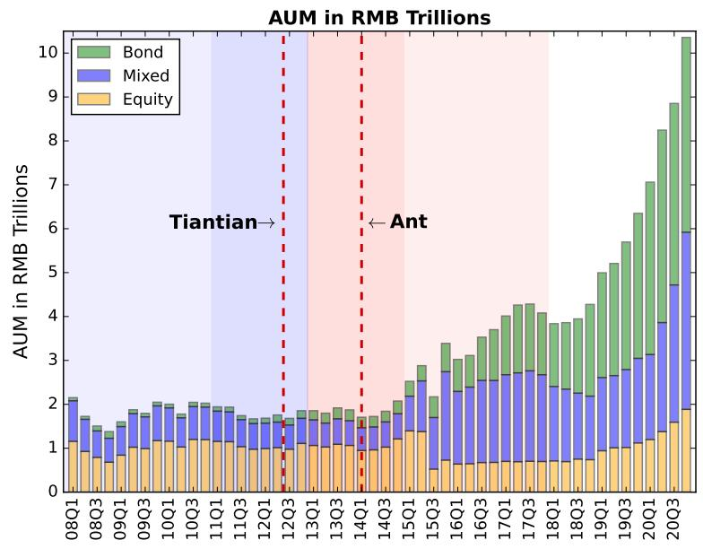  
Figure 1. Introduction of Platforms

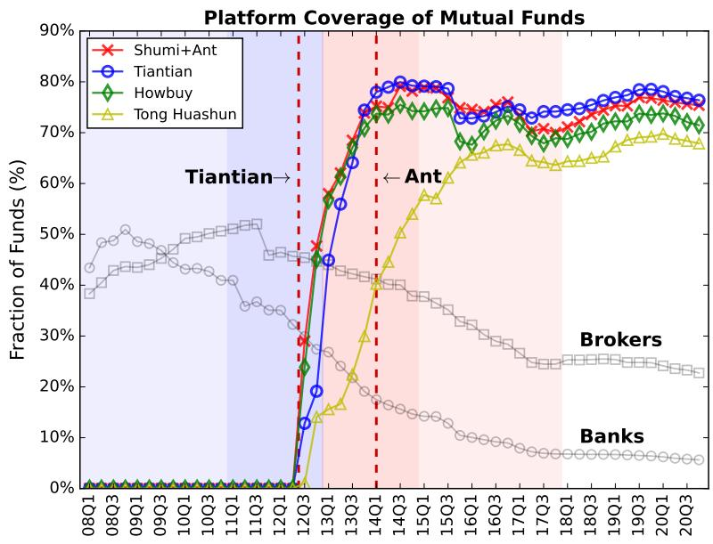

# -Performance Sensitivity, Before and After the Introductio

nds, U.S. equity funds, China mixed funds, and China bond fun The shaded area indicates the 95% confidence intervals. The four graphs show the average fund fl weighted average flow of all funds in that decile. Plotted on the graph is the decile flows averaged ove nning of each quarter t, we sort all funds into deciles based on their past 12-month cumulative raw re capital flow into the funds in each performance decile, for the period before (2008–2012) and after (201

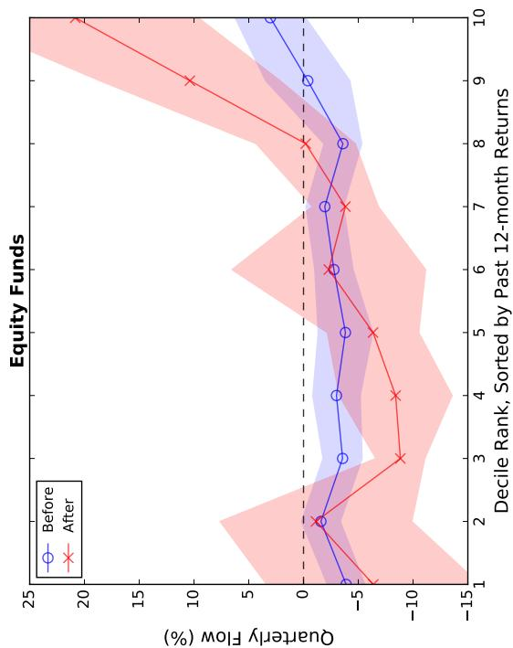

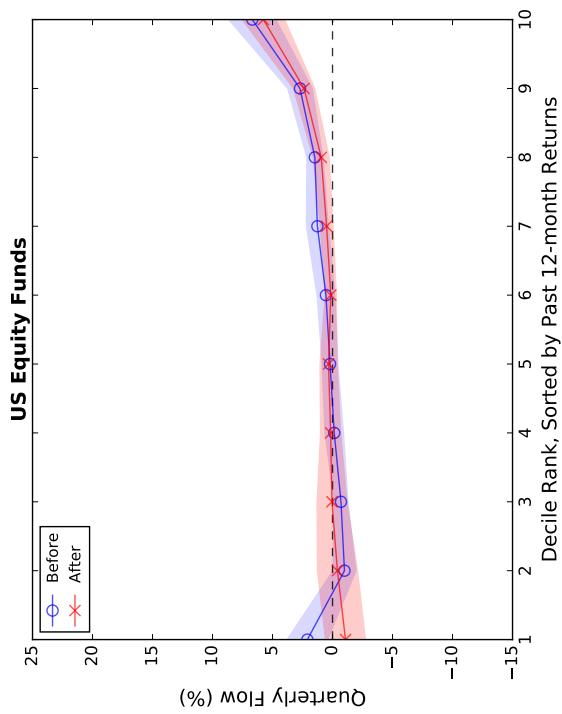

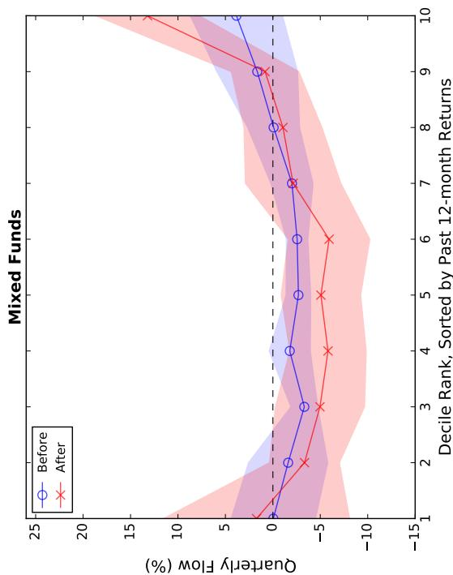

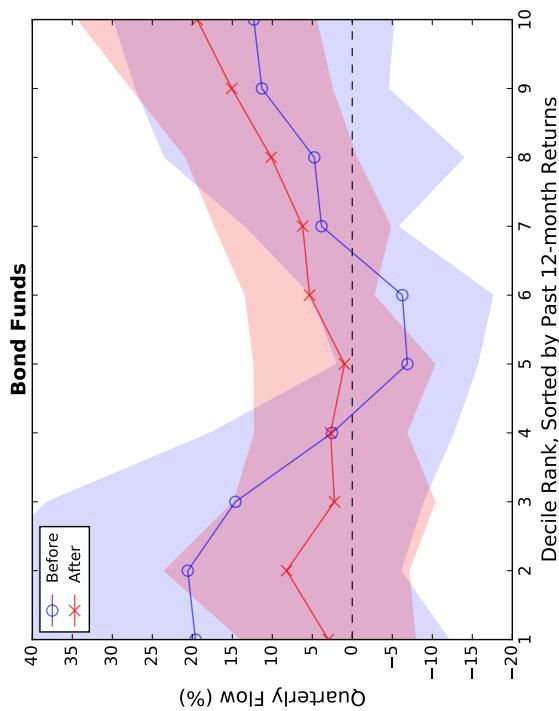

# Time-Series Variation of Flow-Performance

e panels correspond to actively managed China equity, U.S. equity, China mixed, and China b . The top decile contains the top 10% of funds with the highest past 12-month returns. The shade h “x” plots the value-weighted average flow of all deciles; The red line marked with “o” plots the diffe

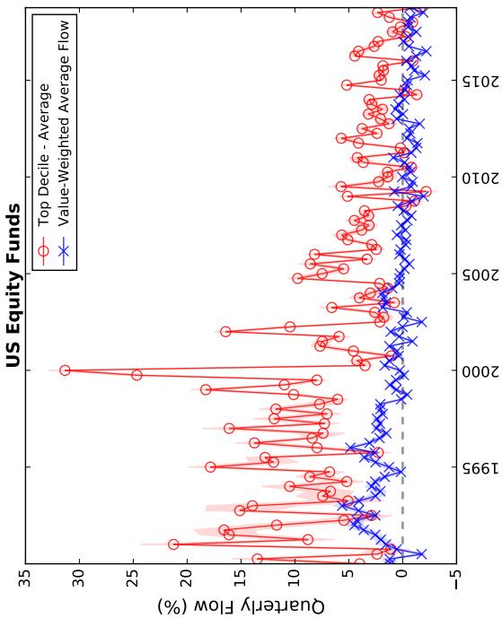

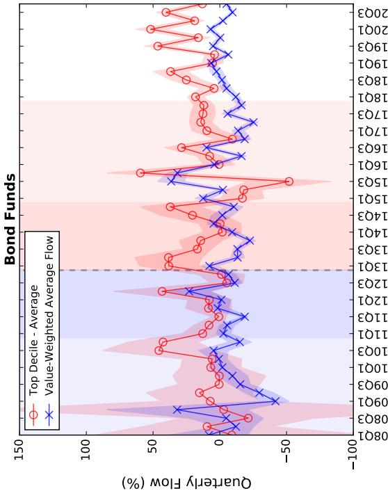

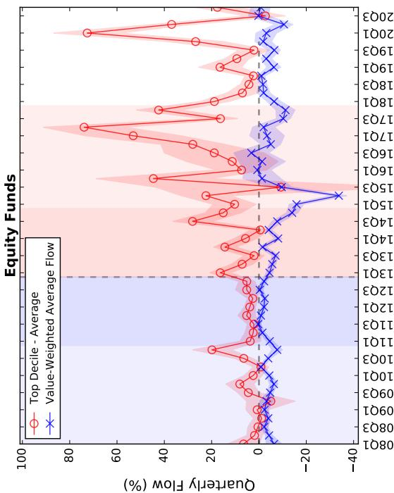

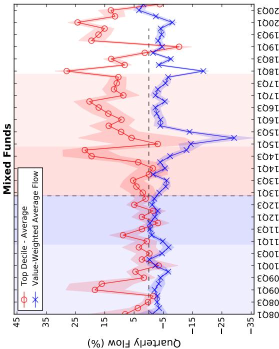

# rchase Fraction: The Whole Market versus Howb

fraction of decile 10 funds on the Howbuy platform and on the whole market is only available from 2015 to 2018. The shaded areas indicate the 95% confidence intervals. The low e period before (2008–2012) and after (2013–2017) the introduction of platforms. The dotted lines re o graphs present the market share of purchase for each de ded by the aggregate purchase amount across e return. In each quarter, market share of purchase for each decile is calculated as the total purchase nning of each quarter t, we sort funds into decil hows the market share of purchase for each performa

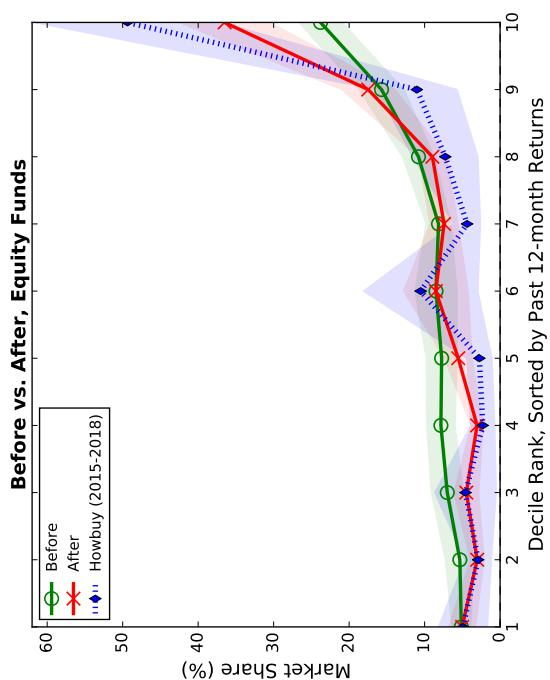

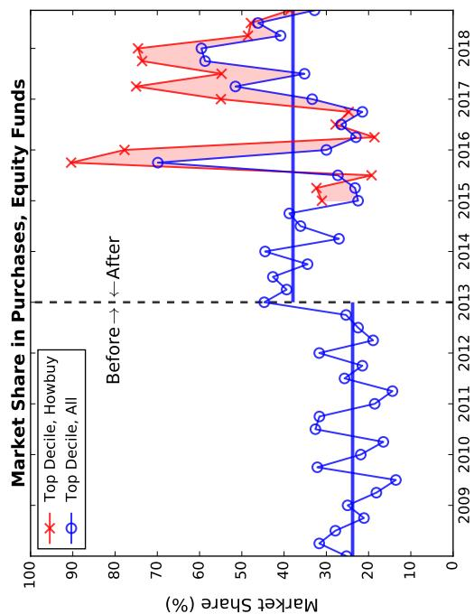

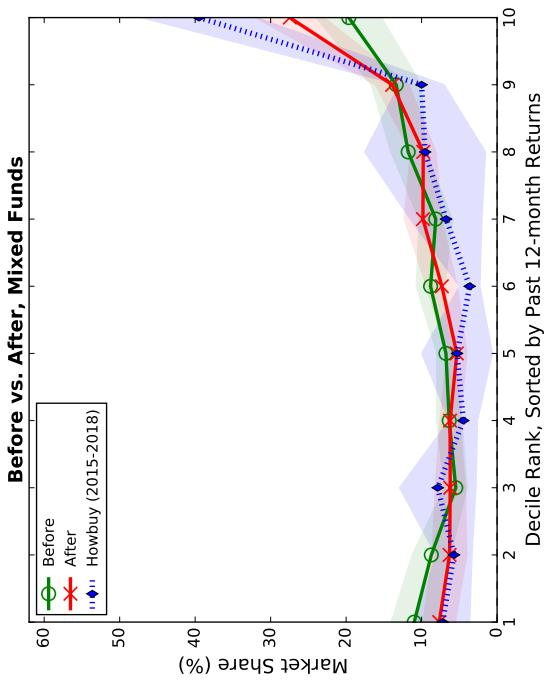

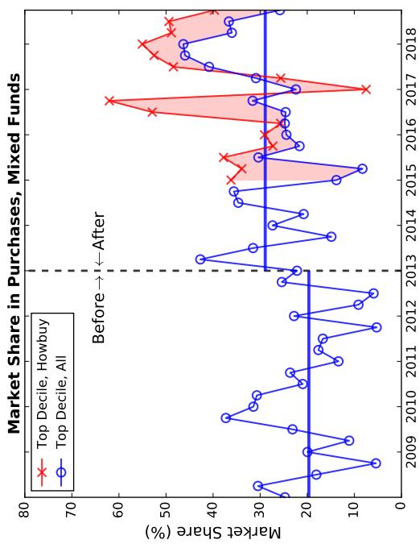

This figure reports the placebo tests on the coefficient estimates of staggered entrance onto platforms. For each quarter, we randomly reshuffle the value of the platform dummy across funds and meantime maintain its overall distribution. We then estimate the regression specification in column (4) and column (8) of Table 3 and save the coefficient estimates on the interaction term, Decile10 $\times$ Platform. We conduct the placebo analysis for 1,000 times. The upper and lower graphs show the distribution of the coefficient estimates for equity and mixed funds respectively. The red dotted line denote the actual estimates.

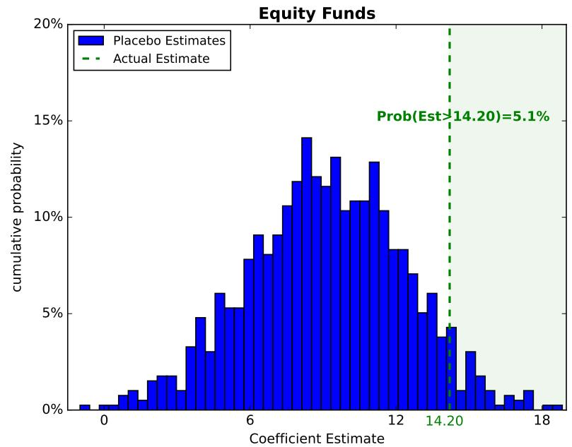  
Figure 5. Placebo Tests on Platform Entrance

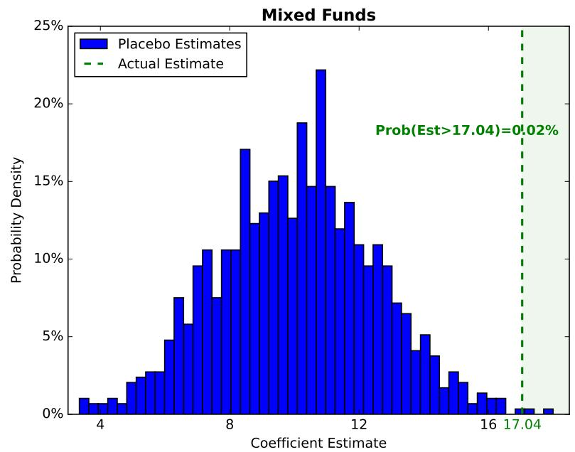

Figure 6. Front-Page Visibility and Flow-Performance Sensitivity

This figure shows the flows to the Top-X funds before and after a fund enters platforms. The flows to the Top-X funds are estimated in a regression setting similar to column (4) and column (8) in Table 4. The only difference is that we further divide the top 30 funds into 10 equal groups (Top 1–3, 4–6, etc.). Since the “Others” group is omitted in the regression estimation, the flows shall be interpreted as the additional flow benchmarking to the “Others” group. The upper panel reports the flows to the Top-X funds when they are off- and on-platforms respectively. The lower panel reports the on- and off-platform difference for each Top-X funds group, and the corresponding 95% confidence intervals.

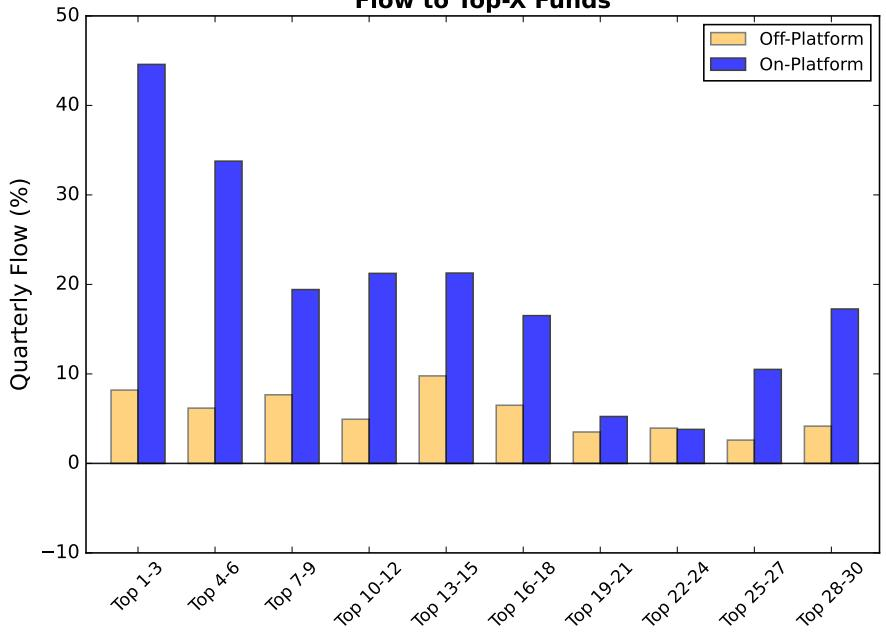  
Flow to Top-X Funds

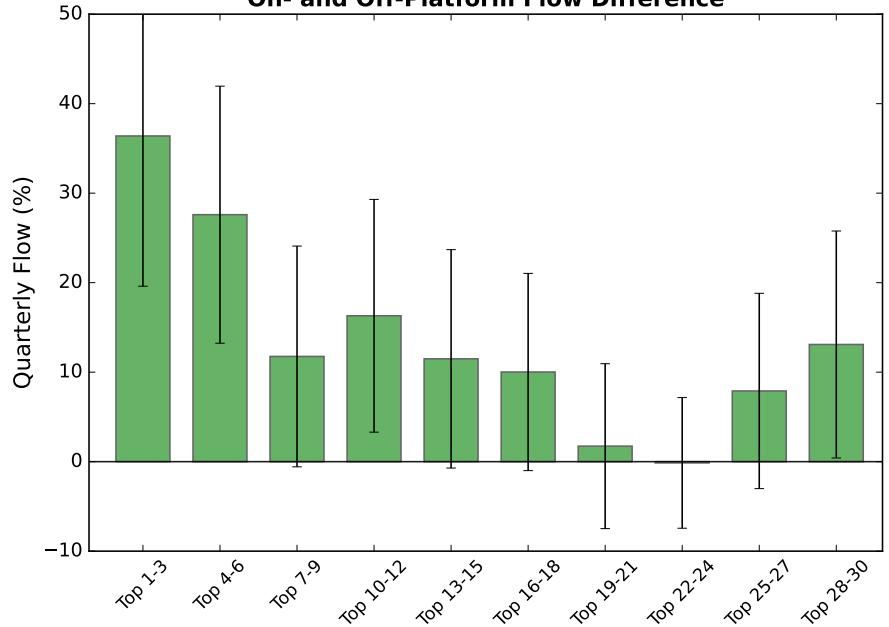  
On- and Off-Platform Flow Difference

# Table 1. Summary Statistics

Panel A shows the summary statistics of actively managed mutual funds year by year. For each fund style and year, we report the average number of unique funds ( $\#$ Funds), aggregate assets under managements (AUM) in billion-yuan, equally-weighted fund monthly returns (Ret), and standard deviation of fund monthly returns (STD), estimated using 12-month observations in the year. Panel B reports the summary statistics for the key variables in our sample. Log(Size) is the natural logarithm of fund’s total net assets (TNA) at each quarter end. Age is the number of months since a fund’s inception. Ret12m the cumulative fund return in the past twelve months. Flow is fund’s quarterly flow, calculated as $\frac { T N A _ { t } - T N A _ { t - 1 } ( 1 + R e t _ { t } ) } { T N A _ { t - 1 } }$ . Subscript $t$ indexes the quarter. Std Return is the standard deviation of fund returns in bps, estimated using daily observations within each quarter. The sample period is from 2008 through 2017.

Panel A. Size of Mutual Fund Industry, by Year   

<table><tr><td rowspan="2">Year</td><td colspan="4">Equity</td><td colspan="4">Mixed</td><td colspan="4">Bond</td></tr><tr><td>#Funds</td><td>AUM</td><td>Ret</td><td>STD</td><td>#Funds</td><td>AUM</td><td>Ret</td><td>STD</td><td>#Funds</td><td>AUM</td><td>Ret</td><td>STD</td></tr><tr><td>2008</td><td>52</td><td>270</td><td>-5.55%</td><td>8.75%</td><td>103</td><td>425</td><td>-4.58%</td><td>7.16%</td><td>25</td><td>70</td><td>0.47%</td><td>0.92%</td></tr><tr><td>2009</td><td>96</td><td>800</td><td>4.89%</td><td>8.60%</td><td>122</td><td>762</td><td>4.09%</td><td>7.41%</td><td>29</td><td>28</td><td>0.37%</td><td>1.33%</td></tr><tr><td>2010</td><td>131</td><td>770</td><td>0.23%</td><td>5.60%</td><td>136</td><td>698</td><td>0.43%</td><td>4.69%</td><td>68</td><td>63</td><td>0.55%</td><td>0.89%</td></tr><tr><td>2011</td><td>171</td><td>589</td><td>-2.24%</td><td>4.67%</td><td>158</td><td>528</td><td>-1.88%</td><td>4.03%</td><td>120</td><td>64</td><td>-0.25%</td><td>1.33%</td></tr><tr><td>2012</td><td>223</td><td>630</td><td>0.62%</td><td>5.89%</td><td>166</td><td>525</td><td>0.44%</td><td>4.93%</td><td>135</td><td>86</td><td>0.60%</td><td>0.85%</td></tr><tr><td>2013</td><td>285</td><td>669</td><td>1.31%</td><td>5.21%</td><td>187</td><td>519</td><td>1.08%</td><td>4.38%</td><td>192</td><td>78</td><td>0.03%</td><td>1.42%</td></tr><tr><td>2014</td><td>344</td><td>634</td><td>1.92%</td><td>3.47%</td><td>214</td><td>481</td><td>1.67%</td><td>2.80%</td><td>281</td><td>123</td><td>1.82%</td><td>1.52%</td></tr><tr><td>2015</td><td>362</td><td>640</td><td>3.54%</td><td>13.12%</td><td>612</td><td>964</td><td>3.06%</td><td>10.26%</td><td>413</td><td>371</td><td>0.91%</td><td>2.09%</td></tr><tr><td>2016</td><td>54</td><td>46</td><td>-0.50%</td><td>9.29%</td><td>734</td><td>873</td><td>-0.80%</td><td>7.71%</td><td>498</td><td>423</td><td>-0.10%</td><td>1.35%</td></tr><tr><td>2017</td><td>146</td><td>183</td><td>1.28%</td><td>2.72%</td><td>1,163</td><td>1436</td><td>0.98%</td><td>2.13%</td><td>458</td><td>233</td><td>0.10%</td><td>0.79%</td></tr><tr><td>2018</td><td>195</td><td>150</td><td>-2.43%</td><td>3.84%</td><td>1,686</td><td>1051</td><td>-1.58%</td><td>2.64%</td><td>764</td><td>648</td><td>0.15%</td><td>0.58%</td></tr><tr><td>2019</td><td>264</td><td>230</td><td>3.53%</td><td>4.93%</td><td>2,148</td><td>1440</td><td>2.54%</td><td>3.54%</td><td>1036</td><td>1380</td><td>0.60%</td><td>0.67%</td></tr><tr><td>2020</td><td>338</td><td>463</td><td>4.27%</td><td>6.22%</td><td>2,594</td><td>2715</td><td>3.11%</td><td>4.55%</td><td>1434</td><td>2226</td><td>0.42%</td><td>0.79%</td></tr></table>

Panel B. Summary Statistics   

<table><tr><td rowspan="6">Equity</td><td>Variable</td><td>N</td><td>Mean</td><td>Median</td><td>Q1</td><td>Q3</td><td>STD</td></tr><tr><td>Log(Size)</td><td>6,083</td><td>20.9</td><td>21.2</td><td>19.9</td><td>22.2</td><td>1.6</td></tr><tr><td>Age</td><td>6,083</td><td>54.6</td><td>49.0</td><td>34.0</td><td>70.0</td><td>24.6</td></tr><tr><td>Ret12m</td><td>6,083</td><td>11.0%</td><td>7.2%</td><td>-6.2%</td><td>22.1%</td><td>28.8%</td></tr><tr><td>Flow</td><td>6,083</td><td>-2.9%</td><td>-4.1%</td><td>-11.5%</td><td>-0.8%</td><td>27.6%</td></tr><tr><td>Std Return</td><td>6,083</td><td>140.6</td><td>128.6</td><td>105.3</td><td>156.9</td><td>53.6</td></tr><tr><td rowspan="6">Mixed</td><td>Variable</td><td>N</td><td>Mean</td><td>Median</td><td>Q1</td><td>Q3</td><td>STD</td></tr><tr><td>Log(Size)</td><td>12,246</td><td>20.5</td><td>20.8</td><td>19.4</td><td>21.8</td><td>1.6</td></tr><tr><td>Age</td><td>12,246</td><td>75.7</td><td>70.0</td><td>43.0</td><td>104.0</td><td>38.2</td></tr><tr><td>Ret12m</td><td>12,246</td><td>11.1%</td><td>5.8%</td><td>-5.4%</td><td>19.5%</td><td>29.6%</td></tr><tr><td>Flow</td><td>12,246</td><td>-0.7%</td><td>-3.6%</td><td>-9.3%</td><td>-0.6%</td><td>36.6%</td></tr><tr><td>Std Return</td><td>12,246</td><td>118.4</td><td>100.4</td><td>72.4</td><td>144.0</td><td>73.9</td></tr><tr><td rowspan="6">Bond</td><td>Variable</td><td>N</td><td>Mean</td><td>Median</td><td>Q1</td><td>Q3</td><td>STD</td></tr><tr><td>Log(Size)</td><td>7,149</td><td>19.3</td><td>19.4</td><td>18.1</td><td>20.5</td><td>1.6</td></tr><tr><td>Age</td><td>7,149</td><td>58.2</td><td>51.0</td><td>36.0</td><td>74.0</td><td>28.2</td></tr><tr><td>Ret12m</td><td>7,149</td><td>7.1%</td><td>5.0%</td><td>0.8%</td><td>9.9%</td><td>13.8%</td></tr><tr><td>Flow</td><td>7,149</td><td>8.3%</td><td>-6.9%</td><td>-21.5%</td><td>6.2%</td><td>74.1%</td></tr><tr><td>Std Return</td><td>7,149</td><td>28.2</td><td>18.1</td><td>10.7</td><td>33.9</td><td>27.5</td></tr></table>

# Table 2. Pre- and Post-Platform Flow-Performance Sensitivity

Panel A reports the average flow into each performance decile of funds, before and after the introduction of platforms. At each quarter end and for each style category, we sort all funds into deciles based on their past 12-month cumulative raw return. We then compute the average next-quarter flow for each decile group, and average the flow quarter by quarter for the five-year sample before (2008–2012) and after (2013– 2017) the introduction of platforms. “After-Before” denotes the post- and pre-platform flow difference, with the corresponding $t$ -statistics reported in parentheses. Panel B reports the purchase fractions for each performance decile in a top FinTech platform – Howbuy, during the sample period from 2015 through 2018. For each quarter, the fraction of purchase for each decile group is computed as the amount of purchase of all funds in that decile divided by the total amount of purchase. The same-period purchase fraction for the whole market (“Market-Wide”) is computed following the same methodology. “Difference” reports the average purchase fraction difference between Howbuy and the whole market, with $t$ -statistics reported in parentheses.

Panel A. Market-Wide Impact, Fund Quarterly Flow (in $\%$   

<table><tr><td colspan="2"></td><td>Decile 1 (Bottom)</td><td>2</td><td>3</td><td>4</td><td>5</td><td>6</td><td>7</td><td>8</td><td>9</td><td>Decile 10 (Top)</td></tr><tr><td rowspan="4">Equity</td><td>Before</td><td>-3.89</td><td>-1.58</td><td>-3.57</td><td>-3.01</td><td>-3.83</td><td>-2.77</td><td>-1.94</td><td>-3.60</td><td>-0.39</td><td>3.03</td></tr><tr><td>After</td><td>-6.37</td><td>-1.13</td><td>-8.84</td><td>-8.41</td><td>-6.35</td><td>-2.31</td><td>-3.82</td><td>-0.20</td><td>10.38</td><td>20.84</td></tr><tr><td rowspan="2">After-Before</td><td>-2.48</td><td>0.45</td><td>-5.27</td><td>-5.40</td><td>-2.52</td><td>0.46</td><td>-1.88</td><td>3.40</td><td>10.77</td><td>17.81</td></tr><tr><td>(-0.53)</td><td>(0.11)</td><td>(-3.86)</td><td>(-2.02)</td><td>(-1.09)</td><td>(0.11)</td><td>(-1.14)</td><td>(1.47)</td><td>(2.48)</td><td>(3.19)</td></tr><tr><td rowspan="4">Mixed</td><td>Before</td><td>-0.05</td><td>-1.61</td><td>-3.32</td><td>-1.78</td><td>-2.7</td><td>-2.56</td><td>-2.02</td><td>-0.08</td><td>1.64</td><td>3.84</td></tr><tr><td>After</td><td>1.72</td><td>-3.34</td><td>-4.97</td><td>-5.81</td><td>-5.06</td><td>-5.93</td><td>-2.14</td><td>-1.07</td><td>0.82</td><td>13.21</td></tr><tr><td rowspan="2">Difference</td><td>1.77</td><td>-1.73</td><td>-1.65</td><td>-4.03</td><td>-2.36</td><td>-3.37</td><td>-0.12</td><td>-0.99</td><td>-0.82</td><td>9.37</td></tr><tr><td>(0.34)</td><td>(-0.65)</td><td>(-0.7)</td><td>(-1.84)</td><td>(-1.13)</td><td>(-1.59)</td><td>(-0.05)</td><td>(-0.42)</td><td>(-0.31)</td><td>(2.69)</td></tr><tr><td rowspan="4">Bond</td><td>Before</td><td>19.6</td><td>20.56</td><td>14.61</td><td>2.53</td><td>-6.89</td><td>-6.26</td><td>3.84</td><td>4.75</td><td>11.3</td><td>12.31</td></tr><tr><td>After</td><td>2.99</td><td>8.21</td><td>2.22</td><td>2.71</td><td>0.97</td><td>5.33</td><td>6.20</td><td>10.13</td><td>15.06</td><td>19.39</td></tr><tr><td rowspan="2">Difference</td><td>-16.61</td><td>-12.35</td><td>-12.39</td><td>0.18</td><td>7.86</td><td>11.59</td><td>2.36</td><td>5.38</td><td>3.76</td><td>7.08</td></tr><tr><td>(-1.04)</td><td>(-0.84)</td><td>(-0.97)</td><td>(0.02)</td><td>(1.15)</td><td>(1.75)</td><td>(0.34)</td><td>(0.52)</td><td>(0.39)</td><td>(0.65)</td></tr></table>

Panel B. Direct Evidence from Howbuy, Purchase Fraction (in %)   

<table><tr><td colspan="2"></td><td>Decile 1 (Bottom)</td><td>2</td><td>3</td><td>4</td><td>5</td><td>6</td><td>7</td><td>8</td><td>9</td><td>Decile 10 (Top)</td></tr><tr><td rowspan="4">Equity</td><td>Market-Wide</td><td>4.60</td><td>3.56</td><td>5.08</td><td>2.79</td><td>4.89</td><td>9.01</td><td>7.65</td><td>8.61</td><td>16.19</td><td>37.61</td></tr><tr><td>Howbuy</td><td>4.92</td><td>2.91</td><td>4.58</td><td>2.29</td><td>2.75</td><td>10.52</td><td>4.37</td><td>7.26</td><td>11.02</td><td>49.37</td></tr><tr><td rowspan="2">Difference</td><td>0.32</td><td>-0.65</td><td>-0.50</td><td>-0.50</td><td>-2.14</td><td>1.51</td><td>-3.27</td><td>-1.35</td><td>-5.17</td><td>11.76</td></tr><tr><td>(0.19)</td><td>(-0.63)</td><td>(-0.23)</td><td>(-0.58)</td><td>(-1.73)</td><td>(0.35)</td><td>(-2.52)</td><td>(-0.59)</td><td>(-1.60)</td><td>(1.69)</td></tr><tr><td rowspan="4">Mixed</td><td>Market-Wide</td><td>8.59</td><td>7.39</td><td>7.00</td><td>6.05</td><td>5.82</td><td>6.14</td><td>7.32</td><td>9.86</td><td>12.80</td><td>29.02</td></tr><tr><td>Howbuy</td><td>7.22</td><td>5.72</td><td>7.87</td><td>4.47</td><td>5.30</td><td>3.64</td><td>6.76</td><td>9.54</td><td>10.00</td><td>39.50</td></tr><tr><td rowspan="2">Difference</td><td>-1.38</td><td>-1.68</td><td>0.87</td><td>-1.58</td><td>-0.52</td><td>-2.51</td><td>-0.56</td><td>-0.32</td><td>-2.80</td><td>10.47</td></tr><tr><td>(-0.66)</td><td>(-1.11)</td><td>(0.33)</td><td>(-1.40)</td><td>(-0.23)</td><td>(-2.21)</td><td>(-0.24)</td><td>(-0.08)</td><td>(-1.42)</td><td>(2.35)</td></tr><tr><td rowspan="4">Bond</td><td>Market-Wide</td><td>6.07</td><td>8.35</td><td>7.56</td><td>9.43</td><td>9.00</td><td>7.86</td><td>10.32</td><td>12.41</td><td>11.28</td><td>17.72</td></tr><tr><td>Howbuy</td><td>2.82</td><td>8.00</td><td>8.19</td><td>7.64</td><td>9.71</td><td>2.87</td><td>10.16</td><td>17.03</td><td>8.82</td><td>24.76</td></tr><tr><td rowspan="2">Difference</td><td>-3.25</td><td>-0.35</td><td>0.62</td><td>-1.78</td><td>0.71</td><td>-4.99</td><td>-0.16</td><td>4.62</td><td>-2.45</td><td>7.04</td></tr><tr><td>(-2.39)</td><td>(-0.12)</td><td>(0.19)</td><td>(-0.62)</td><td>(0.21)</td><td>(-5.83)</td><td>(-0.04)</td><td>(0.91)</td><td>(-0.97)</td><td>(1.21)</td></tr></table>

# Table 3. Staggered Entrance onto Platform and Flow-Performance Sensitivity

This table examines the flow-performance sensitivity utilizing the staggered entrance of funds onto platforms. The model specification is as follow:

$$
\mathrm {F l o w} _ {i, t} = \alpha + \beta_ {1} \cdot \mathrm {D e c i l e 1 0} _ {i, t - 1} + \beta_ {2} \cdot \mathrm {P l a t f o r m} _ {i, t} + \beta_ {3} \cdot \mathrm {D e c i l e 1 0} _ {i, t - 1} \times \mathrm {P l a t f o r m} _ {i, t} + \sum_ {j} \gamma_ {j} \cdot \mathrm {C o n t r o l} _ {i, t - 1} ^ {j} + \varepsilon_ {i, t},
$$

where $\mathrm { F l o w } _ { i , t }$ is fund $_ i$ ’s flow in quarter $t$ . Decile10i,t−1 is a dummy that equals one if fund $_ i$ belongs to the $^ { i , t }$ top performance decile based on the 12-month cumulative return up to the end of quarter $t - 1$ , and zero otherwise. Platform is a dummy that equals one if fund $i$ is available for sale as of the beginning of quarter $^ { \cdot i , t }$ $t$ through the two major platforms: Ant Financial and Tiantian. We control for $\mathrm { L o g } ( \mathrm { S i z e } ) _ { i , t - 1 }$ , the natural logarithm of funds TNA at the end of quarter $t - 1$ , $\mathrm { L o g ( A g e ) } _ { i , t - 1 }$ , the natural logarithm of the number of months since fund inception at quarter $t - 1$ , and $\mathrm { F l o w } _ { t - 1 }$ $t - 1$ , the fund flow in the previous quarter. We conduct the analyses separately for equity and mixed funds. “[-2,2]” denotes the results estimated using a narrow window in the two years before (2011–2012) and two years after (2013–2014) platform introduction. “[-5,5]” denotes the long-window results estimated using the five years before (2008–2012) and five years after (2013–2017) platform introduction. Time fixed effects and fund fixed effects are included as indicated. Standard errors are double-clustered at the time level and fund level. $t$ -statistics are reported in parentheses. *, $^ { * * }$ , and $^ { \ast \ast \ast }$ denote significance at the 10%, 5% and 1% levels, respectively.

Dep.Var.: Fund Quarterly Flow (in $\%$ )   

<table><tr><td rowspan="3"></td><td colspan="4">Equity</td><td colspan="4">Mixed</td></tr><tr><td colspan="2">[-2,2]</td><td colspan="2">[-5,5]</td><td colspan="2">[-2,2]</td><td colspan="2">[-5,5]</td></tr><tr><td>(1)</td><td>(2)</td><td>(3)</td><td>(4)</td><td>(5)</td><td>(6)</td><td>(7)</td><td>(8)</td></tr><tr><td rowspan="2">Decile10</td><td>6.733***</td><td>6.806***</td><td>6.408***</td><td>6.620***</td><td>4.601**</td><td>3.823</td><td>6.010***</td><td>2.217</td></tr><tr><td>(4.23)</td><td>(3.72)</td><td>(3.87)</td><td>(3.50)</td><td>(2.21)</td><td>(1.34)</td><td>(3.15)</td><td>(1.07)</td></tr><tr><td rowspan="2">Platform</td><td>-1.658</td><td>-0.157</td><td>-1.298</td><td>-1.549</td><td>-0.218</td><td>-1.398</td><td>-0.181</td><td>-3.078*</td></tr><tr><td>(-1.23)</td><td>(-0.13)</td><td>(-0.84)</td><td>(-1.19)</td><td>(-0.19)</td><td>(-0.87)</td><td>(-0.10)</td><td>(-1.83)</td></tr><tr><td rowspan="2">Decile10×Platform</td><td>10.531**</td><td>16.324***</td><td>12.159***</td><td>14.203***</td><td>11.794**</td><td>13.947**</td><td>14.432***</td><td>17.043***</td></tr><tr><td>(2.46)</td><td>(3.33)</td><td>(3.07)</td><td>(3.40)</td><td>(2.40)</td><td>(2.39)</td><td>(5.33)</td><td>(5.72)</td></tr><tr><td rowspan="2">Log(Size)</td><td>-2.411**</td><td>-16.979***</td><td>-3.065***</td><td>-16.087***</td><td>-2.615***</td><td>-8.210***</td><td>-4.282***</td><td>-19.508***</td></tr><tr><td>(-2.46)</td><td>(-5.63)</td><td>(-4.51)</td><td>(-6.72)</td><td>(-4.36)</td><td>(-4.03)</td><td>(-8.25)</td><td>(-9.23)</td></tr><tr><td rowspan="2">Log(Age)</td><td>3.999***</td><td>-0.825</td><td>0.451</td><td>6.538</td><td>3.060***</td><td>12.361</td><td>2.531*</td><td>-2.657</td></tr><tr><td>(4.22)</td><td>(-0.15)</td><td>(0.24)</td><td>(1.04)</td><td>(3.77)</td><td>(1.38)</td><td>(1.95)</td><td>(-0.47)</td></tr><tr><td rowspan="2">Flowt-1</td><td>0.166***</td><td>0.111*</td><td>0.135***</td><td>0.078</td><td>0.035</td><td>-0.024</td><td>0.014</td><td>0.006</td></tr><tr><td>(3.63)</td><td>(2.10)</td><td>(3.65)</td><td>(1.54)</td><td>(1.15)</td><td>(-1.25)</td><td>(0.43)</td><td>(0.21)</td></tr><tr><td>Time FE</td><td>Y</td><td>Y</td><td>Y</td><td>Y</td><td>Y</td><td>Y</td><td>Y</td><td>Y</td></tr><tr><td>Fund FE</td><td>N</td><td>Y</td><td>N</td><td>Y</td><td>N</td><td>Y</td><td>N</td><td>Y</td></tr><tr><td>Observations</td><td>3,758</td><td>3,758</td><td>6,083</td><td>6,083</td><td>2,752</td><td>2,752</td><td>12,246</td><td>12,246</td></tr><tr><td>R-squared</td><td>0.094</td><td>0.287</td><td>0.097</td><td>0.258</td><td>0.060</td><td>0.193</td><td>0.060</td><td>0.207</td></tr></table>

# Table 4. Post-Platform Performance Chasing and Closeness to the Front Page

This table estimates the sensitivity of flow to funds’ past performance ranking, conditional on fund’s closeness to the front page. In particular, following the specification in Table 3, we replace the Decile10 dummy with “Top-X” dummies (Top 10, Top 11–30, and Top 31–50), to capture funds’ closeness to the front page. “Top 10” is a dummy variable that equals one for the top-10 ranked funds within each style category, and “Top 11–30” for top 11 to 30, “Top 31–50” for top 31 to 50, and the rest ranked below 50. The group of funds ranked below 50 is omitted because of multicollinearity. Platform $^ { i , t }$ , and the interaction terms between “Top-X” dummies and the Platform dummy are also included. We control for last quarter-end fund Log(Size), Log(Age), Flow in all the specifications. Time fixed effects and fund fixed effects are included as indicated. The sample is from 2008 through 2017. Standard errors are double-clustered at the time level and fund level. $t$ -statistics are reported in parentheses. *, $^ { * * }$ , and $^ { * * * }$ denote significance at the 10%, 5% and 1% levels, respectively.

Dep.Var.: Fund Quarterly Flow (in $\%$ )   

<table><tr><td rowspan="3"></td><td colspan="4">Equity</td><td colspan="4">Mixed</td></tr><tr><td colspan="2">[-2,2]</td><td colspan="2">[-5,5]</td><td colspan="2">[-2,2]</td><td colspan="2">[-5,5]</td></tr><tr><td>(1)</td><td>(2)</td><td>(3)</td><td>(4)</td><td>(5)</td><td>(6)</td><td>(7)</td><td>(8)</td></tr><tr><td rowspan="2">Top10</td><td>7.624**</td><td>8.624**</td><td>6.297***</td><td>6.835***</td><td>1.539</td><td>1.705</td><td>5.272**</td><td>1.481</td></tr><tr><td>(2.60)</td><td>(2.95)</td><td>(3.13)</td><td>(3.00)</td><td>(0.60)</td><td>(0.48)</td><td>(2.25)</td><td>(0.53)</td></tr><tr><td rowspan="2">Top11-30</td><td>3.550**</td><td>4.569**</td><td>4.136**</td><td>4.672**</td><td>6.461***</td><td>6.109***</td><td>4.379***</td><td>2.876**</td></tr><tr><td>(2.18)</td><td>(2.32)</td><td>(2.21)</td><td>(2.28)</td><td>(3.57)</td><td>(3.25)</td><td>(4.07)</td><td>(2.28)</td></tr><tr><td rowspan="2">Top31-50</td><td>2.355</td><td>2.104**</td><td>1.112</td><td>1.298</td><td>0.414</td><td>0.647</td><td>1.304</td><td>0.238</td></tr><tr><td>(1.37)</td><td>(2.18)</td><td>(1.04)</td><td>(1.30)</td><td>(0.33)</td><td>(0.43)</td><td>(1.21)</td><td>(0.23)</td></tr><tr><td rowspan="2">Platform</td><td>-2.929*</td><td>-1.992</td><td>-3.333**</td><td>-3.162**</td><td>-0.565</td><td>-2.288</td><td>-0.963</td><td>-5.146***</td></tr><tr><td>(-1.86)</td><td>(-1.42)</td><td>(-2.04)</td><td>(-2.20)</td><td>(-0.51)</td><td>(-1.44)</td><td>(-0.48)</td><td>(-2.76)</td></tr><tr><td rowspan="2">Top10×Platform</td><td>17.970**</td><td>28.190***</td><td>25.684***</td><td>30.004***</td><td>21.587***</td><td>24.503***</td><td>27.366***</td><td>32.091***</td></tr><tr><td>(2.75)</td><td>(3.02)</td><td>(4.53)</td><td>(5.30)</td><td>(3.06)</td><td>(2.98)</td><td>(4.71)</td><td>(5.63)</td></tr><tr><td rowspan="2">Top11-30×Platform</td><td>10.251**</td><td>15.811***</td><td>9.046**</td><td>12.241***</td><td>0.315</td><td>2.599</td><td>12.620***</td><td>12.349***</td></tr><tr><td>(2.35)</td><td>(3.97)</td><td>(2.68)</td><td>(3.61)</td><td>(0.08)</td><td>(0.60)</td><td>(2.93)</td><td>(3.25)</td></tr><tr><td rowspan="2">Top31-50×Platform</td><td>9.214**</td><td>12.975***</td><td>8.170***</td><td>9.178***</td><td>2.669</td><td>3.203</td><td>8.020**</td><td>8.072**</td></tr><tr><td>(2.66)</td><td>(3.47)</td><td>(2.96)</td><td>(3.27)</td><td>(1.17)</td><td>(1.06)</td><td>(2.55)</td><td>(2.60)</td></tr><tr><td>Controls</td><td>Y</td><td>Y</td><td>Y</td><td>Y</td><td>Y</td><td>Y</td><td>Y</td><td>Y</td></tr><tr><td>Time FE</td><td>Y</td><td>Y</td><td>Y</td><td>Y</td><td>Y</td><td>Y</td><td>Y</td><td>Y</td></tr><tr><td>Fund FE</td><td>N</td><td>Y</td><td>N</td><td>Y</td><td>N</td><td>Y</td><td>N</td><td>Y</td></tr><tr><td>Observations</td><td>3,758</td><td>3,758</td><td>6,083</td><td>6,083</td><td>2,752</td><td>2,752</td><td>12,246</td><td>12,246</td></tr><tr><td>R-squared</td><td>0.104</td><td>0.303</td><td>0.110</td><td>0.271</td><td>0.069</td><td>0.201</td><td>0.057</td><td>0.206</td></tr></table>

# Table 5. Retail vs. Institutional Investors

This table examines the post-platform performance chasing, conditional on the presence of retail investors. Columns (1) to (4) conduct the analyses for equity funds. Following the specification in Table 4, in columns (1) and (2), we divide the sample into halves based on the contemporaneous quarter change in the number of investors holding the fund and then repeat the analysis. In column (3) and (4), we decompose a fund’s qurterly flow (dependent variable) into retail flow and institutional flow. In particular, retail flow is calculated as $\frac { T N A _ { t } * R e t a i l R a t i o _ { t } - T N A _ { t - 1 } * R e t a i l R a t i o _ { t - 1 } ( 1 + R e t _ { t } ) } { T N A _ { t - 1 } }$ $T N A _ { t - 1 }$ . The independent variables are similarly defined as in Table 4, where “Top-X” dummies (Top 10, Top 11–30, and Top 31–50) capture funds’ closeness to the front page. Platform is a dummy that equals one if fund $i$ is available for sale at the platforms as of the $^ { i , t }$ beginning of quarter $t$ . We further control for fund’s Log(Size), Log(Age), Flow in quarter $t - 1$ , and time fixed effects. Similarly, columns (5) to (8) report the estimates for mixed funds. The sample period is from 2008 through 2017. Standard errors are double-clustered at the fund and time level. $t$ -statistics are reported in parentheses. *, **, and $\ast \ast \ast$ denote significance at the 10%, 5% and 1% levels, respectively.

<table><tr><td rowspan="4"></td><td colspan="4">Change in Number of Retail Investors</td><td colspan="4">Retail vs. Institution Flow</td></tr><tr><td colspan="2">Equity</td><td colspan="2">Mixed</td><td colspan="2">Equity</td><td colspan="2">Mixed</td></tr><tr><td>High</td><td>Low</td><td>High</td><td>Low</td><td>Retail</td><td>Inst.</td><td>Retail</td><td>Inst.</td></tr><tr><td>(1)</td><td>(2)</td><td>(3)</td><td>(4)</td><td>(5)</td><td>(6)</td><td>(7)</td><td>(8)</td></tr><tr><td>Top10</td><td>9.617***(3.55)</td><td>-0.142(-0.07)</td><td>4.344(1.32)</td><td>0.069(0.03)</td><td>3.305**(2.15)</td><td>3.303***(3.29)</td><td>4.036**(2.38)</td><td>0.963(1.38)</td></tr><tr><td>Top11–30</td><td>5.617**(2.11)</td><td>1.844*(1.69)</td><td>5.548**(2.56)</td><td>0.066(0.07)</td><td>0.695(0.55)</td><td>3.277***(4.65)</td><td>1.655***(3.11)</td><td>2.277***(3.37)</td></tr><tr><td>Top31–50</td><td>1.663(0.98)</td><td>0.178(0.25)</td><td>0.616(0.32)</td><td>0.43(0.71)</td><td>0.389(0.61)</td><td>0.801(1.64)</td><td>0.554(0.85)</td><td>0.639(1.53)</td></tr><tr><td>Platform</td><td>-6.052**(-2.35)</td><td>0.655(0.57)</td><td>-6.146*(-1.81)</td><td>-1.985*(-1.81)</td><td>-2.320**(-2.03)</td><td>-0.267(-0.50)</td><td>-1.244(-1.34)</td><td>0.709(1.11)</td></tr><tr><td>Top10× Platform</td><td>35.838***(5.53)</td><td>10.023(1.59)</td><td>34.488***(4.77)</td><td>2.478(0.77)</td><td>20.753***(4.96)</td><td>6.497***(3.02)</td><td>16.185***(5.01)</td><td>6.529**(2.22)</td></tr><tr><td>Top11–30× Platform</td><td>13.338***(2.91)</td><td>5.021*(1.72)</td><td>12.141**(2.21)</td><td>2.853(1.14)</td><td>8.937***(3.76)</td><td>2.162(1.51)</td><td>6.590***(3.19)</td><td>4.083**(2.59)</td></tr><tr><td>Top31–50× Platform</td><td>13.998***(3.57)</td><td>2.659(1.66)</td><td>9.088**(2.15)</td><td>1.476(0.67)</td><td>5.250***(3.03)</td><td>3.003**(2.34)</td><td>3.438***(2.87)</td><td>4.517***(2.92)</td></tr><tr><td>Time FE</td><td>Y</td><td>Y</td><td>Y</td><td>Y</td><td>Y</td><td>Y</td><td>Y</td><td>Y</td></tr><tr><td>Observations</td><td>2,993</td><td>2,970</td><td>5,978</td><td>6,006</td><td>6,057</td><td>6,057</td><td>12,229</td><td>12,229</td></tr><tr><td>R-squared</td><td>0.303</td><td>0.498</td><td>0.235</td><td>0.374</td><td>0.278</td><td>0.226</td><td>0.097</td><td>0.051</td></tr></table>

# Table 6. Platform Ranking vs. Intra-Family Ranking

This table reports the sensitivity of flow to funds’ platform performance ranking and intra-family performance ranking. We follow similar model specification as in Table 3. Platform ranking is captured by Decile10i, $t - 1$ , which is defined using funds’ past 12-month returns up to the end of quarter $t - 1$ . Intra-family rankings is captured by FMQuintile5, a dummy variable that equals one if the fund’s past 12-month return ranks among the highest quintile group across that of all funds within its family, and zero otherwise. We include as controls fund Log(Size), Log(Age), and Flow measured at the end of quarter $t - 1$ . Time fixed effects and fund fixed effects are included in all the specifications. The sample is from 2008 through 2017. Standard errors are double-clustered at the time and fund level. $t$ -statistics are reported in parentheses. $^ *$ , $^ { * * }$ , and $^ { \ast \ast \ast }$ denote significance at the 10%, 5% and 1% levels, respectively.

<table><tr><td rowspan="2"></td><td colspan="3">Equity</td><td colspan="3">Mixed</td></tr><tr><td>(1)</td><td>(2)</td><td>(3)</td><td>(4)</td><td>(5)</td><td>(6)</td></tr><tr><td rowspan="2">FMQuintile5</td><td>4.314**</td><td></td><td>2.962*</td><td>3.649**</td><td></td><td>3.124*</td></tr><tr><td>(2.58)</td><td></td><td>(1.87)</td><td>(2.38)</td><td></td><td>(1.87)</td></tr><tr><td rowspan="2">FMQuintile5×Platform</td><td>2.388</td><td></td><td>-1.668</td><td>6.352**</td><td></td><td>1.428</td></tr><tr><td>(0.62)</td><td></td><td>(-0.43)</td><td>(2.63)</td><td></td><td>(0.60)</td></tr><tr><td rowspan="2">Decile10</td><td></td><td>6.457***</td><td>5.394***</td><td></td><td>2.353</td><td>1.158</td></tr><tr><td></td><td>(3.45)</td><td>(2.94)</td><td></td><td>(1.03)</td><td>(0.48)</td></tr><tr><td rowspan="2">Decile10×Platform</td><td></td><td>14.761***</td><td>15.350***</td><td></td><td>16.779***</td><td>15.632***</td></tr><tr><td></td><td>(3.51)</td><td>(3.77)</td><td></td><td>(5.30)</td><td>(4.85)</td></tr><tr><td rowspan="2">Platform</td><td>-0.128</td><td>-1.51</td><td>-1.21</td><td>-2.467</td><td>-3.631*</td><td>-3.587*</td></tr><tr><td>(-0.09)</td><td>(-1.07)</td><td>(-0.87)</td><td>(-1.28)</td><td>(-1.91)</td><td>(-1.87)</td></tr><tr><td rowspan="2">Log(Age)</td><td>9.016</td><td>8.528</td><td>8.456</td><td>-4.053</td><td>-3.851</td><td>-3.804</td></tr><tr><td>(1.31)</td><td>(1.22)</td><td>(1.21)</td><td>(-0.69)</td><td>(-0.67)</td><td>(-0.66)</td></tr><tr><td rowspan="2">Log(Size)</td><td>-14.324***</td><td>-15.904***</td><td>-15.968***</td><td>-18.877***</td><td>-19.466***</td><td>-19.577***</td></tr><tr><td>(-5.85)</td><td>(-6.67)</td><td>(-6.64)</td><td>(-8.31)</td><td>(-8.52)</td><td>(-8.53)</td></tr><tr><td rowspan="2">Past Flow</td><td>0.093*</td><td>0.066</td><td>0.066</td><td>0.015</td><td>0.011</td><td>0.011</td></tr><tr><td>(1.89)</td><td>(1.36)</td><td>(1.34)</td><td>(0.51)</td><td>(0.35)</td><td>(0.34)</td></tr><tr><td>Time FE</td><td>Y</td><td>Y</td><td>Y</td><td>Y</td><td>Y</td><td>Y</td></tr><tr><td>Fund FE</td><td>Y</td><td>Y</td><td>Y</td><td>Y</td><td>Y</td><td>Y</td></tr><tr><td>Observations</td><td>5,542</td><td>5,542</td><td>5,542</td><td>11,195</td><td>11,195</td><td>11,195</td></tr><tr><td>R-squared</td><td>0.246</td><td>0.263</td><td>0.264</td><td>0.200</td><td>0.208</td><td>0.209</td></tr></table>

# Table 7. The Impact on Managerial Risk Taking

This table shows the impact of platforms on managerial risk taking. At the beginning of each quarter $t$ , we use funds’ past 9-month performance ranking to examine their risk taking in quarter $t$ . In panel A, the regression specification is as below:

$$
\operatorname {V o l} _ {i, t} = a + b \operatorname {P l a t f o r m} _ {i, t} + c \operatorname {D e c i l e} 1 0 _ {i, t - 1} + d \operatorname {D e c i l e} 1 0 _ {i, t - 1} \times \operatorname {P l a t f o r m} _ {i, t} + \varepsilon_ {i, t},
$$

Decile10i, is a dummy that equals one if fund $i$ ranks among the top decile within its style category, based $t - 1$ on past 9-month return up to the end of quarter $t - 1$ . In panel B, we replace the Decile10 dummy with the “Top-X” dummies (Top 10, Top 11–30, and Top 31–50). For example, “Top 10” stands for the top-10 ranked funds based on past 9-month return. Platform is a dummy variable that equals one if fund $i$ is $^ { i , t }$ available for sale on platforms in quarter $t$ . We report results for three volatility measures $\left( \mathrm { V o l } _ { i , t } \right.$ ): TotalVol, SysVol, and IdioVol. TotalVol is the standard deviation of fund $_ i$ ’s daily returns in quarter $t$ in basis points. Fund systematic and idiosyncratic volatilities are estimated based on a two-factor model, including a stock fund factor and a bond fund factor, using fund daily returns in quarter $t$ . We control for fund’s Log(Size), Log(Age), and Flow at the end of quarter $t - 1$ . Time fixed effects and fund fixed effects are included in all specifications. The sample period is from 2008 through 2017. Standard errors are double clustered at fund and time levels. $t$ -statistics are reported in parentheses. *, $^ { * * }$ , and $\ast \ast \ast$ denote significance at the $1 0 \%$ , 5% and 1% levels, respectively.

Panel A. Conditional on Past 9-Month Decile Rank   

<table><tr><td rowspan="3"></td><td colspan="3">Equity</td><td colspan="3">Mixed</td></tr><tr><td>TotalVol</td><td>SysVol</td><td>IdioVol</td><td>TotalVol</td><td>SysVol</td><td>IdioVol</td></tr><tr><td>(1)</td><td>(2)</td><td>(3)</td><td>(4)</td><td>(5)</td><td>(6)</td></tr><tr><td>Decile10</td><td>-0.557(-0.26)</td><td>-1.636(-0.74)</td><td>3.464***(3.19)</td><td>-3.54(-1.03)</td><td>-4.768(-1.38)</td><td>3.504***(3.40)</td></tr><tr><td>Platform</td><td>2.291(1.17)</td><td>2.668(1.51)</td><td>-0.295(-0.25)</td><td>2.756(1.19)</td><td>3.468(1.42)</td><td>0.904(0.84)</td></tr><tr><td>Decile10x Platform</td><td>8.840***(2.95)</td><td>8.036**(2.62)</td><td>2.714(1.57)</td><td>11.009**(2.53)</td><td>10.870**(2.55)</td><td>1.448(1.02)</td></tr><tr><td>Log(Size)</td><td>-0.721(-0.53)</td><td>0.627(0.48)</td><td>-2.669***(-3.82)</td><td>-8.377***(-3.29)</td><td>-7.341***(-2.77)</td><td>-4.335***(-5.99)</td></tr><tr><td>Log(Age)</td><td>-10.357(-1.58)</td><td>-11.211*(-1.90)</td><td>1.154(0.29)</td><td>15.530**(2.16)</td><td>13.687*(1.84)</td><td>5.278**(2.32)</td></tr><tr><td>\( Flow_{t-1} \)</td><td>-1.556(-0.69)</td><td>-1.585(-0.71)</td><td>-0.339(-0.36)</td><td>-3.983(-1.26)</td><td>-4.314(-1.33)</td><td>-0.066(-0.11)</td></tr><tr><td>Fund FE</td><td>Y</td><td>Y</td><td>Y</td><td>Y</td><td>Y</td><td>Y</td></tr><tr><td>Time FE</td><td>Y</td><td>Y</td><td>Y</td><td>Y</td><td>Y</td><td>Y</td></tr><tr><td>Observations</td><td>6,083</td><td>6,083</td><td>6,083</td><td>12,246</td><td>12,246</td><td>12,246</td></tr><tr><td>R-squared</td><td>0.896</td><td>0.902</td><td>0.712</td><td>0.879</td><td>0.882</td><td>0.731</td></tr></table>

Panel B. Conditional on Past 9-Month Front-Page Closeness   

<table><tr><td rowspan="2"></td><td colspan="3">Equity</td><td colspan="3">Mixed</td></tr><tr><td>TotalVol</td><td>SysVol</td><td>IdioVol</td><td>TotalVol</td><td>SysVol</td><td>IdioVol</td></tr><tr><td>Top10</td><td>-1.935(-0.73)</td><td>-3.124(-1.13)</td><td>3.821***(3.02)</td><td>-6.200(-1.25)</td><td>-7.679(-1.54)</td><td>3.735***(3.21)</td></tr><tr><td>Top11-30</td><td>-1.614(-0.78)</td><td>-1.901(-0.88)</td><td>0.449(0.55)</td><td>-1.206(-0.56)</td><td>-1.378(-0.63)</td><td>0.636(1.00)</td></tr><tr><td>Top31-50</td><td>1.975(1.26)</td><td>1.777(1.28)</td><td>-0.376(-0.44)</td><td>0.651(0.33)</td><td>0.601(0.29)</td><td>0.522(1.01)</td></tr><tr><td>Platform</td><td>1.901(0.93)</td><td>2.325(1.18)</td><td>-0.705(-0.61)</td><td>1.324(0.54)</td><td>2.301(0.90)</td><td>0.074(0.07)</td></tr><tr><td>Top10× Platform</td><td>16.429***(3.84)</td><td>15.432***(3.79)</td><td>4.750*(1.85)</td><td>24.403***(4.12)</td><td>22.288***(3.71)</td><td>7.789***(3.74)</td></tr><tr><td>Top11-30× Platform</td><td>7.430*(1.80)</td><td>6.853(1.55)</td><td>3.442**(2.31)</td><td>8.749**(2.49)</td><td>7.456**(2.19)</td><td>4.196***(3.01)</td></tr><tr><td>Top31-50× Platform</td><td>0.086(0.02)</td><td>-0.597(-0.17)</td><td>3.205**(2.12)</td><td>5.764*(1.86)</td><td>5.104(1.63)</td><td>2.351**(2.16)</td></tr><tr><td>Controls</td><td>Y</td><td>Y</td><td>Y</td><td>Y</td><td>Y</td><td>Y</td></tr><tr><td>Fund FE</td><td>Y</td><td>Y</td><td>Y</td><td>Y</td><td>Y</td><td>Y</td></tr><tr><td>Time FE</td><td>Y</td><td>Y</td><td>Y</td><td>Y</td><td>Y</td><td>Y</td></tr><tr><td>Observations</td><td>6,083</td><td>6,083</td><td>6,083</td><td>12,246</td><td>12,246</td><td>12,246</td></tr><tr><td>R-squared</td><td>0.896</td><td>0.903</td><td>0.712</td><td>0.880</td><td>0.882</td><td>0.732</td></tr></table>

# Table 8. Implications on Fund Performance

This table reports the impact of platforms on funds’ future performance. At the end of each quarter $t - 1$ , we rank all funds based on their past 12-month cumulative return, and then examine their performance in the subsequent 12 months. The regression specification is as below:

$$
\text {P e r f o r m a n c e} _ {i, [ t + 1, t + 4 ]} = a + b \operatorname {P l a t f o r m} _ {i, t} + c \operatorname {D e c i l e} 1 0 _ {i, t - 1} + d \operatorname {D e c i l e} 1 0 _ {i, t - 1} \times \operatorname {P l a t f o r m} _ {i, t} + \sum_ {j} \gamma_ {j} \operatorname {C o n t r o l} _ {i, t} ^ {j} + \varepsilon_ {i, t},
$$

where the dependent variables, Performance $\textit { \textbf { \textbf { \textit { \textbf { \ i } } } } }$ ,[t+1,t+4], are average monthly return, standard deviation of monthly returns, and Sharpe ratio in the twelve months from quarter $t + 1$ to quarter $t + 4$ . We skip quarter $t$ in the performance calculation to avoid its time overlap with fund flow. Decile10 is a dummy that $^ { i , t - 1 }$ equals one if fund $i$ belongs to the top performance decile based on the twelve-month cumulative return up to the end of quarter $t - 1$ , and zero otherwise. Platform is a dummy that equals one if fund $i$ is $^ { \cdot i , t }$ available for sale as of the beginning of quarter $t$ through the two major platforms. The control variables include Log(Size), Log(Age), Flow at the end of quarter $t - 1$ , and time fixed effects. Standard errors are double-clustered at the fund and time levels. $t$ -statistics are reported in parentheses. *, $^ { * * }$ , and $* * *$ denote significance at the 10%, 5% and 1% levels, respectively.

<table><tr><td rowspan="3"></td><td colspan="2">Monthly Return</td><td colspan="2">STD</td><td colspan="2">Sharpe Ratio</td></tr><tr><td>Equity</td><td>Mixed</td><td>Equity</td><td>Mixed</td><td>Equity</td><td>Mixed</td></tr><tr><td>(1)</td><td>(2)</td><td>(3)</td><td>(4)</td><td>(5)</td><td>(6)</td></tr><tr><td rowspan="2">Decile10</td><td>0.065</td><td>-0.012</td><td>0.144</td><td>-0.109</td><td>0.100*</td><td>0.011</td></tr><tr><td>(0.73)</td><td>(-0.09)</td><td>(0.52)</td><td>(-0.31)</td><td>(1.88)</td><td>(0.19)</td></tr><tr><td rowspan="2">Platform</td><td>-0.039</td><td>-0.086</td><td>-0.35</td><td>0.106</td><td>-0.101</td><td>-0.089</td></tr><tr><td>(-0.33)</td><td>(-0.73)</td><td>(-0.93)</td><td>(0.51)</td><td>(-1.01)</td><td>(-0.79)</td></tr><tr><td rowspan="2">Decile10×Platform</td><td>-0.019</td><td>0.103</td><td>0.342</td><td>0.701*</td><td>-0.235**</td><td>0.065</td></tr><tr><td>(-0.11)</td><td>(0.78)</td><td>(0.79)</td><td>(1.78)</td><td>(-2.54)</td><td>(0.80)</td></tr><tr><td rowspan="2">Log(Size)</td><td>-0.037</td><td>-0.034**</td><td>-0.079</td><td>0.012</td><td>-0.043**</td><td>-0.02</td></tr><tr><td>(-1.34)</td><td>(-2.54)</td><td>(-1.47)</td><td>(0.29)</td><td>(-2.48)</td><td>(-1.61)</td></tr><tr><td rowspan="2">Log(Age)</td><td>-0.131*</td><td>-0.101</td><td>-0.436***</td><td>0.374**</td><td>0.005</td><td>-0.116**</td></tr><tr><td>(-1.71)</td><td>(-1.41)</td><td>(-3.25)</td><td>(2.69)</td><td>(0.11)</td><td>(-2.46)</td></tr><tr><td rowspan="2">Past Flow</td><td>0.00</td><td>-0.000**</td><td>0.003</td><td>-0.001</td><td>0.001**</td><td>0.000</td></tr><tr><td>(-0.51)</td><td>(-2.16)</td><td>(1.35)</td><td>(-1.04)</td><td>(2.46)</td><td>(-0.30)</td></tr><tr><td>Time FE</td><td>Y</td><td>Y</td><td>Y</td><td>Y</td><td>Y</td><td>Y</td></tr><tr><td>Observations</td><td>6,066</td><td>12,179</td><td>6,066</td><td>12,179</td><td>6,066</td><td>12,179</td></tr><tr><td>R-squared</td><td>0.818</td><td>0.679</td><td>0.784</td><td>0.613</td><td>0.763</td><td>0.586</td></tr></table>

# Appendix

# A1. Determinants of Fund Entrance

After the introduction of platforms, we observe a staggered entrance of funds onto platforms. One may wonder how funds decide on whether and when to enter platforms. In this section, we investigate the factors that are associated with funds’ entrance decision.

We use two variables to capture the early or late entrance of a fund (or family) onto platforms: (1) D(Enter≤2013Q1) is a dummy variable that equals one if the fund (or family) enters onto the Tiantian platform on or before March 31, 2013; (2) Log(Enter months) is the natural logarithm of the number of months from March 2012 to the time when the fund (or family) enters Tiantian.27 We conduct a logistic regression and an OLS regression with the two variables as dependent variables, respectively. The explanatory variables are a variety of fund characteristics, including fund size, age, past flow, past return, past return volatility, broker or bank affiliation, and retail ratio. The results are shown in Appendix Table A1.

At the fund level, as shown in column (1), we find that non-bank-affiliated funds and funds with lower retail ratios, larger past flows, smaller sizes, and longer histories are more likely to enter platforms early. Intuitively, bank-affiliated funds, with a strong distribution network in the pre-platform era, have less incentives to enter platforms early. Funds with a smaller retail base and smaller size may want to seize the opportunity from platform to expand their customer base. More importantly, we find that the coefficients on fund past returns and past return volatility are insignificant, suggesting that past performance is not correlated with funds’ platform entrance decisions. The results are qualitatively the same when we use Log(Enter months) as a proxy for late entrance in column (2). At the fund family level, we also observe consistent patterns. Among the 60 fund families, we find that non-bank-affiliated families and families with low retail ratio tend to join platforms early.

# Endogenous Entrance in Explaining Performance Chasing

While certain types of funds choose to enter platforms early, our main concern is whether the endogenous entrance of funds onto platforms can explain the amplified performance chasing documented in the paper. In particular, if some funds, embedded with a higher flow-performance sensitivity, choose to enter platforms early on, then platform funds in general will exhibit a higher flow-performance sensitivity than the off-platform funds, even if platforms do not affect investors’ tendency to chase performance. However, we believe such type of hypothesis unlikely explains our findings and we illustrate as below.

If the endogenous entrance of funds is driven by some static characteristic, e.g., size and retail ratio, such time invariant or highly persistent fund characteristics cannot explain a time-varying flow-performance pattern around platform entrance. In particular, our staggered entrance test in Section 3.3 captures the difference in flow-performance sensitivity for the same funds on- and off-platforms. For any fund characteristic (factor) to explain our results, it has to satisfy the following three criteria simultaneously: (1) it correlates with investors’ flow-performance sensitivity; (2) the change of the factor coincides with the fund’s platform entrance date; (3) the change of the factor is not directly related with the platform.

Though difficult to come up with such a factor, fund’s past performance might be one candidate. Funds may strategically choose to enter platforms exactly when they have a good tracking record. Knowing that investors prefer funds with high past returns, platforms may choose to cover top performing funds early on to promote their business. However, this conjecture is not supported in the data. As given in Appendix Table A1, funds with higher recent returns are not more likely to be covered by platforms early on. More importantly, fund past performance fails to satisfy the criteria (1) listed above, i.e. in the absence of a platform effect, good past performance cannot generate a change in flow-performance sensitivity. In other words, high return is correlated with high flows, but not high flow-performance sensitivity. Consider a fund that expects its performance to be good in the future and chooses to join platforms now; if platform investors and traditional-channel investors react similarly to a top-performing fund, there will be no change in flow-performance sensitivity.

Fund marketing effort is another potential candidate (Jain and Wu (2000), Gallaher et al. (2015)). It is possible that a fund increases its spending on marketing when it gets into the top rank, and this happens to be the time that the fund enters platforms. Even if platforms have nothing to do with the increased flow, we might still observe a positive correlation between platform entry and increase in flow-performance sensitivity. Again, we find such hypothesis not supported in the data. If the amplified performance chasing in the market is driven by a market-level change in funds’ marketing expenditure, we shall also observe a rise in funds’ advertising fees around the introduction of platforms. However, when we plot funds’ advertising fees over time in the upper left panel of Appendix Figure A2, these expenses appear to be smooth around 2013.28 Overall, we find little evidence that increases in advertising expense explains our results.

# A2. Changing Market Conditions

One may wonder if the amplified performance chasing is caused by a drastically different postplatform sample, unnecessarily related to the presence of FinTech platforms. The Chinese

stock market climbs up rapidly in the first half of 2015, followed by a sudden collapse in the second half of 2015. Would the documented pattern in performance chasing possibly be explained by a much more volatile market condition in the post-platform era? Apart from aggregate market conditions, how would the change in the structure of the mutual fund industry, e.g., the composition of funds and the availability of other distribution channels, affect the overall flow-performance sensitivity? To address these concerns, we conduct the following analyses.

Excluding 2015: To ensure that our long-window results are not driven by the extreme market movements in 2015, we exclude the year 2015 from our sample.29 Row (1) in Panel A of Table A2 suggests that top decile funds, comparing with their peers, attract an extra quarterly flow of 18.1% after joining platforms. The magnitude is even slightly larger than the 16.85% quarterly flow estimated under the baseline specification, suggesting that the post-platform increase in performance chasing is not driven by the market crash in 2015.

Time-Varying Performance Chasing: To ensure that our results are not driven by confronting factors that affect market-wide performance chasing via channels unrelated to platforms, we further allow for time-varying performance chasing by adding After $\times$ Decile10 in our baseline specification, where After is a dummy variable that equals one for periods on and after platform introduction. As platform is important enough to disrupt the entire mutual fund industry, naturally, we shall expect some of the platform effect to be absorbed by After $\times$ Decile10. Still, row (2) in Panel A of Table A2 suggests that our findings cannot be fully explained by time-varying market-wide performance chasing. Focusing solely on the cross-fund variations in flow-performance sensitivity, by controlling for the level of performance chasing at the market level, we find that top decile funds attract an extra inflow of 10.32% in the post-platform era.

Change in Morningstar Rating: To alleviate the concerns that post-platform performance chasing is caused by platform funds receiving better Morningstar rating, in row (3) of Table A2, we control for Morningstar ratings by including dummy variables Ms5star and Ms4star, and their interactions with the Platform dummy. Ms5star (Ms4star) equals one if the fund Morningstar rating is five (four) star, and zero otherwise. The results remain the same qualitatively.30

Control for Linkages to Banks/Brokerages: How does the presence of alternative distribution channels, e.g., distribution of funds via banks and brokers, coincide with

the platform emergence and affect the performance chasing? As can be seen in Figure 1, the coverage of funds via banks and brokers exhibit a decreasing trend during our sample, suggesting a less important role played by traditional channels in the post-platform era. Meanwhile, controlling for the number of sales relationships between mutual funds and banks/brokers and their interactions with Decile10 $^ { i , t - 1 }$ in our baseline specification, row (4) suggests that the effect of platform-induced performance chasing remain qualitatively and quantitatively similar.

Constant Fund Sample: During our sample period from 2008 to 2017, the mutual fund industry experiences a steady growth, reflected in both the size of assets under management and the number of funds available for sale (Figure 1 and Table 1). To show that our results are not driven by an increased pool of funds that creates more dispersed performance rank, row (5) of Table A2 reports the magnitude of performance chasing, estimated using a sample of funds that exist before 2012. The coefficient on the interaction term is 15.54%, similar to that of the baseline specification.

Value-Weighted: To further rule out the concern that our results are driven by the entrance of small funds with more volatile flows, we conduct weighted least squares regressions for our main analysis using the TNA $^ { i , t - 1 }$ of each fund as the weight for each observation. The results, as reported in row (6) of Panel A, are similar to our baseline results.

# A3. Alternative Specifications

In this section, we further conduct robustness tests using alternative measures to capture funds’ platform entrance and performance ranking.

Replace Platform with Log(#Platforms): In row (7) of Panel A Table A2, we replace the Platform $^ { i , t }$ dummy with the natural logarithm of the total number of platforms on which a fund is available for sale, $\mathrm { L o g } ( \# \mathrm { P l a t f o r m s } ) _ { i , t }$ $^ { \textrm { \scriptsize 2 , t } }$ . The coefficient on the cross term between Decile10i,t−1 dummy and $\mathrm { L o g } ( \# \mathrm { P l a t f o r m s } ) _ { i , t }$ is 7.3 with a $t$ -stat of 9.12. It suggests $^ { \mathbf { \Gamma } _ { i , t } }$ that a one standard deviation increase in fund’s platform exposure leads to an extra quarterly flow of 7.8% for a top-decile fund.31

Replace Decile10 with Performance Rank: In our baseline specification, we capture funds’ past performance using Decile10, a dummy variable that equals one for the best performing funds in the top decile.32 However, one may wonder whether the dispersion of fund returns remains stable during our sample, i.e., can time-varying cross-fund return

dispersion explain the post-platform increase in flow to the top-decile funds. To address this concern, we replace Decile10 dummy with funds’ performance decile rank, which has a value ranging from one to ten, constructed based on funds’ past twelve months’ return. In row (8) of Panel A Table A2, the coefficient on the cross term between the performance rank and the Platform dummy remains significant. In particular, when the performance decile rank of a platform fund increases by 9 from Decile 1 to Decile 10, it attracts an extra quarterly flow of $1 1 . 9 \%$ .

Alternative Past Performance Horizons: In addition to the Decile10i,t−1 dummy constructed based on funds’ past 12 months returns, we further repeat the analysis with the Decile10i,t−1 dummy defined based on funds’ past 1, 3, 6, 24, and 36 months performance. Such horizons are chosen because platforms prevalently use these return horizons in the ranking of funds. Panel B of Table A2 reports the panel regression results following the model specification of Table 3. The results are qualitatively the same for all return horizons, although the change in flow-performance sensitivity seems to be most pronounced for the model with past twelve months. Our estimation is consistent with industry practitioners’ observation that among all return horizons, investors seemingly to pay most attention to funds’ past one year performance.

# A4. Appendix Figures and Tables

This section exhibits the Figures and Tables in the Appendix.

# Information Display: FinTech Platforms vs. On

Panel B shows a screenshot from Charles Schwarb OneSource, an online brokerage firm in specific fund on Alipay. The last figure in Panel A shows a performance rank list on the Howbuy plat s from the Ant Financial Platform. Specifically, the figures show the front page of Alipay, the perfor play of information on the FinTech platforms in China and a typical online brokerage firm in the U

anel A   

<table><tr><td>Equity</td><td>Mixed</td><td>Bond</td><td>MMF</td><td>Index</td></tr><tr><td>Fund Name</td><td>NAV</td><td>12m Ret</td><td></td><td></td></tr><tr><td>Fullgoal Internet Equity...006751</td><td>2.29692020-7-3</td><td>126.34%</td><td></td><td></td></tr><tr><td>GF Diversified Emerging...003745</td><td>2.20272020-7-3</td><td>123.01%</td><td></td><td></td></tr><tr><td>GF Medical Equity...004851</td><td>2.96062020-7-3</td><td>114.88%</td><td></td><td></td></tr><tr><td>ICBC Frontier Medical...001717</td><td>3.33502020-7-3</td><td>111.61%</td><td></td><td></td></tr><tr><td>BY Medical Health...001915</td><td>1.99802020-7-3</td><td>110.09%</td><td></td><td></td></tr><tr><td>Central Europe Medical...006228</td><td>2.11692020-7-3</td><td>108.17%</td><td></td><td></td></tr><tr><td>TrueValue Medical...003230</td><td>2.76512020-7-3</td><td>108.04%</td><td></td><td></td></tr><tr><td>FS Cinda New Energy...001410</td><td>3.20302020-7-3</td><td>107.85%</td><td></td><td></td></tr><tr><td>ICBC Medical Health...006002</td><td>2.75782020-7-3</td><td>106.87%</td><td></td><td></td></tr><tr><td>Central Europe Medical...006229</td><td>2.09572020-7-3</td><td>106.68%</td><td></td><td></td></tr></table>

<table><tr><td colspan="4">China Asset Market Select Mixed Fund
000011</td></tr><tr><td rowspan="2" colspan="2">Daily Return +0.87%</td><td colspan="2">NAV (07-03 Update)
15.7380</td></tr><tr><td colspan="2">MS Rating ★★★★★★</td></tr><tr><td colspan="2">Performance Trendline</td><td colspan="2">NAV</td></tr><tr><td>Fund: +5.21%</td><td>Peer Mean: +17.07%</td><td colspan="2">CSI300: +6.63%</td></tr><tr><td>20.0%</td><td></td><td></td><td></td></tr><tr><td>10.0%</td><td></td><td></td><td></td></tr><tr><td>0.0%</td><td></td><td></td><td></td></tr><tr><td>-10.0%</td><td></td><td></td><td></td></tr><tr><td>-20.0%</td><td></td><td></td><td></td></tr><tr><td>01-03</td><td>04-03</td><td colspan="2">07-03</td></tr><tr><td>Past 1m</td><td>Past 3m</td><td>Past 6m</td><td>Past 12m Past 36m</td></tr><tr><td colspan="2">Historical Performance</td><td colspan="2">Historical NAV</td></tr><tr><td colspan="2">Horizon</td><td>Return</td><td>Peer Ranking</td></tr><tr><td colspan="2">Past Week</td><td>+6.25%</td><td>254/3729</td></tr><tr><td colspan="2">Past Month</td><td>+10.33%</td><td>1588/3644</td></tr><tr><td colspan="4">Open to buy Open to Sell (Subscription fee 0.15%)</td></tr></table>

<table><tr><td colspan="3">Fund Ranking List</td></tr><tr><td colspan="3">Performance Rank</td></tr><tr><td>Equity</td><td>NAV</td><td>12m Ret</td></tr><tr><td>Fullgoal Internet Equity...006751</td><td>2.2969</td><td>+126.34%</td></tr><tr><td>GF Diversified Emerging...003745</td><td>2.2027</td><td>+123.01%</td></tr><tr><td>GF Medical Equity...004851</td><td>2.9606</td><td>+114.88%</td></tr><tr><td>ICBC Frontier Medical...001717</td><td>3.3350</td><td>+111.61%</td></tr><tr><td>BY Medical Health ...001915</td><td>1.9980</td><td>+110.09%</td></tr><tr><td>Central Europe Medical...006228</td><td>2.1169</td><td>+108.17%</td></tr><tr><td>TrueValue Medical...003230</td><td>2.7651</td><td>+108.04%</td></tr><tr><td>FS Cinda New Energy...001410</td><td>3.2030</td><td>+107.85%</td></tr><tr><td>ICBC Medical Health...006002</td><td>2.7578</td><td>+106.87%</td></tr></table>

<table><tr><td>Shanghai</td><td>717消费券</td><td></td><td></td><td></td></tr><tr><td>Scan</td><td>Pay</td><td>Collect</td><td>Pocket</td><td></td></tr><tr><td>Takeout</td><td>Koubei</td><td>Hotel</td><td>Movies</td><td>CityService</td></tr><tr><td>Yu&#x27;E Bao</td><td>Funds</td><td>Taobao</td><td>Didi Taxi</td><td>Huabei</td></tr><tr><td>HealthCode</td><td>Ant Forest</td><td>Hellobike</td><td>All</td><td></td></tr><tr><td colspan="5">ChinaJoy门票立减10元
717生活狂欢节专享价 GO</td></tr><tr><td colspan="3">抗击新冠肺炎</td><td colspan="2">较上日新增确诊数据</td></tr><tr><td>1</td><td>19</td><td>6</td><td colspan="2">189610</td></tr><tr><td>Home</td><td>Fortune</td><td>Koubei</td><td>Friends</td><td>Me</td></tr></table>

# Panel B:

# OneSource Select List

# OneSource Select List?

ladorransafthutaundeSoceeectsfsoeiveanovenenatestiuuafunaesSht Advisorync.(ConucseesieeseafulngfeaagdfsbleohbsutuandnSose

the Select List and about how Schwabmakes it easier for you to find the right fund

Select ListLarge-Cap U.S.Stock

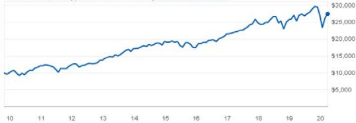  
Growth of 10,0o0Hypothetical Investment|3Month Performance

thetextboxabove.

# Large-CapU.8.StockFundCharacteristics

# Large-Cap U.S.Stock Funds

ClickothfundblfuarterlyadaddeturnddetailedndexpesPerformanceotedispstperformaeandisntef futureesultsefoaooeseillaedseea originalcost.

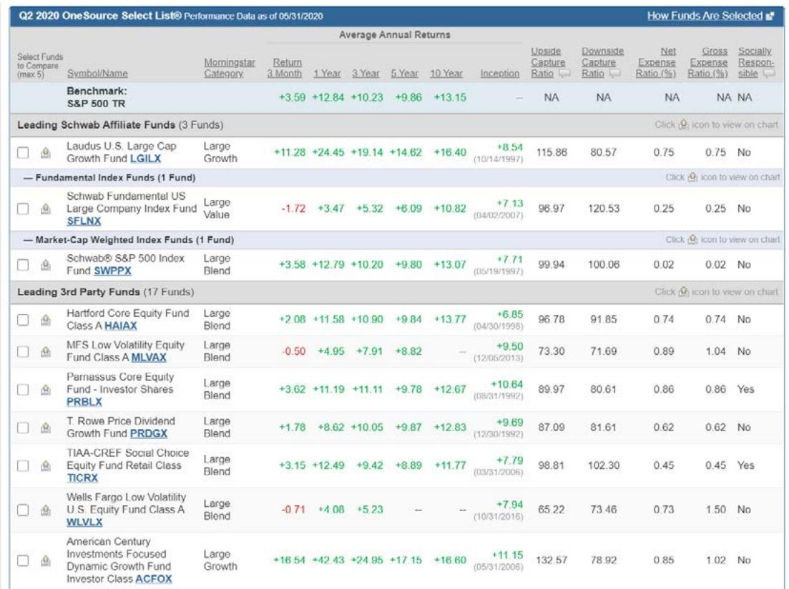

# etail Ratio and Fund Expense Ratios around Platfo

AdvertiseEXP% = AdvertiseEXP∗ 2/((TNAt + TNAt−1)/2). The shaded areas indicate the 9 s via income statement on a semi-annual basis. The annualized expense ratio is calculated as the corr al operating expense subtracting management expense, custodian expense, transaction expense, and In the lower two graphs, we plot the annualized total operating expense and advertising expense rat orts the value-weighted retail ratio for each style of funds over time. The upper right graph plots the

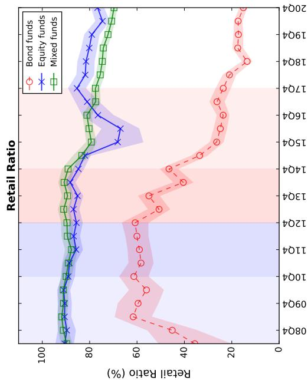

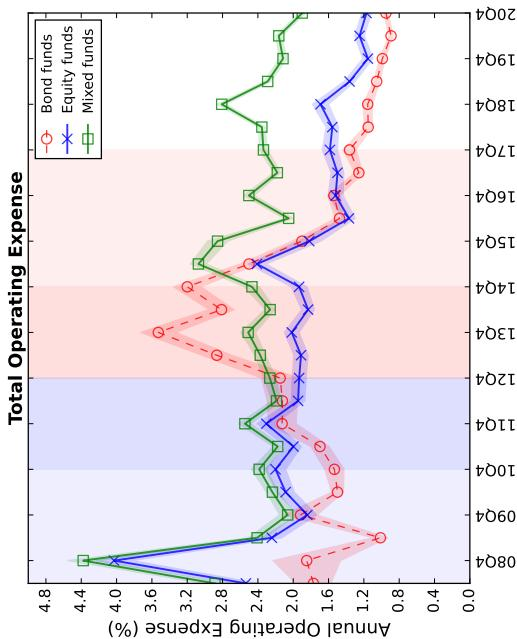

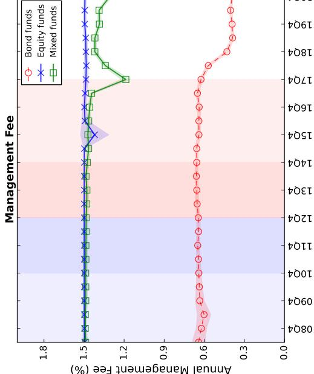

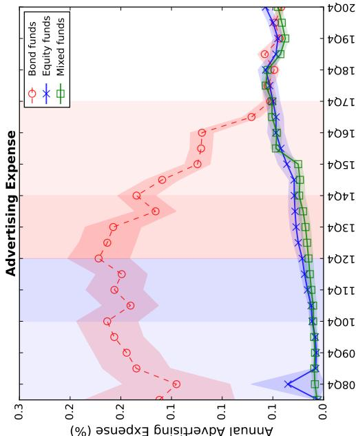

# Table A1. Determinants of Entrance onto Platforms

This table examines the cross-sectional determinants for funds’ and families’ entrance onto platforms. Column (1) and (2) includes all the funds with inception dates before the end of 2012. Column (3) and (4) includes all the families with inception dates before the end of 2012. D(Enter $\leq$ 2013Q1) is a dummy variable that equals one if the fund (or family) enters onto the Tiantian platform on or before March 31, 2013. Log(Enter months) is the natural logarithm of the number of months from March 2012 to the time when the fund (or family) enters Tiantian. Bank-affiliated is a dummy variable that equals one if the controlling shareholder $>$ 30% ownership) is a bank, and Broker-affiliated is defined similarly. We also include control variables of Retail Ratio, which is the fraction of a fund held by individual investors at the end of June 2012, past 12-month return and the standard deviation of return by the end of June 2012 (MRett−1,t−4 and MRetStd $t - 1$ , $t - 4$ ), Log(Size), Log(Age), and Flow at the end of June 2012. Control variables for families are constructed as the value-weighted average of all funds within the family. We include style fixed effect for fund specifications. $t$ -statistics are adjusted using heteroscedasticity-robust standard errors and are reported in parentheses. *, **, and $\ast \ast \ast$ denote significance at the 10%, 5% and 1% levels, respectively.

<table><tr><td rowspan="2"></td><td colspan="2">Fund</td><td colspan="2">Family</td></tr><tr><td>D(Enter≤2013Q1)</td><td>Log(Enter months)</td><td>D(Enter≤2013Q1)</td><td>Log(Enter months)</td></tr><tr><td></td><td>Logit(1)</td><td>OLS(2)</td><td>Logit(3)</td><td>OLS(4)</td></tr><tr><td>Log(Size)</td><td>-0.250***(-2.92)</td><td>0.113***(2.98)</td><td>-0.855*(-1.78)</td><td>0.19(1.30)</td></tr><tr><td>Log(Age)</td><td>0.669**(2.24)</td><td>-0.131(-1.16)</td><td>4.141*(1.68)</td><td>-0.277(-0.46)</td></tr><tr><td>Flow</td><td>0.587**(2.43)</td><td>-0.200***(-4.27)</td><td>1.967(0.59)</td><td>-0.711(-1.01)</td></tr><tr><td>\( MRet_{t-1,t-4} \)</td><td>0.145(0.69)</td><td>0.06(0.70)</td><td>1.716(1.41)</td><td>-0.015(-0.06)</td></tr><tr><td>\( MRetStd_{t-1,t-4} \)</td><td>-0.081(-0.65)</td><td>0.097(1.11)</td><td>0.39(0.45)</td><td>0.08(0.38)</td></tr><tr><td>Bank-Affiliated</td><td>-1.681***(-4.83)</td><td>0.662***(6.50)</td><td>-2.593*(-1.95)</td><td>0.973**(2.37)</td></tr><tr><td>Broker-Affiliated</td><td>-0.073(-0.34)</td><td>0.198**(2.28)</td><td>0.389(0.44)</td><td>0.134(0.55)</td></tr><tr><td>Retail Ratio</td><td>-2.008***(-3.90)</td><td>0.575***(3.44)</td><td>-10.140***(-3.09)</td><td>1.693*(1.69)</td></tr><tr><td>Style FE</td><td>Y</td><td>Y</td><td>Y</td><td>Y</td></tr><tr><td>Observations</td><td>481</td><td>481</td><td>60</td><td>60</td></tr><tr><td>R-squared</td><td>0.106</td><td>0.137</td><td>0.3252</td><td>0.266</td></tr></table>

# Table A2. Alternative Specifications

Panel A shows the regression estimations under alternative specifications, following a similar specification in Table 3. The sample period is from 2008 through 2017. The first row reports the baseline specification. In model (1), we report the regression estimates, excluding the whole year of 2015. Model (2) allows for time-varying performance chasing by controlling for After $\times$ Decile. In model (3), we control for dummy variable Ms5star (Ms4star), which equals one if the fund Morningstar rating is five (four) star, and zero otherwise, and their interactions with the Platform dummy. In model (4), we control for $\mathrm { L o g } ( \# \mathrm { B a n k } ) _ { i , t - 1 }$ and $\mathrm { L o g } ( \# \mathrm { B r o k e r s } ) _ { i , t - 1 }$ , and their interactions with Decile10i, $t - 1$ dummy. $\mathrm { L o g } ( \# \mathrm { B a n k } ) _ { i , t - 1 }$ $( \mathrm { L o g } ( \# \mathrm { B r o k e r s } ) _ { i , t - 1 } )$ is the natural logarithm of the number of banks (brokers) in which a fund is available for sale at quarter $t - 1$ . Model (5) restricts the sample to the funds with inception year on and before 2012. In model (6), we estimate weighted least squared regressions, using the TNA $^ { i , t - 1 }$ of each fund as the weight for each observation. In model (8), we replace the Platform $^ { i , t }$ dummy with the natural logarithm of the number of platforms that a fund is available for purchase in quarter $t - 1$ . In model (9), we replace the Decile10i,t−1 dummy with the performance decile rank variable that ranges from one to ten. Panel B shows the sensitivity of flow to past returns at different horizons. We replace the Decile10i, $t - 1$ dummy constructed using past 12-month returns with Decile10 $_ { i , t - 1 }$ dummies constructed based on past 1, 3, 6, 24, and 36 months returns, respectively. *, **, and $^ { \ast \ast \ast }$ denote significance at the 10%, 5% and $1 \%$ levels, respectively.

<table><tr><td colspan="5">A. Alternative Specifications</td></tr><tr><td></td><td>Decile10×Platform</td><td>Decile10</td><td>N</td><td>R2</td></tr><tr><td rowspan="2">Baseline</td><td>16.845***</td><td>4.944***</td><td>18,329</td><td>0.184</td></tr><tr><td>(8.03)</td><td>(3.77)</td><td></td><td></td></tr><tr><td rowspan="2">(1). Exclude 2015</td><td>18.070***</td><td>5.035***</td><td>15,930</td><td>0.213</td></tr><tr><td>(8.07)</td><td>(4.03)</td><td></td><td></td></tr><tr><td rowspan="2">(2). Control After×Decile10</td><td>10.318**</td><td>3.652**</td><td>18,329</td><td>0.184</td></tr><tr><td>(2.48)</td><td>(2.60)</td><td></td><td></td></tr><tr><td rowspan="2">(3). Control for MorningStar 5 &amp; 4 ratings</td><td>15.013***</td><td>4.849***</td><td>18,329</td><td>0.187</td></tr><tr><td>(6.92)</td><td>(3.76)</td><td></td><td></td></tr><tr><td rowspan="2">(4). Control Bank &amp; Broker</td><td>16.473***</td><td>2.89722</td><td>18,329</td><td>0.186</td></tr><tr><td>(8.21)</td><td>(0.34)</td><td></td><td></td></tr><tr><td rowspan="2">(5). Inception &lt;2012</td><td>15.542***</td><td>4.708***</td><td>15,512</td><td>0.138</td></tr><tr><td>(6.60)</td><td>(3.80)</td><td></td><td></td></tr><tr><td rowspan="2">(6). Value-Weighted</td><td>16.400***</td><td>4.759***</td><td>18,329</td><td>0.181</td></tr><tr><td>(8.54)</td><td>(3.77)</td><td></td><td></td></tr><tr><td rowspan="2">(7). Replace Platform with Log(#Platforms)</td><td>7.300***</td><td>4.378***</td><td>18,329</td><td>0.184</td></tr><tr><td>(9.12)</td><td>(3.50)</td><td></td><td></td></tr><tr><td rowspan="2">(8). Replace Decile10 with Rank12m</td><td>1.321***</td><td>0.548***</td><td>18,329</td><td>0.176</td></tr><tr><td>(5.13)</td><td>(3.64)</td><td></td><td></td></tr></table>

<table><tr><td colspan="7">B. Alternative Past Return Horizons</td></tr><tr><td></td><td>1 Month</td><td>3 Months</td><td>6 Months</td><td>12 Months</td><td>24 Months</td><td>36 Months</td></tr><tr><td>Decile10</td><td>1.959(1.36)</td><td>3.063*(1.76)</td><td>3.896**(2.61)</td><td>4.944***(3.77)</td><td>3.170**(2.57)</td><td>2.056(1.23)</td></tr><tr><td>Decile10*Platform</td><td>8.455***(3.41)</td><td>10.485***(3.69)</td><td>16.796***(6.63)</td><td>16.845***(8.03)</td><td>12.846***(4.69)</td><td>16.091***(6.28)</td></tr><tr><td>Controls</td><td>Y</td><td>Y</td><td>Y</td><td>Y</td><td>Y</td><td>Y</td></tr><tr><td>Fund FE, Time FE</td><td>Y</td><td>Y</td><td>Y</td><td>Y</td><td>Y</td><td>Y</td></tr><tr><td>Observations</td><td>18,329</td><td>18,329</td><td>18,329</td><td>18,329</td><td>18,329</td><td>18,329</td></tr><tr><td>R-squared</td><td>0.169</td><td>0.172</td><td>0.183</td><td>0.184</td><td>0.173</td><td>0.174</td></tr></table>