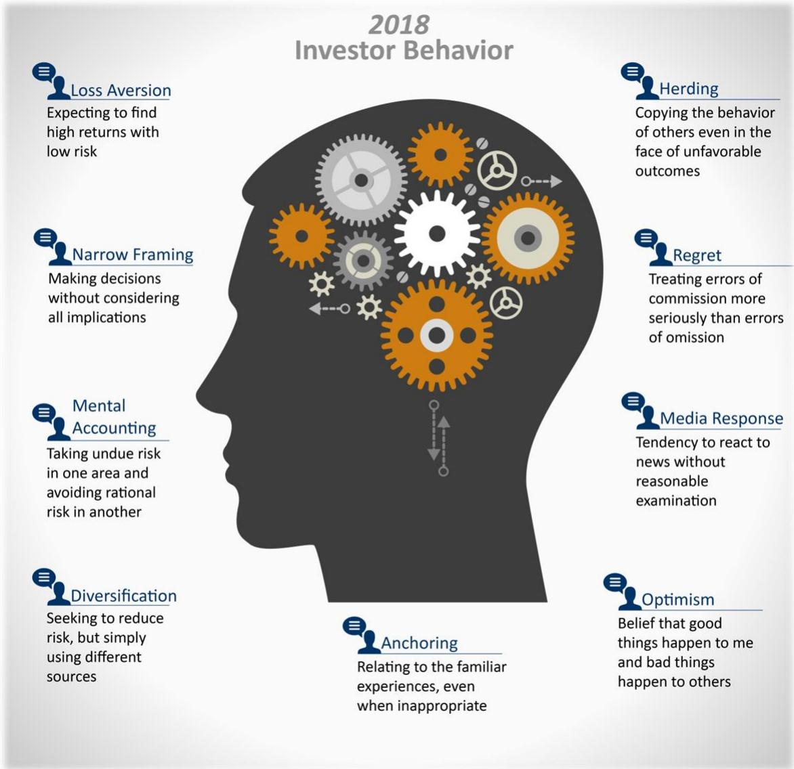
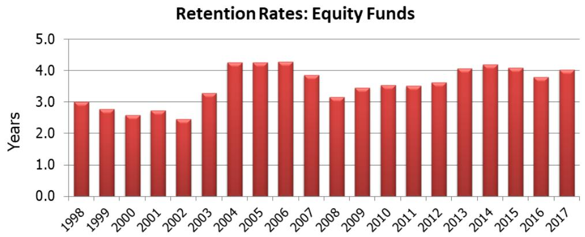
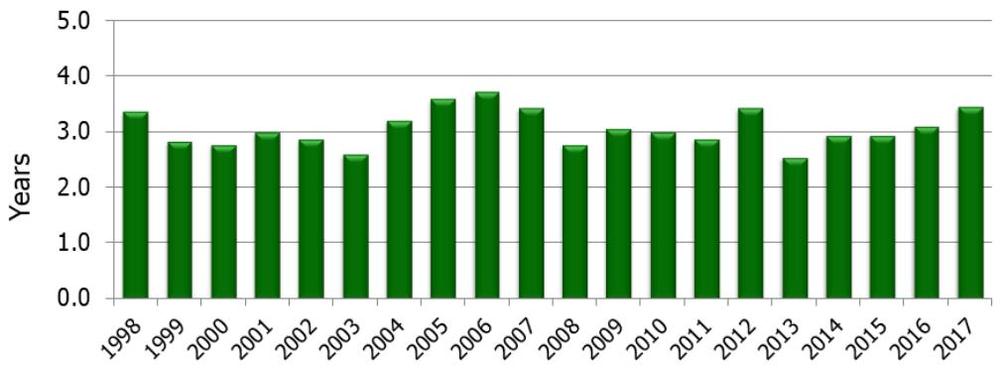
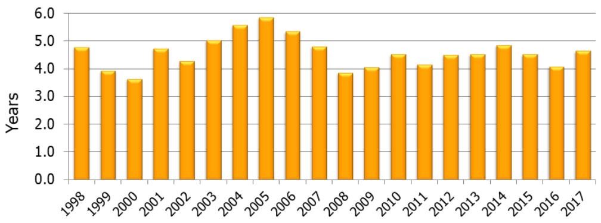
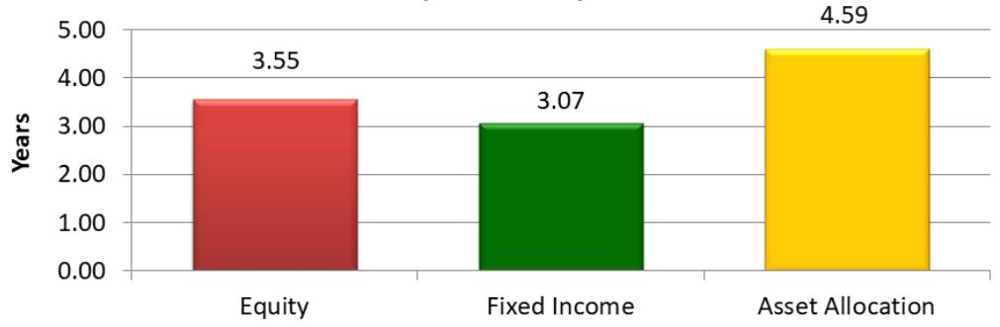
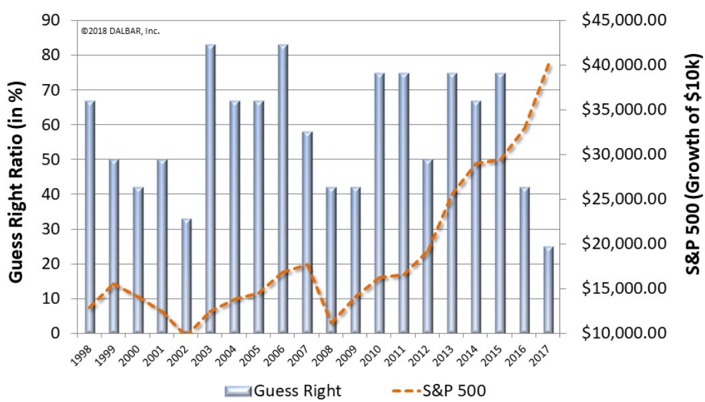
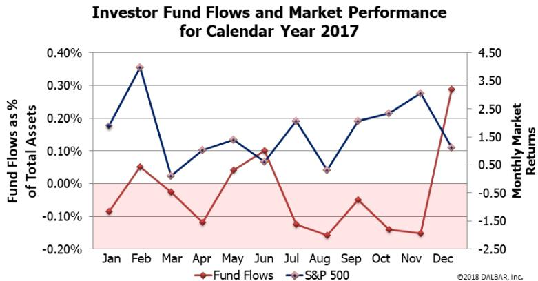

# Quantitative

# Analysis of Investor

# Behavior

# 2018 QAIB Report

For the period ending: December 31, 2017

Compliments of:

David Lovell, na

Swan Global Investments

1099 Main Avenue

Suite 206

9703828901206

david.lovell@swanglobalinvestments.com

# CONTENTS

Introduction.. .3   
Executive Summary .... 5   
Behind the Numbers: Investor Psychology….... .7   
Taking a Closer Look. .8   
Short-Term Focus and Market Timing.. .9   
GLOSSARY.. ..15   
QAIB Products. .18   
RIGHTS OF USAGE AND SOURCING INFORMATION. ..20

# Introduction

Since 1994, DALBAR’s Quantitative Analysis of Investor Behavior (QAIB) has measured the effects of investor decisions to buy, sell and switch into and out of mutual funds over short and long-term timeframes. These effects are measured from the perspective of the investor and do not represent the performance of the investments themselves. The results consistently show that the average investor earns less – in many cases, much less – than mutual fund performance reports would suggest.

The goal of QAIB is to improve performance of both independent investors and financial advisors by managing behaviors that cause investors to act imprudently. QAIB offers guidance on how and where investor behaviors can be improved.

QAIB 2018 examines real investor returns in nearly 30 different categories of funds. The analysis covers the 30-year period to December 31, 2017, which encompasses the aftermath of the crash of 1987, the drop at the turn of the millennium, the crash of 2008, plus recovery periods leading up to the most recent bull market. This year’s report examines the results of investor behavior during a booming 2017.

# About DALBAR, Inc.

DALBAR, Inc. is the financial community’s leading independent expert for evaluating, auditing and rating business practices, customer performance, product quality and service. Launched in 1976, DALBAR has earned the recognition for consistent and unbiased evaluations of investment companies, registered investment advisers, insurance companies, broker/dealers, retirement plan providers and financial professionals. DALBAR awards are recognized as marks of excellence in the financial community.

# Methodology

QAIB uses data from the Investment Company Institute (ICI), Standard & Poor’s, Bloomberg Barclays Indices and proprietary sources to compare mutual fund investor returns to an appropriate set of benchmarks. Covering the period from January 1, 1988 to December 31, 2017, the study utilizes mutual fund sales, redemptions and exchanges each month as the measure of investor behavior. These behaviors reflect the “Average Investor.” Based on this behavior, the analysis calculates the “average investor return” for various periods. These results are then compared to the returns of respective indices.

A glossary of terms and examples of how the calculations are performed can be found in the Appendices section of this report.

# The QAIB Benchmark and Rights of Usage

Investor returns, retention and other industry data presented in this report can be used as benchmarks to assess investor performance in specific situations. Among other scenarios, QAIB has been used to compare investor returns in individual mutual funds and variable annuities, as well as for client bases and in retirement plans. Please see the “Rights of Usage” section in the Appendices for more information and appropriate citation language.

# Visit the QAIB Store!

Renowned investor behavior research is now at your fingertips! Visit the QAIB Store at www.QAIB.com for images, infographics and data feeds from the 2018 study. You can find a menu of additional products on page 18 of this report.

For questions, please contact Cory Clark at cclark@dalbar.com or 617-624-7100 for additional questions

# Executive Summary

 In 2017, the Average Equity Fund Investor underperformed the S&P 500 by 1.19% ( $2 0 . 6 4 \%$ vs. 21.83%).   
 The Average Equity Fund Investor was outperforming the S&P 500 by a slim margin entering the month of October before underperforming the final 3 months of the year. The Average Equity Fund Investor’s underperformance can be entirely attributed to the $4 ^ { \mathrm { t h } }$ quarter.   
 Two of the three best performing months for the S&P 500 (October and November) coincided with relatively large net outflows of assets.

 The Average Equity Index Fund Investor underperformed the S&P 500 by $0 . 4 9 \%$ (21.34% vs. $2 1 . 8 3 \%$ ) but outperformed the Average Equity Fund Investor by $0 . 7 0 \%$ (21.34% vs. 20.64%).   
 In 2017, the Average Fixed Income Fund Investor underperformed the BloombergBarclays Aggregate Treasury Index by 0.79 ( $1 . 5 2 \%$ vs. 2.31%).   
 The Average Asset Allocation Fund Investor earned a return of 10.08 in 2017. Just about splitting the difference between the Average Equity Fund Investor return $( 2 0 . 6 4 \% )$ and the Average Fixed Income Fund Investor return $( 1 . 5 2 \% )$ .

 When examining funds by capitalization and style, the Average Growth Fund Investor emerged as the clear winner. The Average Large Cap Growth Fund Investor earned $2 9 . 4 5 \%$ , while the Average Small Cap Growth Fund Investor earned $2 5 . 4 3 \%$ , and the Average Mid Cap Growth Investor earned $2 4 . 2 5 \%$ for the year. All growth fund investors outperformed all value and blend investors.

The Average Small Cap Value Fund Investor was the worst performing capitalization and style fund investor, earning only $1 0 . 8 2 \%$ on the year. This performance was only marginally better than the Average Asset Allocation Investor (whose portfolios are comprised of both equity and fixed income).

When examining specific sector funds, the Average Technology Fund Investor $( 3 5 . 6 8 \% )$ and the Average Healthcare Fund Investor $( 2 3 . 4 5 \% )$ emerged as the highest performing of all the sector fund investors.

Investments traditionally associated with safety were out of favor in 2017 and consequently the Average Natural Resources Fund Investor, Average Utilities Fund Investor and Average Precious Metals Fund Investor were the 3 poorest performing sector fund investors.

The Average Target Date Fund Investor outperformed the Average Asset Allocation Fund Investor by $6 . 8 4 \%$ ( $1 6 . 9 2 \%$ vs. $1 0 . 0 8 \%$ ). This can be explained in part by the fact that net cash flow for Target Date Funds was decidedly positive throughout the year while cash flows of asset allocation funds was mostly negative despite the bull market.

 Equity fund Retention Rates rose by almost 3 months, from an average of 3.80 years in 2016, to an average of 4.03 years in 2017.   
 Fixed income fund Retention Rates rose over 4 months, from an average of 3.09 years in 2016, to an average of 3.45 years in 2017.   
 Asset allocation fund Retention Rates rose by over six months in 2017, pushing from 4.09 years to 4.65 years.

<table><tr><td></td><td>Average Equity Fund Investor (%)</td><td>Average Fixed Income Fund Investor (%)</td><td>Average Asset Allocation Fund Investor (%)</td><td>Inflation (%)</td><td>S&amp;P 500 (%)</td><td>Bloomberg-Barclays Aggregate Treasury Index (%)</td></tr><tr><td>20 Year</td><td>5.29</td><td>0.44</td><td>2.58</td><td>2.15</td><td>7.20</td><td>4.60</td></tr><tr><td>10 Year</td><td>4.88</td><td>0.48</td><td>2.52</td><td>1.64</td><td>8.50</td><td>3.31</td></tr><tr><td>5 Year</td><td>10.93</td><td>-0.40</td><td>5.41</td><td>1.48</td><td>15.79</td><td>1.27</td></tr><tr><td>3 Year</td><td>8.12</td><td>-0.05</td><td>3.85</td><td>1.71</td><td>11.41</td><td>1.40</td></tr><tr><td>12 Month</td><td>20.64</td><td>1.52</td><td>10.08</td><td>2.11</td><td>21.83</td><td>2.31</td></tr></table>

# BEHIND THE NUMBERS…

# INVESTOR PSYCHOLOGY

When discussing investor behavior it is helpful to first understand the specific thoughts and actions that lead to poor decision-making. Investor behavior is not simply buying and selling at the wrong time, it is the psychological traps, triggers and misconceptions that cause investors to act irrationally. That irrationality leads to buying and selling at the wrong time, which leads to underperformance.

There are 9 distinct behaviors that tend to plague investors based on their personal experiences and unique personalities.

Past performance is no guarantee of future results.

# Taking a Closer Look

… Examining the Various Average Fund Investors

For years, DALBAR’s QAIB report has looked at equity and fixed income fund investors to see how their actual market gain/loss compares to reported market returns. In 2008, DALBAR introduced the Average Asset Allocation Investor, covering funds that invest in a mix of equity and fixed income securities. In 2018, DALBAR is introducing for the first time Average Fund Investors for various fund classifications.

With valuations fair to high1, anticipation of lowered taxes, and the market presumably anticipating economic expansion, growth stocks ruled the day in 2017. Large cap growth fund investors earned almost $30 \%$ on the year, beating the S&P 500 by a wide margin $2 9 . 4 5 \%$ vs. $2 1 . 8 3 \%$ .

<table><tr><td>Rank</td><td>2017</td><td>Return</td><td>2016</td><td>Return</td></tr><tr><td>1</td><td>Tech/Telecom</td><td>35.68%</td><td>Precious Metals</td><td>42.99%</td></tr><tr><td>2</td><td>Growth Large</td><td>29.45%</td><td>Value Small</td><td>23.74%</td></tr><tr><td>3</td><td>Growth Small</td><td>25.43%</td><td>Utilities</td><td>22.90%</td></tr><tr><td>4</td><td>Growth Mid</td><td>24.25%</td><td>Nat Resources</td><td>22.52%</td></tr><tr><td>5</td><td>Health</td><td>23.45%</td><td>Blend Small</td><td>19.72%</td></tr><tr><td>6</td><td>Passive Equity</td><td>21.34%</td><td>Financial</td><td>17.08%</td></tr><tr><td>7</td><td>AA Large</td><td>20.70%</td><td>Value Mid</td><td>16.16%</td></tr><tr><td>8</td><td>Consumer</td><td>19.55%</td><td>Value Large</td><td>14.07%</td></tr><tr><td>9</td><td>Blend Mid</td><td>18.46%</td><td>Blend Mid</td><td>13.27%</td></tr><tr><td>10</td><td>Value Large</td><td>16.99%</td><td>Blend Large</td><td>11.72%</td></tr><tr><td>11</td><td>Target Date</td><td>16.92%</td><td>Passive Equity</td><td>11.13%</td></tr><tr><td>12</td><td>Financial</td><td>15.34%</td><td>Growth Small</td><td>10.95%</td></tr><tr><td>13</td><td>Blend Small</td><td>13.55%</td><td>Tech/Telecom</td><td>8.86%</td></tr><tr><td>14</td><td>Value Mid</td><td>13.47%</td><td>Target Date</td><td>7.12%</td></tr><tr><td>15</td><td>Alt-Equity World</td><td>12.36%</td><td>Alt-Asset Allocation</td><td>5.01%</td></tr><tr><td>16</td><td>Real Estate</td><td>11.93%</td><td>Real Estate</td><td>4.98%</td></tr><tr><td>17</td><td>Value Small</td><td>10.82%</td><td>Growth Mid</td><td>4.39%</td></tr><tr><td>18</td><td>Alt-Equity Domestic</td><td>9.13%</td><td>Consumer</td><td>4.20%</td></tr><tr><td>19</td><td>Precious Metals</td><td>7.43%</td><td>Alt-Multisector Bond</td><td>3.96%</td></tr><tr><td>20</td><td>Utilities</td><td>6.67%</td><td>Alt-Equity Domestic</td><td>3.62%</td></tr><tr><td>21</td><td>Alt-AA</td><td>5.80%</td><td>Alt-Equity World</td><td>1.80%</td></tr><tr><td>22</td><td>Nat Resources</td><td>2.59%</td><td>Growth Large</td><td>1.61%</td></tr><tr><td>23</td><td>Alt-Multisector Bond</td><td>0.83%</td><td>Health</td><td>-12.92%</td></tr></table>

1 According to YCarts.com, average P/E ratios of the S&P 500 in 2017 were in the range of 23-24.

The average technology fund investor led all investor categories for 2017 and earned $10 \%$ more than any other sector fund investor. Sectors associated with safety such as precious metals and natural resources were at the bottom of the list.

# Short-Term Focus and Market Timing

Irrational investor behavior is typically triggered by some sort of stimulus. A geopolitical event, previous market experiences, news stories, or a hot tip from a colleague can distract an investor from his or her long-term goal. But investor underperformance emanates only partially from poor decision-making; other factors such as fees, the need for cash, and the unavailability of funds to invest can all lead to an investor lagging the overall market.

For example, if Harry has to withdraw some portion of his investments to cover medical costs. That can hardly be considered irrational investor behavior. Harry may miss a market advance that will plague his portfolio for years to come but it was not due to any of the psychological factors we have discussed over the years.

Or perhaps Harry does not have money to invest due to his personal circumstances, but when he gets his Federal tax return he plans to put it all into his IRA. If the market tanks in the first quarter before Harry contributes his tax refund, he looks like a genius. If he misses a $1 ^ { \mathfrak { s t } }$ quarter bull run, it looks like he timed the market all wrong. The truth was that Harry did what he could do and was at the mercy of Lady Luck.

Past performance is no guarantee of future results.

While underperformance is not due entirely to irrational investor behavior, there are two behaviors for which evidence shows time and time again that fall outside of what would be generally accepted as a prudent investment strategy. The behaviors are the tendency to move into and out of investments too frequently and the tendency to time the market.

The data shows that the average mutual fund investor has not stayed invested for a long enough period of time to execute a long term strategy. In fact, they typically stay invested for just a fraction of a market cycle. QAIB has also shown numerous instances in which market conditions create a shift in cash flows which run counter to the eventual direction of the market.

# Retention Rates

Over the past 20 years, equity mutual fund investors have seldom managed to stay invested for more than 4 years. When they have done so, it has generally been during periods of bull markets. Equity fund retention rates surpassed the four year mark from 2004-2006 and would do so again in 2013-2015. In 2016, equity fund retention rates dipped below 4 years to 3.80 years but in 2017 rebounded back over the 4-year mark (4.03 yrs.).

After exhibiting retention rates below the 3-year mark 2013-2015, the Average Fixed Income Fund Investor surpassed the 3.0 year mark in 2016 (3.09 yrs.) and continued to forge higher in 2017 to its highest Retention Rate (3.45 yrs.) since 2006.

  
Retention Rates: Fixed Income Funds

Asset allocation mutual fund investors have generally stayed invested longer than their equity and fixed income investor counterparts. Asset allocation fund retention rates have stood above the four year mark for eight straight years. In 2016, asset allocation fund Retention Rates decreased to 4.09 years, nearly falling below the 4.0 year mark for the first time since 2008. However, in 2017, the Average Asset Allocation Investor followed the trend of other Average Investors and stayed put. Retention Rates for the 2017 Average Asset Allocation Investor rebounded to the levels before 2016 where fund redemptions accelerated.

  
Retention Rates: Asset Allocation Funds

The market conditions of 2017 caused the expected effect on fund Retention Rates. Investors tend to withdraw funds when markets decline or there is imminent fear of a crash or correction. The effect of the increased withdrawals is to reduce retention rates. The Retention Rates plummeted in 2016 as the Average Investor was not comfortable where they stood. The Average Investor was more comfortable in 2017 and for good reason, the markets gave no reason to be concerned, so investors hung on and made their money right alongside the market indices.

  
Average Mutual Fund Retention Rates (1998-2017)

# Market Timing

The retention rate data for equity, fixed income and asset allocation mutual funds strongly suggests that over the long-term, investors lack the patience to stay invested in any one fund for much more than four years. Even when the markets are in perfect harmony, which is how one might categorize 2017, Retention Rates still do not suggest sufficient holding periods. Investors displayed more patience in 2017, but only from a relative standpoint. Over a quarter of equity funds’ assets are being redeemed and replaced with new purchases each year on average over the last 20 years.

Low retention rates are not a result of investors investing their money for a few years and then divesting forever. The growth of overall mutual fund assets over time suggests much of the money being redeemed is moving from one investment to another. It can be theorized that much of the money movement suppressing Retention Rates can be attributed to the Average Investor’s tactical strategies and market timing.

DALBAR continues to analyze the investors’ market timing successes and failures through their purchases and sales. This form of analysis, known as the Guess Right Ratio, examines fund inflows and outflows to determine how often investors correctly anticipate the direction of the market the following month. Investors guess right when a net inflow is followed by a market gain, or a net outflow is followed by a decline.

Investors have guessed right $50 \%$ of the time or more 14 out of the last 20 years, but 2017 was not one of them. Unfortunately for the Average Investor, guessing right did not produce superior gains over the years because the dollar volume of

bad guesses exceeds the volume of right guesses. Even one month of wrong guesses can wipe out several months of right ones.

In 2017, investors guessed right only 3 out of the 12 months (25%) despite a consistently up-trending market.

  
How Often do Investors Guess Correctly?

While Retention Rates suggest a decrease in redemptions, total redemptions actually outweighed total sales in 8 out of the 12 months. So while investors were less likely to redeem their funds, they were even less likely to add more funds. Perhaps this signifies distrust with the current bull market where investors are unwilling to continue investing at the same rate during all-time market highs. Fortunately for the Average Investor, this ostensible trepidation did not lead to significant underperformance, as the Average Equity Fund Investor only underperformed the S&P 500 by $1 . 1 9 \%$ .

As we examined earlier in this report, the $1 . 1 9 \%$ underperformance by the Average Equity Fund Investor occurred primarily in the 4th $4 ^ { \mathrm { t h } }$ quarter. In October, the S&P was up over $2 . 3 \%$ , the second best month of the year

Past performance is no guarantee of future results.

to that point. At that time, net fund flows were at its second lowest level of the year. Money flows and the market direction were uncorrelated. That continued to an even greater extent in November, as net outflows continued to accelerate and the market continued to rise at an even greater pace. For the second straight month, the second best month of the year (November surpassed October for that title) coincided with the second greatest outflow of the year (November surpassed October for that title as well).

December was (and typically always is) the month that experiences the largest net inflow of funds. Unfortunately when investors were piling money back into mutual funds, the S&P 500 was having an unremarkable month in comparison to the other months of the year. In December, net inflows were far and away greater than any other month. December’s $+ 0 . 2 9 \%$ net inflow was nearly triple the second largest inflow that took place in June. However the S&P 500 earned only $1 . 1 1 \%$ , below its average monthly return of $1 . 6 6 \%$ in 2017.

# GLOSSARY

# Average Investor

The average investor refers to the universe of all mutual fund investors whose actions and financial results are restated to represent a single investor. This approach allows the entire universe of mutual fund investors to be used as the statistical sample, ensuring ultimate reliability.

# [Average] Investor Behavior

QAIB quantitatively measures sales, redemptions and exchanges (provided by the Investment Company Institute) and describes these measures as investor behaviors. The measurement of investor behavior is the net dollar volume of these activities that occur in a single month during the period being analyzed.

# [Average] Investor Return (Performance)

QAIB calculates investor returns as the change in assets, after excluding sales, redemptions, and exchanges. This method of calculation captures realized and unrealized capital gains, dividends, interest, trading costs, sales charges, fees, expenses and any other costs. After calculating investor returns in dollar terms (above) two percentages are calculated:

 Total investor return rate for the period   
 Annualized investor return rate

Total return rate is determined by calculating the investor return dollars as a percentage of the net assets, sales, redemptions and exchanges for the period.

Annualized return rate is calculated as the uniform rate that can be compounded annually for the period under consideration to produce the investor return dollars.

# Average Equity Fund Investor

The Average Equity Fund Investor is comprised of a universe of both domestic and world equity mutual funds. It includes growth, sector, alternative strategy, value, blend, emerging markets, global equity, international equity, and regional equity funds.

# Average Fixed Income Investor

The Average Fixed Income Fund Investor is comprised of a universe of fixed income mutual funds, which includes investment grade, high yield, government, municipal, multi-sector, and global bond funds. It does not include money market funds.

# Average Asset Allocation Investor

The Average Asset Allocation Fund Investor is comprised of a universe of funds that invest in a mix of equity and debt securities.

# Average [Sector] Fund Investor

The Average [Sector] Fund Investor is comprised of a universe of funds that invest solely in companies that operate in related fields or specific industries. The following Average Sector Fund Investors were referenced in this report: Consumer, Health, Financial, Tech/Telecom, Real Estate, Precious Metals, Utilities, and Natural Resources.

# Average [Capitalization and Style] Fund Investor

The Average [Capitalization and Style] Fund Investor is comprised of a universe of funds that are categorized by the types of companies in which they invest:

Small-cap mutual funds invest primarily in companies with market capitalizations of up to $\$ 2-2.5$ billion.

Mid-cap mutual funds invest primarily in companies with market capitalization that generally ranges from $\$ 1$ billion to $\$ 7$ billion or in companies with both small and medium market capitalization.

Large-cap mutual funds invest primarily in companies with market capitalizations which are generally more than $\$ 5$ billion or in companies with both medium and large market capitalizations.

Growth mutual funds invest primarily in common stock of growth companies, which are those that exhibit signs of above-average growth, even if the share price is high relative to earnings/intrinsic value.

Value mutual funds invest primarily in common stock of value companies, which are those that are out of favor with investors, appear underpriced by the market relative to their earnings/intrinsic value, or have high dividend yields.

Blend mutual funds invest primarily in common stock of both growth and value companies or are not limited to the types of companies in which they can invest.

# Average Equity Index Fund Investor

The Average Equity Index Fund Investor is comprised of a universe of funds that are designed to track the performance of a U.S. equity market index.

# Average Target Date Fund Investor

The Average Target Date Fund Investor is comprised of a universe of funds that follow a predetermined reallocation of assets over time based on a specified target retirement date.

# Average Alternative Strategies (Alt-) Fund Investor

The Average Alternative Strategies (Alt-) Fund Investor is comprised of a universe of funds that employ alternative investment approaches like long/short, market neutral, leveraged, inverse, or commodity strategies to meet their investment objective. The following Average Alternative Strategies Fund Investors were referenced in this report: Alt-Domestic Equity, Alt-World Equity, Alt – Asset Allocation (“AA”), and Alt-Multisector Bond.

# Guess Right Ratio

The Guess Right Ratio is the frequency that the average investor makes a shortterm gain. One point is scored each month when the average investor has net inflows and the market (S&P 500) rises in the next month. A point is also scored when the average investor has net outflows and the market declines in the next month. The ratio is the number of points scored as a percentage of the total number of months under consideration.

# Retention Rate

Retention Rate reflects the length of time the average investor holds a fund if the current redemption rate persists. It is the time required to fully redeem the account. Retention rates are expressed in years and fractions of years.

# Inflation Rate

The monthly value of the consumer price index is converted to a monthly rate. The monthly rates are used to compound a “return” for the period under consideration. This result is then annualized to produce the inflation rate for the period.

# QAIB Products

# Custom QAIB

Advisor Edition.

Made for theaverage investor,this editioniscustomizable,giving advisorsapersonalized report they canpass on to their clients in it's entirety.

Advisor Edition. Copyrights....5249

Thisadd-on to the Advisor Edition allowspurchaserstouse any of the report'sdata incustomized communication.

QAIB Return Builder..

Looking for more than the typical1,3, 5?Generate Average Investor Returns basedonyourcustomtimeframesof over25different categoriesofAverage Investors."

# Communication Builder

Periodic Table ofInvestorReturns....$250

Getthe Average InvestorReturns for23different categoriesof fund investorsoverthelast10 years.

2017Returnsvs.Benchmark.

Agraphicalrepresentation of the Average Equity,Fixed Income,and AssetAllocation Fund InvestorReturn for2o17vs.benchmarks of the S&P500,BloombergBarclays AggregateBond Index,and inflation.

2017 Capitalization & Style

Analysis.. ..$79

Avisual depiction of Average Investor Returns brokendown bycapitalization (large,mid small-cap)and style（growth,value,blend).

Retention Rates.

These 3graphs show the Retention Rates of equity,fixed income,and assetallocation funds datingbackto1998.

2017Fund Flows vs.S&P 500.

tracks the SsP 500 throughout 2017while the othertracks thenet inflow oroutflow of equity mutual fund assets foreachmonth.Used to showtherelationshipbetween Average Investor's buying/sellingand market performance.

Average Investor vs.Systematic Investor.. .$49

This set of2 graphs shows the hypotheticalgrowth of s1o.oooover20 years fortwo different investors.The first is the Average Equity Fund Investor and the second isthe Systematic Investorof$41.67amonthoverthe20 years.Whowins?Theanswermay

Measuring

Shortfallin

Average Investor Returns

Past performance is no guarantee of future results.

More Content, More Value, Making it easier to give clients perspective

# 2018 QAIB

# For Period Ending

# Look-Backs

These QAIB look backs take an in depth look at the average investorduringspecific, noteworthy periodsin the stock market's history.The QAIB Look-Back series includes:

2017: Our Most Recent Year..569

The 2016 Election. $99

The 2008 Great Recession (2007-2009) $99

.$99

.$99

# QAIB Stories

Quincy and his wife Caroline inherited$20.000in1998.Theyeach tookSiooooand invested itin their ownaccount.Theyboth invested in mutual fundswith similar performancebut thishusbandand wifehaveverydifferent styleswhen itcomes towhenand howmuchto invest.Fast forward20yearsand see how Quincyand Caroline are doing today.

Anatomy of Investor Returns:Harry.. $99

MeetHarry.He'saconfused, disenchanted skeptic,trying to find answersabout his investment account.Use this blunt,lighthearted story to highlight concerns oftheaverageinvestorand foster an honest discussion about your client-advisorrelationship,and whatmakes youdifferent.

# RIGHTS OF USAGE AND SOURCING INFORMATION

Investor returns, retention and other industry data presented in this report can be used as benchmarks to assess investor performance in specific situations. Among other scenarios, QAIB has been used to compare investor returns in individual mutual funds and variable annuities, as well as for client bases and in retirement plans.

Purchase of the Advisor Edition of QAIB includes the rights to redistribute printed or electronic copies, of this complete report to clients. Please Note: The purchase of this report does not include the rights to replicate or reproduce charts and data elements separately in customized materials. In addition, purchase of the Advisor Edition of QAIB includes the rights to post this report on your company’s internal password protected website. The rights to post to the World Wide Web are not included.

For more information on creating a custom analysis or presentation using the QAIB data and methodology, contact Cory Clark at cclark@dalbar.com or 617- 624-7156.

This study was conducted by an independent third party, DALBAR, Inc. A research firm specializing in financial services, DALBAR is not associated with Swan Global Investments. The information herein is believed to be reliable, but accuracy and completeness cannot be guaranteed. It is for informational purposes only and is not a solicitation to buy or sell securities.